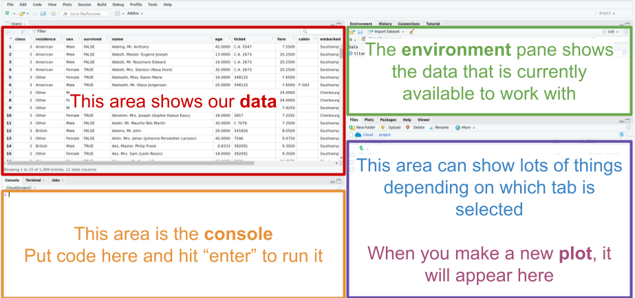

# Exploring Data with R {#lab1}

```{r setup, include=FALSE}
library(tidyverse)

knitr::opts_chunk$set(echo = TRUE)
knitr::opts_chunk$set(results = 'hold')
# knitr::opts_chunk$set(class.source = 'code-style')
# knitr::opts_chunk$set(class.output = 'out-style')

titanic <- read.csv('data/titanic.csv')
```

```{r, echo=FALSE, out.width="100%"}
knitr::include_graphics("img/titanic.png")
```

In this session, we will learn a bit about data and how to look at it in R.  This will largely involve copying and pasting code from this document into your own RStudio window and interpreting the results, though you will also have to make some tweaks to that code on your own.  The big point is to get a feel for the power of the tools we will be learning to use in the rest of the semester.

For most of what we will be doing, this document shows both the R code and, below it, the result that code is expected to produce.  The questions you will need to answer for the accompanying assignment are presented as numbered footnotes.

Another big point is that even though statistics is about dealing with data, those data are *meaningful*.  They are not just numbers or names, they are a peek into the world.  They offer glimpses of someone's life, of the workings of some natural process, of some social structure, etc.  Any dataset will be limited in how wide of a glimpse it gives us, and the point of statistics is how to learn and make decisions based on that glimpse.

The primary skills developed in this activity are:

1. Viewing data in R
2. Making frequency tables
3. Making bar charts
4. Making histograms

## R and RStudio

All of our labs will make use of RStudio, a graphical interface to the statistical computing language R.  The R language represents the current state of the art in both academic and industrial research.  It is likely to remain relevant for many years to come because it is free and open-source, meaning both that it is widely accessible and that improvements and extensions are relatively easy to make.  In fact, many of the best features of R that we will be using are extensions made by people outside the "core" development team for R.  These extensions are called "packages", and they represent bundles of code that are useful for doing statistics.

RStudio makes it easier to work with the R language, and it is also free and can be installed on computers running any modern operating system (Windows, Mac, Linux, etc.).  RStudio is already installed on the computers in the Technology-Enhanced Classrooms and the Library Public Computing Sites on campus.  If you are working on your own computer, you will have an easier time of it if you install RStudio on it.  Installing RStudio requires installing R, but you only need to do this once.  Follow the installation instructions for **RStudio Desktop** here: <https://rstudio.com/products/rstudio/download/>

You can also use RStudio in a browser!  This way, even if you don't have access to a computer with RStudio installed locally, you can use it if you have access to the internet.  You can run RStudio online here: <https://rstudio.cloud/>.  The downside with this is that there is a cap to the amount of time you can spend using the online version, so you are better off using a local installation whenever possible.

This first lab will use the cloud version so we can jump right in.  Access the first Lab here:

<https://rstudio.cloud/project/2118415>

Note that you may need to create an account, but it is free to do so.

<!-- ## Tidyverse -->

<!-- Once you have RStudio up and running, there's one more thing you need to do to make sure you can do the labs in the course.  Open up RStudio, paste the line below into your console, and hit enter: -->

<!-- ```{r eval = FALSE} -->
<!-- install.packages("tidyverse") -->
<!-- ``` -->

<!-- This will install a package called "tidyverse" that we will be using in class that will make R much more useful for us.  You only need to do this once on any particular computer, and it may already be installed.  If so, running this won't hurt, it'll just make sure you've got everything we need. -->

## Meet your data

The data we will be looking at are passenger records from the RMS *Titanic*, an oceanliner which famously sank on April 15, 1912.  Though the liner was not filled to capacity, lax safety precautions---including a failure to carry enough lifeboats---meant that many of her passengers died because they were unable to evacuate when the ship struck an iceberg.

<!-- ### Load the data -->

<!-- Open up a browser and head to the course Blackboard page.  Under the "Datasets" folder, you will find a file called "titanic.csv".  Download the file and make sure you take note of where you saved it. -->

<!-- Make sure RStudio is running.  You can load the data into RStudio by going to **File** > **Import Dataset** > **From text (readr)...** and finding the "titanic.csv" file wherever you put it.  If you are doing this using the online version of RStudio, you will first have to **Upload** the file to your workspace using the "Files" panel on the right. -->

### Check out the variables

This is what RStudio looks like (with some helpful colored labels):

```{r, echo=FALSE, out.width="100%"}

```

In the upper left of the RStudio screen, you'll see a bunch of columns.  These are our data in "raw" form.  Each row represents a specific passenger and each column represents a different *variable*.  Based on the names of each variable and the types of *values* it seems to take, can you figure out what each variable is?  In other words, what does each column tell us about a person?^[For each variable in the dataset, say whether it is a) Discrete or Continuous; b) what scale it is measured on (nominal, ordinal, interval, or ratio); and c) what you think it means based on the name of the variable and/or what values it takes.]

## Answering questions with data

Now that we've gotten acquainted with the kind of data we have, we can begin using it to answer some questions.  This will involve simplifying the data, turning it into a summary form that makes it easier to understand.  The three types of summaries we will explore today are **frequency tables**, **bar charts**, and **histograms**.

### Frequency tables

The first question is, who was actually aboard the *Titanic*?  One way we could answer this question is to read the names of all 1300 or so people in our dataset, but this would not be particularly efficient or informative.  What we are going to do instead is *simplify*, and focus on specific aspects of each person.

Let's first ask **how many passengers were male or female**.  One way to answer this question is by constructing a **frequency table**.  In the RStudio window, see the big open space just below our data?  This is called the "console" and is where we will do most of our work.  Copy and paste the code below into the "Console".  The code should appear right after the ">".  Once it is there, hit **enter** to run it and see the results.

```{r}
titanic %>%
  group_by(sex) %>%
  summarize(n = n())
```

We got a table that counted the frequency of males and females on the passenger list.  We went from 1300 or so rows with multiple variables each to just two numbers.  A pretty concise summary!  But how did we do it?  Let's break down that bit of code:

* `titanic` is our original dataset.
* `group_by(sex)` tells R to group that dataset by sex.
* `summarize(n=n())` tells R to take our grouped dataset and *summarize* it by counting the `n`umber of people in each group and labeling the resulting number "`n`".
* The funky symbol `%>%` connects the three steps above and makes sure R does them in the order we want.

Let's try a few things to get a sense of why that code did what it did.  What happens if we change `n = n()` in the last line to `Number = n()`?

```{r error=TRUE}
titanic %>%
  group_by(sex) %>%
  summarize(Number = n())
```

Everything looks the same except that instead of the column being labeled "n", it is labeled "Number".  So the bit before the equals sign is how the frequency table will be labeled.

Now let's try something that seems like a small change:  Instead of `n = n()` in the last line, let's write `n = m()`.  Only one letter different, surely it can't be that big of a difference?

```{r error=TRUE}
titanic %>%
  group_by(sex) %>%
  summarize(n = m())
```

R doesn't like it!  It reports an error because it doesn't know what to do with `m()`.  That's because `n()` is a **function**, it is an instruction that tells R to count the `n`umber of something.  On the other hand, `m()` doesn't mean anything to R so it throws up its hands.

We saw that we know not just the sex of each passenger, the "residence" variable tells us whether each person is American, British, or something else.  Let's modify our code to get a frequency table for country of residence instead of sex:

```{r}
titanic %>%
  group_by(residence) %>%
  summarize(n = n())
```

Easy!  So all we need to do to get a frequency table for a particular variable is to put the name of that variable in the parentheses in the `group_by` line.  Since we're on a roll, let's see if we can count the number of passengers with or without college degrees:

```{r error=TRUE}
titanic %>%
  group_by(degree) %>%
  summarize(n = n())
```

No dice!  R tells us that it can't find a column labeled "degree", and indeed, there is no such variable in our data since it was not recorded.  This illustrates that the variable in the parens in the `group_by` line can't be just anything, it has to be the name of a variable (spelled exactly the same!) that exists in our data.

Finally, let's construct a frequency table using multiple variables at once.  This lets us answer questions like, **how many British women were aboard the _Titanic_**?  We can put multiple variables in the `group_by` line:

```{r error=TRUE}
titanic %>%
  group_by(residence, sex) %>%
  summarize(n = n())
```

Now we can begin to address a few more questions.  This time, you will have to figure out how to fiddle with our code for making frequency tables.  Write code that will produce the frequency table below:^[What code did you write to make a frequency table for number of people of each class who did or did not survive?]

```{r echo=FALSE}
titanic %>%
  group_by(class, survived) %>%
  summarize(n = n())
```

This table breaks down the number of people who did or did not survive the sinking of the *Titanic* by their "class", with first-class being the most expensive with the most amenities and third-class being the least expensive with the least amenities.  Do you notice any patterns?^[Were there more people in third class than first class?  For each of the three classes, is the number of survivors more than the number who died?]

### Bar charts

Trying to find patterns among six numbers in a frequency table is not impossible, but it's also not easy.  Bar charts make numerical relationships easy to see visually, so we don't need to compare a bunch of numbers.

Let's see how even a simple comparison is easier with a bar chart than a frequency table.  First, let's make a frequency table for the number of passengers in each class:^[What R code would produce this frequency table?]

```{r echo=FALSE}
titanic %>%
  group_by(class) %>%
  summarize(n = n())
```

Now, use the following code to instead construct a **bar chart** that displays the same information as the table, but in a visual form:

```{r}
titanic %>%
  ggplot(aes(x = class)) +
  geom_bar()
```

Pretty neat!  It is now easy to see how much more 3rd class passengers there are than 1st or 2nd, and that interestingly, there are fewer 2nd class than 1st class passengers^[What about the bar chart conveys the same information as the frequency table?  In other words, what is the visual aspect of the bar chart that represents the numbers in the table?].  Notice that the code we used is similar to what we've been using, but differs in some important ways:

* The first line is the same, telling R what dataset we are using (`titanic`).
* The second line tells R that we want to make a `plot` and that we want to put the variable `class` along the horizontal axis of that plot (the `x` axis).  The "gg" in front of "plot" refers to the "**g**rammar of **g**raphics", which is language R uses to describe plots.  In this language, different parts of a plot are called "**aes**thetics", which is why `x = class` falls inside a parenthetical labeled `aes`(thetic).
* The final line just tells R that we want to make a `bar` chart.  In the grammar of graphics, different types of charts are called `geom`s.
* Notice that the second 2 lines are connected by a `+` rather than our `%>%` symbol.  This is a historical accident, but the meaning of the two symbols is basically the same: they are telling R the order in which it should follow our instructions.

### Histograms

So far, we have been summarizing *discrete* variables.  There are also some continuous variables in our data, for example the age of each passenger as well as how much they paid for their tickets.  Let's try making a frequency table to figure out how many people of different ages sailed on the *Titanic*:

```{r}
titanic %>%
  group_by(age) %>%
  summarize(n = n())
```

Well that's not very helpful!  R didn't even bother to show us the whole table.  Though we can see something interesting:  Age is measured in years, and for passengers at least one year old, their age is a whole number.  But there are fractions of years for passengers less than a year old---these ages were *measured* in months rather than years.

The main point is that even though age can be measured in a more or less fine-grained manner, it is effectively *continuous*.  We don't want to know how many passengers were exactly 31.3491 years old, we want to get a sense of whether there are more younger than older passengers, whether there might be different clusters or age groups, that sort of thing.  In other words, we want to know something about how people are *distributed* across different age ranges.

We can construct a summary that conveys this information using a **histogram**.  This is very similar to a bar chart; the difference is that bar charts are for discrete variables while histograms are for continuous variables.  The code below constructs a histogram to summarize passenger age:

```{r}
titanic %>%
  ggplot(aes(x = age)) +
  geom_histogram()
```

The resulting histogram shows a bunch of bars, the height of which indicate the number of passengers within a particular age range.^[Compare the code we used to make a histogram to what we used to make a bar chart above.  What is different between them?]

Notice that we got a couple messages from R in addition to our plot, one about "non-finite values" and another about "picking a better value".  When R says, "non-finite values", it is talking about people for whom their age was not recorded.  This is an unfortunate thing about real data: sometimes it has missing pieces.  This didn't stop R from making the plot we wanted using the non-missing data, but R wanted to warn us just in case.

The message about "picking a better value" is important:  When you make a histogram, you are looking at how many things fall within a particular range of values, say, between ages 4 and 8.  How do you decide those ranges?  If you don't tell R how to do that, it will decide on its own to divide up the range of values into 30 "bins", each of which corresponds to a range of values that is the same width.  This is usually not what we want.

Instead, we should decide how big or small we want those ranges to be.  The following code tells R to make our histogram using "bins" that are 5 years "wide" (0-4, 5-9, 10-14, etc.):

```{r}
titanic %>%
  ggplot(aes(x = age)) +
  geom_histogram(binwidth = 5)
```

Here's what it looks like when we set the width of each bin to be just 1 year^[What code would produce this plot?]:

```{r, echo = FALSE}
titanic %>%
  ggplot(aes(x = age)) +
  geom_histogram(binwidth = 1)
```

And here's what it looks like when we set the width of each bin to be 10 years^[What code would produce this plot?]:

```{r, echo = FALSE}
titanic %>%
  ggplot(aes(x = age)) +
  geom_histogram(binwidth = 10)
```

Choosing different bin widths makes the resulting histogram look very different.  There is not necessarily one "right" answer, so being able to quickly see the differences between different histograms makes R very handy.^[What bin width do you think makes the best histogram for passenger ages?  Why?  Do you think different bin widths might be better in different circumstances?]

## Wrap-up

Today we began our adventure by using RStudio to explore some data.  We saw how to look at data and how to summarize it in various helpful ways.  These were frequency tables, bar charts, and histograms.

* Frequency tables count the number of times a particular value of a particular variable (or combination of values across multiple variables) occurs in our dataset.
* Bar charts display those counts in a visual form that makes it easier to compare frequencies.
* Histograms let us visually summarize counts of continuous variables by putting them in "bins", the width of which we need to decide.