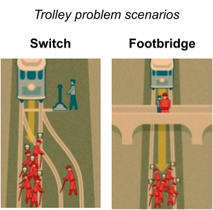

# Confidence intervals with bootstrapping {#lab6}

```{r setup, include=FALSE}
knitr::opts_chunk$set(echo = TRUE)
knitr::opts_chunk$set(results = 'hold')
# knitr::opts_chunk$set(class.source = 'Rcode')
knitr::opts_chunk$set(
  class.output  = "Rout text-muted",
  class.message = "Rout text-info",
  class.warning = "Rout text-warning",
  class.error   = "Rout text-danger"
)

set.seed(12222)
```

```{r, echo=FALSE, out.width="100%"}

```

In this session, we will get practice using R to find confidence intervals via bootstrapping.  As with our initial exposure to hypothesis testing in the previous session, this is meant as a "first contact" with the basics of the techniques.  In the first part, we will revisit the Kobe data to get a view of how resampling works, since this is the heart of the bootstrapping technique.  In the second part, we will use bootstrapping to create confidence intervals representing people's tendencies when making moral decisions.

## Required packages

Like last time, we will require both the `tidyverse` and `infer` packages for this session, so make sure to load both from R's library with the line below.

```{r}
library(tidyverse)
library(infer)
```

## What is Kobe's field goal percentage?

Last time, we asked whether Kobe Bryant had a "hot hand" during the 2009 NBA finals.  We used randomization to test the null hypothesis that Kobe's chance of making a hit was the same regardless of whether his previous shot was a hit or not.

This time we are just interested in what proportion of Kobe's shots actually make it in the basket.  The traditional basketball term for this is Kobe's "field goal percentage".  This constitutes a **population parameter** that we could label mathematically as $\pi_{\text{Kobe}}$.  The "population" here is all the shots Kobe ever attempted across his career.  The sample are the shots Kobe attempted during the 2009 NBA finals.  The sample yields a **point estimate** $\hat{p}_{\text{Kobe}}$ of the population parameter $\pi_{\text{Kobe}}$.

### Load the data

Run the following line of code to download the dataset consisting of every shooting attempt Kobe made during the 2009 NBA finals.  This is the same data we looked at last time:

```{r}
kobe <- read_csv("https://raw.githubusercontent.com/gregcox7/StatLabs/main/data/kobe.csv")
```

### What is the point estimate?

What we are interested in this time is just the proportion of Kobe's shots that were hits rather than misses.  For today, we don't care what the outcome of his previous shot was.

To get the point estimate of the proportion of Kobe's shots that were hits rather than misses, we can use the following chunk of code:

```{r}
kobe %>%
    specify(response = shot, success = "H") %>%
    calculate(stat = "prop")
```

::: {.exercise}
This is the chunk of code we used to find the observed *difference* in hit proportions last time, as a function of whether Kobe's previous shot was a hit or not:

```{r eval=FALSE}
kobe %>%
    specify(shot ~ prev_shot, success = "H") %>%
    calculate(stat = "diff in props", order = c("H", "M"))
```

Compare the code from last time with the code we just used to find the proportion of Kobe's shots that were hits.  Note any similarities and differences and try to describe *why* those differences might be there.  *Hint:* consider that last time we had both an explanatory and response variable, but now we are only interested in a single (response) variable.

:::

### Model the randomness

Although our sample gives us a point estimate ($\hat{p}_{\text{Kobe}}$) of Kobe's true field goal percentage ($\pi_{\text{Kobe}}$), we know that our point estimate is unlikely to be a perfect estimate.  This is because we know that any sample from a population is subject to **sampling variability** which can be treated as effectively "random".  A confidence interval is based on modeling the sampling variability that produced the actual sample we got, so we can know what *range* of values for the population parameter remain plausible.

**Bootstrapping** models this randomness by using our sample as an estimate of the population and repeatedly *resampling* from that estimated population.  Let's see how that works.

#### A single resample

To get a sense of how resampling works, let's again focus on a smaller number of shots from the 2nd quarter of the 1st game.  Like last time, the `filter` function let's us pull out just those few shots:

```{r}
kobe %>%
    filter(game == 1, quarter == 2)
```

The following chunk of code resamples from Kobe's shots during that quarter to produce a new sample of shots:

```{r}
kobe %>%
    filter(game == 1, quarter == 2) %>%
    specify(response = shot, success = "H") %>%
    generate(reps = 1, type = "bootstrap")
```

::: {.exercise}
The chunk of code below is what we used last time to generate a single "shuffle" of these same shots:

```{r eval = FALSE}
kobe %>%
    filter(game == 1, quarter == 2) %>%
    specify(shot ~ prev_shot, success = "H") %>%
    hypothesize(null = "independence") %>%
    generate(reps = 1, type = "permute")
```

Compare that code from last time to the code we just used to do resampling.  Note any similarities and differences.  *Hint:* does it matter that when doing bootstrapping we do not have a "null hypothesis"?

:::

The final step in doing bootstrapping is to calculate the sample statistic---in this case, the proportion of hits---on our randomly generated re-sample.  We can do this by adding a `calculate` line at the end of the code we used to make the resample:

```{r}
kobe %>%
    filter(game == 1, quarter == 2) %>%
    specify(response = shot, success = "H") %>%
    generate(reps = 1, type = "bootstrap") %>%
    calculate(stat = "prop")
```

#### Many resamples

We can remove the `filter` line to generate a single bootstrap resample proportion based on the full data.

```{r}
kobe %>%
    specify(response = shot, success = "H") %>%
    generate(reps = 1, type = "bootstrap") %>%
    calculate(stat = "prop")
```

Of course, the whole point of bootstrapping is to get a *range* of plausible values and so we will need more than one resample!  And like last time, we will want to get R to remember the proportions from each resample so we can use them later; we will call it `boot_dist`.  The following chunk of code uses bootstrapping to produce a distribution of sample proportions, the variability of which mimics the sampling variability that was at work when generating our original observed sample:

```{r}
boot_dist <- kobe %>%
    specify(response = shot, success = "H") %>%
    generate(reps = 1000, type = "bootstrap") %>%
    calculate(stat = "prop")
```

And like last time, we can use a histogram to get a nice visual summary of the bootstrap distribution:

```{r}
boot_dist %>%
    visualize()
```

### Create the interval

To find a confidence interval, we need to find the "middle" of the bootstrap distribution.  We also need to decide how wide that "middle" should be.  For example, to create a 95% confidence interval, we need to find where the middle 95% of the distribution is.

The middle 95% is between two different *quantiles* of the bootstrap distribution.  Specifically, the 2.5% and 97.5% quantiles define the boundaries of the 95% confidence interval.  This is because they are the values for which 2.5% of the simulated proportions are below the interval and 2.5% of the simulated proportions are above the interval.  So, in total, 5% of the values are outside the interval meaning the remainder (95%) are inside it.

We can find the relevant quantiles using our faithful `summarize` function, now applied to the bootstrap distribution:

```{r}
boot_dist %>%
    summarize(CI = quantile(stat, probs = c(0.025, 0.975)))
```

The list of numbers under `probs` gives the probabilities above, but in terms of proportions rather than percent (so `0.025` instead of 2.5%, for example).

::: {.exercise}
Modify the following code to get the boundaries of the **90% confidence interval**:

```{r eval=FALSE}
boot_dist %>%
    summarize(CI = quantile(stat, probs = c(___, ___)))
```

a. What code did you use?
b. What were the boundaries that you found?

:::

As with many things, R has some shortcuts!  The following code also finds the 95% confidence interval, where we use `level` to set how wide we want the interval.  Note that we are putting the result under the label `boot_ci` so we can use it to help us visualize the interval:

```{r}
boot_ci <- boot_dist %>%
    get_confidence_interval(level = 0.95)
```

Now we can add the 95% confidence interval that we saved under `boot_ci` to our visualization:

```{r}
boot_dist %>%
    visualize() +
    shade_confidence_interval(endpoints = boot_ci)
```

### Form a conclusion

Now we are in a position to form a conclusion about Kobe's true field goal percentage based on the sample that we had.

::: {.exercise}
Answer the following based on the 95% confidence interval we just constructed for Kobe's field goal percentage.

a. Is it plausible that Kobe makes more than half of the shots he attempts?  Explain your reasoning.
b. Kobe's actual career field goal percentage was 44.7%.  In other words, the true value of the population parameter was $\pi_{\text{Kobe}} = 0.447$.  Is this value contained within the 95% confidence interval?

:::

## How willing are people to sacrifice one life to save many?

It is a [well-known Vulcan dictum](https://youtu.be/v1mE_lyVKRQ?t=100) that the needs of the many outweigh the needs of the few (or the one).  But what may be true for Vulcans is not necessarily morally acceptable for humans.  Moreover, even a human who endorses the basic logic that it is better to save more lives than fewer lives may not be willing to put that logic into practice.  Fortunately, we are rarely put into situations where we would have to make that choice.

Philosophers and psychologists have studied moral decision making in many ways.  One way is by asking people what they would do in a hypothetical scenario.  A common scenario is called the "Trolley problem":

> A man in blue is standing by the railroad tracks when he notices an empty trolley car rolling out of control. It is moving so fast that anyone it hits will die. Ahead on the main track are five people. There is one person standing on a side track that doesn't rejoin the main track. If the man in blue does nothing, the trolley will hit the five people on the main track, but not the one person on the side track. If the man in blue flips a switch next to him, it will divert the trolley to the side track where it will hit the one person, and not hit the five people on the main track.

What should the man in blue do?  Should he sacrifice the one person on the side track to save the five people on the main track?  Or should he do nothing, leaving the five people on the main track to their fate?  @AwadEtAl2020 presented scenarios like this to a very large group of people from all over the world (roughly 70,000), with the aim of studying how different cultural backgrounds might influence people's moral judgments.

They presented a few different versions of the Trolley problem.  One was like the description above, in which the man in blue only has to flip a switch.  A different version went like this:

> A man in blue is standing on a footbridge over the railroad tracks when he notices an empty trolley car rolling out of control. It is moving so fast that anyone it hits will die. Ahead on the track are five people. There is a large person standing near the man in blue on the footbridge, and this large person weighs enough that the trolley would slow down if it hit him (the man in blue does not weigh enough to slow down the trolley). If the man in blue does nothing, the trolley will hit the five people on the track. If the man in blue pushes the one person, that one person will fall onto the track, where the trolley will hit the one person, slow down because of the one person, and not hit the five people farther down the track.

In this second version, called the "footbridge" version, the man in blue has to take a much more active role, literally throwing another person on the tracks to save the other five.  In a sense, though, it amounts to the same question: should the man in blue sacrifice one person to save five other people?

These pictures, provided by @AwadEtAl2020, depict the scenarios corresponding to the two different versions of the Trolley problem:

```{r, echo=FALSE, out.width="50%", fig.align='center'}

```

In this section, we will look at the judgments @AwadEtAl2020 obtained from people and see whether a majority would be willing to sacrifice one life to save five in each of these scenarios.

### Load the data

Let's load the relevant data collected by @AwadEtAl2020 with the following line of code:

```{r}
trolley <- read_csv("https://raw.githubusercontent.com/gregcox7/StatLabs/main/data/trolley.csv")
```

For our purposes, these are just the data from people living in the USA, but this is still quite a large sample!  Now that the `trolley` data has appeared in RStudio's environment pane (in the upper right), click on it to explore the structure of the data.

### What is the point estimate? {#calc-prop}

First, let's get the point estimate for the proportion of people who would sacrifice someone.  We will do this separately for each version of the Trolley problem, making use of the `filter` function like we did for Kobe's data above.

The **response variable** is `Sacrifice` which is either "Yes" or "No".  For our purposes, we will call "Yes" a "success" (though of course it is arguable whether either option in the Trolley problem should be considered a "success").

::: {.exercise}
The code below provides a starting point for you to find the point estimates of the proportion of people in each scenario who would sacrifice someone to save five others.

```{r eval = FALSE}
trolley %>%
    filter(Scenario == "___") %>%
    specify(response = ___, success = "___") %>%
    calculate(stat = "___")
```

a. What is the proportion of people in the sample in the "Switch" scenario who chose to sacrifice someone to save five others?
b. What is the proportion of people in the sample in the "Footbridge" scenario who chose to sacrifice someone to save five others?

:::

### Model the randomness

Now we need to model the randomness involved in sampling variability to get bootstrap distributions of the proportions of people who recommend sacrificing in each scenario.  Generate **1000** bootstrap resamples for each scenario.

::: {.exercise}
The code below provides a starting point for you to use bootstrapping to obtain a distribution of the sample proportions we *could have* gotten due to sampling variability.  Notice that this will save the two bootstrap distributions under two different names, `boot_dist_switch` and `boot_dist_footbridge`.  If all goes well, these will appear in your RStudio environment pane, but otherwise you won't see anything at the console.

```{r eval = FALSE}
boot_dist_switch <- trolley %>%
    filter(Scenario == "___") %>%
    specify(response = ___, success = "___") %>%
    generate(reps = ___, type = "___") %>%
    calculate(stat = "___")

boot_dist_footbridge <- trolley %>%
    filter(Scenario == "___") %>%
    specify(response = ___, success = "___") %>%
    generate(reps = ___, type = "___") %>%
    calculate(stat = "___")
```

What code did you use to generate the two bootstrap distributions?

:::

### Create the intervals

Now that you've created your bootstrap distributions, use the following code as a starting point to generate 95% confidence intervals for each.  *Hint:* remember the names we gave to the bootstrap distributions in the previous exercise; also recall that `level` should be a number between 0 and 1, rather than a percentage.

```{r eval = FALSE}
boot_ci_switch <- ___ %>%
    get_confidence_interval(level = ___)

boot_ci_footbridge <- ___ %>%
    get_confidence_interval(level = ___)
```

Finally, you can use the following code outline to visualize either of the two distributions by filling in the blanks with the appropriate `boot_dist_` and `boot_ci_`.

```{r eval = FALSE}
___ %>%
    visualize() +
    shade_confidence_interval(endpoints = ___)
```

::: {.exercise}
--

a. What is the 95% confidence interval for the proportion who choose to sacrifice in the "Switch" scenario?
a. What is the 95% confidence interval for the proportion who choose to sacrifice in the "Footbridge" scenario?

:::

### Form a conclusion

```{r echo = FALSE}
boot_dist_switch <- trolley %>%
    filter(Scenario == "Switch") %>%
    specify(response = Sacrifice, success = "Yes") %>%
    generate(reps = 1000, type = "bootstrap") %>%
    calculate(stat = "prop")

boot_dist_footbridge <- trolley %>%
    filter(Scenario == "Footbridge") %>%
    specify(response = Sacrifice, success = "Yes") %>%
    generate(reps = 1000, type = "bootstrap") %>%
    calculate(stat = "prop")

boot_ci_switch <- boot_dist_switch %>%
    get_confidence_interval(level = 0.95)

boot_ci_footbridge <- boot_dist_footbridge %>%
    get_confidence_interval(level = 0.95)
```

Now it is time to interpret the confidence intervals we just found in the context of the particular research scenario.

::: {.exercise}
What do the confidence intervals you just found tell us about the proportion of people in the US population who would recommend sacrificing one life to save five?  Does this proportion seem to depend on the specifics of the scenario (i.e., whether it is the "Switch" or "Footbridge" version)?  For each version, could we say that more than half of the population would recommend sacrificing one person to save five?

:::

## Wrap-up

In this session, we got practice using R to construct confidence intervals using bootstrapping.  We used R to generate many "resampled" dataset to simulate the kinds of samples we could have seen due to sampling variability.  This allows us say what values of the population parameter are plausible given a sample from that population.