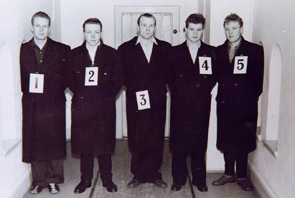

# Inference for proportions {#lab8}

```{r setup, include=FALSE}
knitr::opts_chunk$set(echo = TRUE)
knitr::opts_chunk$set(results = 'hold')
# knitr::opts_chunk$set(class.source = 'Rcode')
knitr::opts_chunk$set(
  class.output  = "Rout text-muted",
  class.message = "Rout text-info",
  class.warning = "Rout text-warning",
  class.error   = "Rout text-danger"
)

set.seed(12222)

library(tidyverse)
library(infer)

lineup <- read_csv("https://raw.githubusercontent.com/gregcox7/StatLabs/main/data/lineup.csv")
fairness <- read_csv("https://raw.githubusercontent.com/gregcox7/StatLabs/main/data/lineup_fairness.csv")
```

```{r, echo=FALSE, out.width="100%"}

```

In this session, we will collect and apply all the techniques we have encountered for doing inferential statistics with proportions:

* [Hypothesis testing](#lab5) for deciding whether two proportions are significantly different from one another.
* [Confidence intervals](#lab6) for representing what values of a population proportion are plausible based on a sample.
* [Using the normal distribution](#lab7) as a mathematical model for a sampling distribution.

Many of the exercises in this activity may require you to look back to these previous sessions for hints and guidance as we apply these techniques to address some important questions about eyewitness memory.

To help with the later exercises in this session, be sure to **download the worksheet for this session** by right-clicking on the following link and selecting "Save link as...": [Worksheet for Lab 8](https://raw.githubusercontent.com/gregcox7/StatLabs/main/worksheets/ws_lab08.Rmd).  Open the saved file (which by default is called "ws_lab08.Rmd") in RStudio.

## Get to know the data

**Eyewitness testimony** is an important tool for establishing whether a suspect may or may not have committed a crime.  If an eyewitness identifies a suspect as the person they saw at the scene of a crime, this is usually taken as strong evidence of the suspect's potential culpability.  These identifications are usually done within a **lineup**, where the eyewitness is shown a *suspect* among several other non-suspects known as *"fillers"*.  If the witness identifies the suspect as the person they saw, this information can be used to investigate that person and to provide evidence in court.

Despite the importance of eyewitness testimony, human memory is far from perfect.  It can be difficult for people to (a) remember details of a person's face in the midst of a stressful event like experiencing a crime; and (b) identify whether a suspect matches what they remember even when people are encountered in different settings (e.g., different light conditions, different clothes, different facial hair/makeup, etc.).  Because of these difficulties, eyewitnesses will sometimes make false identifications.  Moreover, subtle details of how the police present the lineup to the witness may influence how accurately they can pick out a suspect.  As a result, there is considerable interest in understanding how accurate eyewitness testimony is and how best to conduct police lineups to minimize false identifications.

The data for this session were collected as part of a long-term study of the use of police lineups [@WixtedEtAl2016].  The study was conducted in the field in 2013, in the Robbery Division of the Houston (Texas) Police Department.  The participants were eyewitnesses in various robbery cases.  For each case, the investigating officer constructed a lineup consisting of **six** photographs.  One photograph was of the **suspect** in the case, the remaining five were **fillers**, defined as non-suspects who still match the *physical description* of the suspect.  The lineups were shown either *simultaneously* (all six photos at once) or *sequentially* (one photo at a time).

![Examples of simultaneous and sequential photo lineups [@GepshteinEtAl2020].](img/lineup_types.png)

It is important to note that the investigators who showed these lineups to the eyewitnesses were **blind** as to which person in the lineup was the suspect.  As a result, the investigators would not be able to systematically *bias* the identifications that witnesses made.

Here are the first few rows of the data, to give a sense of what it looks like:

```{r echo = FALSE}
knitr::kable(head(lineup))
```

Each row represents the response from a single witness to a single six-person photo lineup.  There are just two variables:

* **presentation**: Whether the six photos were presented to the witness in "Sequential" or "Simultaneous" format.
* **ID**: Whether the witness identified the "Suspect" as being the person they saw, or whether they identified one of the "Filler" people instead.

## Confidence interval (bootstrapping): How accurate are eyewitnesses?

An important thing to keep in mind is that even if the witness identified the suspect in the lineup, that does not necessarily mean the suspect is guilty or even that they were present at the scene of the crime.  On the other hand, identifying one of the fillers is *definitely* a mistake, since these people are known to have nothing to do with the crime being investigated.

:::{.exercise}

Our first task in analyzing these data is to estimate the proportion of suspect ID's from these lineups.  For the moment, we will ignore whether the lineup was presented simultaneously or sequentially.  Our aim here is to build a 95% confidence interval that describes how often, on average, witnesses identify the suspect from the lineup.

a. Use the following chunk of code to calculate and store the proportion of suspect ID's in the lineup data.  **Hint:** look back at how we wrote the `specify` and `calculate` lines for Kobe's Field Goal Percentage, and keep in mind that we are focused on the proportion of *suspect* ID's, not the proportion of *filler* ID's.

```{r eval = FALSE}
lineup %>%
    specify(___) %>%
    calculate(___)
```

What is the observed proportion of suspect ID's?

b. Use the following chunk of code to use bootstrapping to build a sampling distribution for the proportion of suspect ID's.  We will use this distribution to find and visualize a 95% confidence interval.  Be sure to generate at least 1000 simulated datasets.

```{r eval = FALSE}
boot_prop_id_dist <- lineup %>%
    specify(___) %>%
    generate(___) %>%
    calculate(___)

boot_prop_id_ci <- boot_prop_id_dist %>%
    get_confidence_interval(level = 0.95)

boot_prop_id_dist %>%
    visualize() +
    shade_confidence_interval(boot_prop_id_ci)
```

Report and interpret the 95% confidence interval you found (stored under `boot_prop_id_ci` in the Environment pane).  What do you think this interval tells us about the accuracy of eyewitnesses in general?

:::

## Hypothesis test 1 (normal distribution): Are eyewitnesses better than chance?

In the previous exercise, you constructed a 95% confidence interval for the proportion of suspect ID's from photo lineups.  It is important to consider whether this proportion is higher than would be expected by chance.  If eyewitnesses were merely picking a person at random from the lineup, they would still pick the suspect some of the time just by chance.  We can frame this as a **research question** that can be tackled with a **hypothesis test**.

::: {.exercise}

Our research question is, "is the proportion of suspect ID's greater than would be expected if eyewitnesses were picking randomly?"

a. If eyewitnesses were picking randomly, what proportion of the time would we expect them to pick the suspect from the lineup?  (Recall that each lineup has six photographs.)
b. What are the null and alternative hypotheses corresponding to our research question?
c. Use the chunk of code below to help you use the *normal distribution* to model the sampling distribution assuming the null hypothesis is true.  For the first blank, this should be your answer to part [a].  For the second blank, see how many rows the `lineup` dataset has---this is our sample size.  For the third blank, this should be your answer to part [a] of the previous exercise.  The final result is a "Z score".

```{r eval = FALSE}
null_prop_id <- ___
sample_size <- ___
obs_prop_id <- ___

null_se <- sqrt(null_prop_id * (1 - null_prop_id) / sample_size)

z_score <- (obs_prop_id - null_prop_id) / null_se
```

What is the Z score you found?  In your own words, describe what this Z score tells us about how "extreme" our observed proportion is relative to what we would have expected if the null hypothesis were true.

d. Run the following chunk to find the p value (note that you will need to have completed part [c] for this to work!):

```{r eval = FALSE}
pnorm(z_score, lower.tail = FALSE)
```

Based on the p value, would you reject the null hypothesis?  What does this say about whether eyewitnesses might be picking the suspect just at random?

:::

## Hypothesis test 2 (permutation): Is there a difference between sequential and simultaneous lineups?

Recall that the lineups in this study were presented in one of two ways: either simultaneously or sequentially.  Laboratory studies of eyewitness memory (using mock crimes instead of real ones) have found that simultaneous lineups tend to produce more "correct" identifications of the suspect.  Will the same be true in the real lineups we have been analyzing?

::: {.exercise}

In this exercise, our research question is, "is there a difference in the proportion of suspect ID's between sequential and simultaneous lineups?"  We will address this question by using random permutation to conduct a hypothesis test.

a. What are the null and alternative hypotheses corresponding to our research question?
b. Use the following chunk of code to calculate the observed difference in the proportion of suspect ID's between sequential and simultaneous lineups:

```{r eval = FALSE}
obs_diff <- lineup %>%
    specify(___) %>%
    calculate(___, order = c("Sequential", "Simultaneous"))
```

What is the observed difference in proportions (this will be stored under `obs_diff` after you run your code)?  Based on this result, which type of presentation might produce a higher proportion of suspect ID's?

c. Use the following chunk of code to use random permutation to simulate at least 1000 datasets assuming the null hypothesis is true, then visualize where our observed difference falls relative to that distribution.  Remember to put one of "greater", "less" or "two-sided" for the `direction` setting in the last line; the appropriate setting depends on the alternative hypothesis (i.e., your answer to part [a]).  Also, make sure you've completed part [b], since this code needs `obs_diff` to run!

```{r eval = FALSE}
null_diff_dist <- lineup %>%
    specify(___) %>%
    hypothesize(___) %>%
    generate(___) %>%
    calculate(___, order = c("Sequential", "Simultaneous"))

null_diff_dist %>%
    visualize() +
    shade_p_value(obs_stat = obs_diff, direction = ___)
```

d. Use the following chunk to find the p value for this hypothesis test (make sure you have completed parts [b] and [c], since this code depends on both of them having been completed successfully):

```{r eval = FALSE}
null_diff_dist %>%
    get_p_value(obs_stat = obs_diff, direction = ___)
```

What was the p value you got?  Based on that p value, would you reject the null hypothesis?  What does your conclusion tell us about whether simultaneous or sequential presentation differ in how much they produce suspect ID's?

:::

## Hypothesis test 3 (permutation): Does it matter if police know who the suspect is?

Even though these lineups were conducted in the field, they were conducted in a well-controlled setting where the police investigator who assembled and presented the lineup was not working on that same case.  As a result, the investigator was "blind" in the sense that they did not know which of the pictures was the suspect.  This was to make sure that the investigator would not accidentally or intentionally bias the witness toward identifying the police's suspect.

What if the investigator who prepared the lineup *was* involved in the case and therefore knew who the suspect was?  The photos would still be shuffled prior to presenting them to the witness, so the investigator still wouldn't know which position the suspect is in.  In a simultaneous presentation, the suspect could appear in any location and in a sequential presentation, the suspect could appear at any spot in the order.  Even so, because the investigator is working the case, they might choose filler photographs in such a way as to make their suspect "stand out", biasing the witness to pick that person.

To study how much this matters, the authors of the study prepared a set of "mock" lineups.  In these cases, real photo lineups were presented to people who were *not* witnesses to the crime.  As a result, these people could only guess who the suspect was, since they had no information about the crime.  The authors of the study compared lineups that were prepared either by the investigating officer ("Not blind") or by an officer unfamiliar with the investigation ("Blind"---this is the type of lineup we analyzed above).

This is what the first few rows of the resulting data look like, which are stored under the name `fairness`:

```{r echo = FALSE}
knitr::kable(head(fairness))
```

There are two variables:

* **condition**: Whether the lineup was "Blind" or "Not blind"
* **ID**: Whether the mock witness picked the "Suspect" or a "Filler".

::: {.exercise}

Our research question is, "do mock witnesses make a higher proportion of suspect ID's for not-blind lineups as opposed to blind lineups?"  We will address this question by using random permutation to conduct a hypothesis test.

a. What are the null and alternative hypotheses corresponding to our research question?
b. Use the following chunk of code to calculate the observed difference in the proportion of suspect ID's between sequential and simultaneous lineups:

```{r eval = FALSE}
obs_fairness_diff <- fairness %>%
    specify(___) %>%
    calculate(___, order = c("Not blind", "Blind"))
```

What is the observed difference in proportions (this will be stored under `obs_fairness_diff` after you run your code)?  Is this result more consistent with the null hypothesis or with the alternative hypothesis?

c. Use the following chunk of code to use random permutation to simulate at least 1000 datasets assuming the null hypothesis is true, then visualize where our observed difference falls relative to that distribution.  Remember to put one of "greater", "less" or "two-sided" for the `direction` setting in the last line; the appropriate setting depends on the alternative hypothesis (i.e., your answer to part [a]).  Also, make sure you've completed part [b], since this code needs `obs_fairness_diff` to run!

```{r eval = FALSE}
null_fairness_diff_dist <- fairness %>%
    specify(___) %>%
    hypothesize(___) %>%
    generate(___) %>%
    calculate(___, order = c("Not blind", "Blind"))

null_fairness_diff_dist %>%
    visualize() +
    shade_p_value(obs_stat = obs_fairness_diff, direction = ___)
```

d. Use the following chunk to find the p value for this hypothesis test (make sure you have completed parts [b] and [c], since this code depends on both of them having been completed successfully):

```{r eval = FALSE}
null_fairness_diff_dist %>%
    get_p_value(obs_stat = obs_fairness_diff, direction = ___)
```

What was the p value you got?  Based on that p value, would you reject the null hypothesis?  What does your conclusion tell us about whether non-blind police lineups are "fair" in the sense that they do not bias a witness toward a particular suspect?

:::

## Wrap-up

In this session, we revisited many of the core concepts in statistical inference.  We used both simulation and the normal distribution to find confidence intervals for individual proportions and to conduct hypothesis tests for comparing proportions.