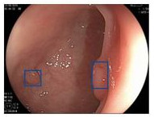

# Inference for proportions {#lab8}

```{r setup, include=FALSE}
knitr::opts_chunk$set(echo = TRUE)
knitr::opts_chunk$set(results = 'hold')
# knitr::opts_chunk$set(class.source = 'Rcode')
knitr::opts_chunk$set(
  class.output  = "Rout text-muted",
  class.message = "Rout text-info",
  class.warning = "Rout text-warning",
  class.error   = "Rout text-danger"
)

set.seed(12222)
```

```{r, echo=FALSE, out.width="100%"}
knitr::include_graphics("img/robodoc.jpeg")
```

In this session, we will collect all the techniques we have encountered for doing inferential statistics with proportions:

* [Hypothesis testing](#lab5) for deciding whether two proportions are significantly different from one another.
* [Confidence intervals](#lab6) for representing what values of a population proportion are plausible based on a sample.
* [Using the normal distribution](#lab7) as a mathematical model for a sampling distribution.

Many of the exercises in this activity will require you to look back to these previous sessions for hints and guidance as we apply these techniques to a new dataset that addresses the question of whether algorithms can help in making important medical diagnoses.

## Required packages

Make sure you have loaded both the `tidyverse` and `infer` packages from R's library:

```{r}
library(tidyverse)
library(infer)
```

## Get to know the data

The data we will be working with in this session are from a study of whether using an algorithm can aid in the detection of "adenomas" in images from colonoscopies [@Wang2019].  An adenoma is a benign tumor that can, in time, become malignant.  For this reason, it is important to detect them early so they can be removed before they lead to colon cancer.  Adenomas are detected by looking for particular structures in images like the one below:



As you can tell, looking for these structures is not always easy, even for experts.  Part of the problem is that the images are all very similar to one another and an expert's attention may not be drawn to the most important parts of the image.  In other words, even though the application is in medical diagnosis, the "problem" is psychological.  Perhaps a computer algorithm could help "solve" this problem by directing attention to the right parts of the image.  On the other hand, it might be that the algorithm gives bad suggestions.  The purpose of this study was to see whether the algorithm had an effect at all and, if so, whether it helped or hurt the detection of the adenomas that lead to colon cancer.

Run the line below to download the data into your R environment:

```{r}
colonoscopy <- read_csv("https://raw.githubusercontent.com/gregcox7/StatLabs/main/data/colonoscopy.csv")
```

Let's take a quick look at the data:

```{r}
colonoscopy
```

These data are from an **experiment**.  Each row represents a specific image like the one shown above.  Each image was randomly assigned to be analyzed using a different `method`:  `"Routine"` analyses involved a professional analyst looking at the image; `"Computer-aided"` analyses used an automated algorithm to identify potential adenomas which were then double-checked by a human analyst.  The variable `detected`, which is either `"Yes"` or `"No"`, indicates whether an adenoma was detected in the image.

## What are the point estimates?

Before we start doing any fancy inference, let's first get the **point estimates**, that is, the proportions of images identified as containing an adenoma using each method.  We can figure this out by hand using the counts in the table below:

```{r}
colonoscopy %>%
    group_by(method, detected) %>%
    summarize(n = n())
```

::: {.exercise}
Refer to the frequency table above to answer the following questions.

a. What is the proportion of images with an adenoma detected using the "Routine" method?
b. What is the proportion of images with an adenoma detected using the "Computer-aided" method?
c. Based on these point estimates, do these data suggest there may be a benefit to using the algorithm?

:::

## Confidence intervals

Before we consider the question of whether the difference in proportions between methods is large enough that it probably isn't due to chance, let's take a moment to look at the detection rates using the routine method.  In particular, based on this sample, we will construct a confidence interval.  This interval will reflect how often the routine analysis detects adenomas in the whole population.  First, we will find this interval using bootstrapping like we have before.  Then, we will use the normal distribution.

### Using bootstrapping

::: {.exercise}
Fill in the blanks in the code below to generate a bootstrap distribution for the proportion of adenomas detected using the `"Routine"` method and find the **95% confidence interval**.

The code will save the bootstrap distribution under the name `boot_dist_routine`.  The confidence interval will be saved under `boot_ci_routine`.  At the end, the code will `visualize` the result using a histogram with the confidence interval overlaid on top.

For guidance, be sure to refer to the [previous activity](#lab6).

```{r eval = FALSE}
boot_dist_routine <- colonoscopy %>%
    filter(method == "___") %>%
    specify(response = ___, success = "___") %>%
    generate(reps = 1000, type = "___") %>%
    calculate(stat = "___")

boot_ci_routine <- boot_dist_routine %>%
    get_confidence_interval(level = ___)

boot_dist_routine %>%
    visualize() +
    shade_confidence_interval(endpoints = boot_ci_routine)
```

a. What code did you use?
b. What is the 95% confidence interval you found?
c. In your own words, interpret what this interval means in the context of this scenario.
d. Based on the histogram, do you think a normal distribution will be a good fit to this sampling distribution?  Why or why not?

:::

### Using the normal distribution

Last time, we saw that we could, at least some of the time, use the normal distribution to approximate a sampling distribution.  An advantage of using the normal distribution is that we don't need to simulate the distribution, we can figure out what it would look like using some math.

In particular, the normal distribution says that the sampling distribution will have a mean equal to the point estimate from our sample ($\hat{p}$) and a standard error equal to $\sqrt{\frac{\hat{p} \left(1 - \hat{p} \right)}{n}}$ where $n$ is the sample size.

::: {.exercise}
Fill in the blanks below to get R to remember the point estimate for the "Routine" method that you found earlier (this is our $\hat{p}$) as well as the total number of observations using the "Routine" method (this is our $n$).  The corresponding standard error is then calculated and saved in R under the name `se_routine`.

```{r eval=FALSE}
p_hat_routine <- ___
n_routine <- ___
se_routine <- sqrt((p_hat_routine * (1 - p_hat_routine)) / n_routine)

se_routine
```

a. What is the standard error?
b. Fill in the blanks in the following code to use the normal distribution to find the lower and upper boundaries of the 95% confidence interval (`ci_lower` and `ci_upper`, respectively).  What did you get for the lower and upper boundaries of the confidence interval?
```{r eval=FALSE}
ci_lower <- qnorm(p = 0.025, mean = ___, sd = ___, lower.tail = TRUE)
ci_upper <- qnorm(p = 0.025, mean = ___, sd = ___, lower.tail = FALSE)
```
c. How does the interval you just found in part (b) compare to the 95% CI you found earlier using bootstrapping?  Are the boundaries similar or different?

:::

## Hypothesis test

Now that we have a handle on how well a routine analysis can detect adenomas, does using an algorithm have any effect at all?  In other words, our **research question** is: *is there a difference in the proportion of detected adenomas using a routine method vs. a computer-aided method?*  We will address this question using a hypothesis test, first doing it with randomization and then the normal distribution.

Note that we are interested in whether there is *any* effect of using the computer-aided method because, as noted above, it is possible that the algorithm could help by directing attention to more important parts of the image, but it could also hurt by directing attention to uninformative parts of the image.  We want to make sure that our test is sensitive to *both* of these possible outcomes.

::: {.exercise}
--

a. What is the explanatory variable and what is the response variable?
a. What are the null and alternative hypotheses?

:::

Many of the techniques we will use are the same as those we used in an [earlier activity](#lab5), just applied to the current `colonoscopy` data instead.  Be sure to refer to that earlier activity for hints and guidance.

### The point estimate of the difference

::: {.exercise}
Fill in the blanks in the code below to find the point estimate of the *difference* in proportions between routine and computer-aided methods.

For the `specify` line, remember that the first part goes `[name of response variable] ~ [name of explanatory variable]`.

```{r eval = FALSE}
obs_diff <- colonoscopy %>%
    specify(___ ~ ___, success = "___") %>%
    calculate(stat = "diff in props", order = c("Computer-aided", "Routine"))

obs_diff
```

What was the code you used?

:::

### Using randomization

First, we will conduct our hypothesis test by using randomization to simulate what the data would have looked like if the null hypothesis were true.

::: {.exercise}
Fill in the blanks in the code below to use random permutation to simulate what the data would have looked like if the null hypothesis were true.  The resulting sampling distribution will be saved under `null_dist_random` and then visualized using a histogram.

*Hint:* For the last blank, there are three "legal" options: you can put either `direction = "less"`, `direction = "greater"`, or `direction = "two-sided"` depending on what the alternative hypothesis is.

```{r eval = FALSE}
null_dist_random <- colonoscopy %>%
    specify(___ ~ ___, success = "___") %>%
    hypothesize(null = "___") %>%
    generate(reps = 1000, type = "___") %>%
    calculate(stat = "diff in props", order = c("Computer-aided", "Routine"))

null_dist_random %>%
    visualize() +
    shade_p_value(obs_stat = obs_diff, direction = "___")
```

a. What was the code you used?
b. Based on the visualization you just made, would the observed difference in proportions be plausible if the null hypothesis were true?

:::

### Using the normal distribution

To see how the hypothesis test would go if we had used the normal distribution, we actually don't need to do very much to our code.  The major difference is that the `stat` that we calculate is called a `"z"`, that is, the code will directly calculate the $Z$ value.  As we know, a $Z$ value is given by

$$
\begin{align}
Z & = \frac{\text{Point estimate} - \text{Null mean}}{\text{Standard error}} \\
Z & = \frac{(\hat{p}_1 - \hat{p}_2) - 0}{SE}
\end{align}
$$

where $(\hat{p}_1 - \hat{p}_2)$ is the observed difference in proportions.  As a result, a $Z$ value represents how unusual our observed difference is relative to the distribution of differences that would be expected if the null hypothesis were true.

::: {.exercise}

--

a. Fill in the blanks in the code below to find the $Z$ value for the observed difference.  What was the $Z$ value you found?
```{r eval=FALSE}
obs_z <- colonoscopy %>%
    specify(___ ~ ___, success = "___") %>%
    calculate(stat = "z", order = c("Computer-aided", "Routine"))

obs_z
```
b. Run the following code to visualize where our observed difference falls on the normal distribution.  Compare the code below to the code we used in the previous exercise; what is similar and what is different?
```{r eval=FALSE}
null_dist_normal <- colonoscopy %>%
    specify(detected ~ method, success = "Yes") %>%
    assume("z")

null_dist_normal %>%
    visualize() +
    shade_p_value(obs_stat = obs_z, direction = "two-sided")
```
c. Use the following code to find the $p$ value, that is, the proportion of differences that would be at least as extreme as the one we observed, if the null hypothesis were true.  What is the $p$ value you got?
```{r eval=FALSE}
null_dist_normal %>%
    get_p_value(obs_stat = obs_z, direction = "two-sided")
```
d. Assuming we adopt a significance level of 0.05, do we reject the null hypothesis?  What can we conclude about the relationship between using computer-aided analysis and accuracy of adenoma detection?  (Recall that this is an *experiment*.)
e. Would we have ended up making a different decision using the randomization procedure in the previous section?

:::

<!-- To use the normal distribution rather than randomization, we need to know its mean and standard deviation.  The mean is equal to what the different would be if the null hypothesis were true, namely, 0.  The standard error is found using the formula -->

<!-- $$ -->
<!-- SE = \sqrt{\hat{p}_{\text{Pool}} \left(1 - \hat{p}_{\text{Pool}} \right) \left(\frac{1}{n_1} + \frac{1}{n_2} \right)} -->
<!-- $$ -->

<!-- where $\hat{p}_{\text{Pool}}$ is the "pooled" proportion across the two groups being compared and $n_1$ and $n_2$ are the total numbers of observations in each group.  We can find the SE using the frequency table we found at the beginning of the session, which we reproduce here so you don't have to scroll: -->

<!-- ```{r echo = FALSE} -->
<!-- colonoscopy %>% -->
<!--     group_by(method, detected) %>% -->
<!--     summarize(n = n()) -->
<!-- ``` -->

<!-- ::: {.exercise} -->
<!-- Fill in the blanks below to get R to remember the pooled proportion (`p_hat_pool`) and the two group sizes (`n_routine` and `n_aided`).  The standard error for the difference in proportions is then calculated and saved in R under the name `se_diff`. -->

<!-- The pooled proportion is the *total number of detected adenomas* divided by the *total number of all images*. -->

<!-- ```{r eval=FALSE} -->
<!-- p_hat_pool <- ___ -->
<!-- n_routine <- ___ -->
<!-- n_aided <- ___ -->
<!-- se_diff <- sqrt(p_hat_pool * (1 - p_hat_pool) * ((1 / n_routine) + (1 / n_aided))) -->

<!-- se_diff -->
<!-- ``` -->

<!-- a. What is the standard error? -->
<!-- b. Fill in the blanks in the following code to use the normal distribution to find the lower and upper boundaries of the 95% confidence interval (`ci_lower` and `ci_upper`, respectively). -->
<!-- ```{r eval=FALSE} -->
<!-- ci_lower <- qnorm(p = 0.025, mean = ___, sd = ___, lower.tail = TRUE) -->
<!-- ci_upper <- qnorm(p = 0.025, mean = ___, sd = ___, lower.tail = FALSE) -->
<!-- ``` -->
<!-- What did you get for the lower and upper boundaries of the confidence interval? -->
<!-- c. How does the interval you just found in part (b) compare to the 95% CI you found earlier using bootstrapping?  Are the boundaries similar or different? -->

<!-- ::: -->

## Wrap-up

In this session, we revisited many of the core concepts in statistical inference.  We used both simulation and the normal distribution to find confidence intervals for individual proportions and to conduct hypothesis tests for comparing proportions.