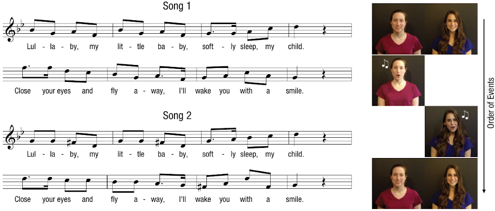

# Inference about a mean {#lab9}

```{r setup, include=FALSE}
knitr::opts_chunk$set(echo = TRUE)
knitr::opts_chunk$set(results = 'hold')
# knitr::opts_chunk$set(class.source = 'Rcode')
knitr::opts_chunk$set(
  class.output  = "Rout text-muted",
  class.message = "Rout text-info",
  class.warning = "Rout text-warning",
  class.error   = "Rout text-danger"
)

library(tidyverse)
library(infer)

gss <- read_csv("https://raw.githubusercontent.com/gregcox7/StatLabs/main/data/gss2010.csv")
lullaby <- read_csv("https://raw.githubusercontent.com/gregcox7/StatLabs/main/data/lullaby_wide.csv")

set.seed(12222)
```

```{r, echo=FALSE, out.width="100%"}

```

In this session, we will learn about doing inference when the response variable is *numerical* rather than *categorical*.  Specifically, we will focus on how we can use data to draw inferences about what a population average might be, based on a sample.  This is very similar to how we have been drawing inferences about a population proportion.  As we shall see, simulation methods like bootstrapping work just the same with a numerical response variable as they do with a categorical response variable.  Where they differ is that the mathematical model for proportions is a *normal* distribution whereas the mathematical model for means is a **T distribution**.

These methods are also critical for estimating and testing differences within a *pair* of measurements.  Because each observation is *paired* with another, in the end we are just analyzing a single number for each case, which is the *difference* within each pair.

To help with the later exercises in this session, be sure to **download the worksheet for this session** by right-clicking on the following link and selecting "Save link as...": [Worksheet for Lab 9](https://raw.githubusercontent.com/gregcox7/StatLabs/main/worksheets/ws_lab09.Rmd).  Open the saved file (which by default is called "ws_lab09.Rmd") in RStudio.

## Overworked?

To begin, we will first address some questions about the *number of hours people work per week*.  The relevant data was collected as part of the General Social Survey (GSS) in 2010.  The first few rows of the survey results look like this:

```{r echo = FALSE}
knitr::kable(head(gss))
```

There are a number of interesting variables here, but the one that we are interested in is called `HoursWorked`.  It is the number of hours that each person in the survey reports working per week.

::: {.exercise}

Use the following chunk of code to make a histogram of the number of hours worked per week, based on the GSS data.  In R, the dataset is called `gss` and number of hours worked per week is recorded as the variable `HoursWorked`.  Play around with different binwidths until you find one that seems to give a good sense of the shape of the data.

```{r eval = FALSE}
___ %>%
    ggplot(aes(x = ___)) +
    geom_histogram(binwidth = ___)
```

a. Describe the shape of the distribution of `HoursWorked`, noting whether it is skewed or symmetrical, how many modes it has, and whether there may be any outliers.
b. Do these data appear to satisfy the "normality" condition for whether we can use a mathematical model?

:::

### Confidence interval via bootstrapping

As we've noted, we can still use **bootstrapping** to construct a sampling distribution.  But now, instead of a sampling distribution for a proportion, we will build a sampling distribution for the *mean*.

::: {.exercise}

Use the following chunk of code to use bootstrapping to build a sampling distribution for the mean number of hours worked per week, using the `gss` data.  Set `level` to give us 95% confidence interval and be sure to generate at least 1000 repetitions.  *Hint:* this will look a lot like when we were working with proportions, but with one important difference---instead of "prop" as the `stat`istic we calculate for each simulated dataset, we calculate the `mean`.

```{r eval = FALSE}
hours_boot_dist <- ___ %>%
    specify(response = ___) %>%
    generate(reps = ___, type = "___") %>%
    calculate(stat = "___")

hours_boot_ci <- hours_boot_dist %>%
    get_confidence_interval(level = ___)

hours_boot_dist %>%
    visualize() +
    shade_confidence_interval(hours_boot_ci)
```

a. Report the 95% confidence interval you found and interpret it in context.
b. Based on your results, is it plausible that people on average work around 40 hours per week?
c. In your own words, describe the difference between the histogram you made in the previous exercise and the one you made in this exercise.  They are both histograms that show a distribution of numbers, but the numbers mean different things.

:::

### Confidence interval via mathematical model

In addition to bootstrapping, when the conditions are met, we can also use a mathematical model for the sampling distribution.  This model is the **T distribution**.  To use it, we need to know the **standard error** of the mean, which we can calculate using this formula:

$$
SE = \frac{s}{\sqrt{n}}
$$

where $s$ is the sample standard deviation and $n$ is the sample size.

Once we have the standard error, we use it to construct a confidence interval using this formula:

$$
\bar{x} \pm t^{\star}_{df} \times SE
$$

Remember that $t^{\star}_{df} \times SE$ is the "margin of error" and represents how many standard error's from the mean ($\bar{x}$) we believe the true population parameter might be.

We need the T distribution to find $t^{\star}_{df}$.  As we've noted, the T distribution has a different shape depending on how many **degrees of freedom** it has.  The number of degrees of freedom is one less than the sample size:

$$
df = n - 1
$$

::: {.exercise}

Fill in the blanks in the code below to use R to carry out the calculations needed to use the T distribution to find a 95% confidence interval.  This exercise is about translating the mathematical formulas above into meaningful labels.  Notice that the first part of the chunk finds and stores the `sample_mean`, `sample_sd` (sample standard deviation), and `sample_size`.  Use these labels to fill in the appropriate blanks.  You will also need to supply a number for the `confidence_level` (which should be between 0 and 1, like in the previous exercise).

```{r eval=FALSE}
sample_mean <- gss %>%
    summarize(mean(HoursWorked)) %>%
    pull()

sample_sd <- gss %>%
    summarize(sd(HoursWorked)) %>%
    pull()

sample_size <- gss %>%
    summarize(n()) %>%
    pull()

standard_error <- ___ / sqrt(___)

degrees_of_freedom <- ___ - 1

confidence_level <- ___

tail_probability <- 1 - (1 - confidence_level) / 2

critical_t <- qt(p = tail_probability, df = degrees_of_freedom)

c(___ - critical_t * standard_error, ___ + critical_t * standard_error)
```

a. What was the 95% confidence interval that you found?
b. Compare the 95% confidence interval you found in this exercise with the one you found in the previous exercise using bootstrapping.  Are they similar?  Why might you expect them to be at least a little different?

:::

### Hypothesis test via mathematical model

Finally, we can use the T distribution to conduct a hypothesis test.  To do this, we calculate a **T score** which represents how far our observed result is from what we would expect if the null hypothesis were true.  We can then use the T distribution to figure out the $p$ value, i.e., the probability of observing a T score at least as extreme as the one we observed.

Just like a Z score, a T score is defined as the difference between a point estimate and its hypothesized value, relative to the standard error:

$$
\begin{align*}
T & = \frac{\text{point estimate} - \text{null value}}{\text{standard error}} \\
& = \frac{\bar{x} - \mu_0}{SE}
\end{align*}
$$

::: {.exercise}

Our research question is, "do people on average work *more* than 40 hours per week?"  Fill in the blanks in the code below to find the T score.  The final line will calculate the $p$ value using the T distribution.  *Hint:* Like in the last exercise, use the *names* of stored values (like `sample_size`) to fill in each blank, with the exception of `null_value` which you will need to specify based on our research question.

```{r eval=FALSE}
sample_mean <- gss %>%
    summarize(mean(HoursWorked)) %>%
    pull()

sample_sd <- gss %>%
    summarize(sd(HoursWorked)) %>%
    pull()

sample_size <- gss %>%
    summarize(n()) %>%
    pull()

null_value <- ___

standard_error <- ___ / sqrt(___)

degrees_of_freedom <- ___ - 1

t_score <- (___ - ___) / ___

pt(q = t_score, df = ___, lower.tail = FALSE)
```

Based on the p value you got, would you reject the null hypothesis?  What do you conclude and why?

:::

## Do infants prefer people who sing familiar songs?

Sam Mehr, Lee Ann Song (aptly named), and Liz Spelke [@MehrEtAl2016] were interested in how infants use music as a social cue.  When an infant sees someone for the first time, are they more likely to be attracted to that person if they sing a song that the infant already knows?

@MehrEtAl2016 conducted an experiment in which a child's parents were taught a new melody and were instructed to sing it to their child at home over the course of 1--2 weeks.  After this exposure period, the parents brought their infant back to the lab.  The infant was seated in front of a screen showing videos of two adults the infant had never seen before.  At first, the two adults just smiled in silence.  They recorded the proportion of the time that the infant looked at each stranger during this "before" phase.  Then, one of these people sang the melody that the parents had been singing for 1--2 weeks, while the other sang a totally new song.  Finally, during the "after" phase, the infant saw the same videos of each person silently smiling and the researchers recorded the proportion of the time spent looking at the person who sang the familiar song.  Will infants tend to look more at the stranger who sang the familiar song?

### Check out the data

First, let's take a look at the data, which are saved in R under the name `lullaby`.  These are the first few rows:

```{r echo = FALSE}
knitr::kable(head(lullaby))
```

Each row is data from a specific infant.  There are three variables in this dataset:

* "id": A number identifying each infant in the study.
* "Before": In the phase before the infants heard anyone sing, what proportion of the time did they look at the person who would eventually sing the familiar melody?
* "After": In the phase after the infants heard the two people sing, what proportion of the time did they look at the person who sang the familiar melody?

::: {.exercise}

Answer the following questions based on your understanding of how the study was designed:

a. If an infant showed no preference during either the Before or After phase, what proportion of the time in that phase would they spend looking at the person who sang the familiar melody?
b. If an infant did not change who they looked at after hearing each person sing, what would the difference in looking proportions be between the Before and After phase?

:::

### Examine the distribution of differences

Our **research question** is whether hearing the two people sing affected infant's viewing preferences.  As a result, we are interested in the **difference** between `After` and `Before`.  To find this for each infant, we will use R's `mutate` function:

::: {.exercise}

Run this chunk of code and examine the result:

```{r eval = FALSE}
lullaby %>%
    mutate(diff = After - Before)
```

a. In your own words, describe what the line of code `mutate(diff = After - Before)` did.
b. Refer to the description of the study given above.  What does a positive value of `diff` say about how an infant's looking preferences changed?  What does a negative value of `diff` say about how their preferences changed?

:::

The nice thing about that `mutate` line is that we can add more code after it that uses the `diff` variable we created in that line.  For example, we can make a histogram of the differences in looking time from before to after:

::: {.exercise}

Use the following chunk to make a histogram of the `diff`erences in looking times from Before to After hearing the people sing.

```{r eval = FALSE}
lullaby %>%
    mutate(diff = After - Before) %>%
    ggplot(aes(x = ___)) +
    geom_histogram(binwidth = 0.1)
```

a. Describe the shape of the distribution (be sure to note the number of modes, skewness, and whether there may be any outliers).
b. Based on the histogram, do these data appear to satisfy the conditions required for using a mathematical model (specifically, the T distribution)?  Why or why not?
c. Based on the histogram, does it seem like the average preference may have changed after hearing the people sing?  If so, in what direction?

:::

### Confidence interval by bootstrapping

::: {.exercise}

To begin, let's use bootstrapping to construct a confidence interval for the difference in looking time between Before and After.  This confidence interval will describe how much hearing someone sing a familiar melody changes infants' looking preferences.

Fill in the blanks in the code below to construct a **95% confidence interval** for the mean difference in looking proportion from before to after.  Be sure to refer to code from earlier in the session, as well as previous labs, for guidance.  (*Hint:* if you're looking for the name of the response variable, remember that we are doing inference about a *difference*.)

```{r eval = FALSE}
lullaby_boot_dist <- lullaby %>%
    mutate(diff = After - Before) %>%
    specify(response = ___) %>%
    generate(reps = ___, type = "___") %>%
    calculate(stat = "___")

lullaby_boot_ci <- lullaby_boot_dist %>%
    get_confidence_interval(level = ___)

lullaby_boot_dist %>%
    visualize() +
    shade_confidence_interval(lullaby_boot_ci)
```

Based on the confidence interval you found, is there evidence for a significance difference in looking preferences from before to after hearing the people sing?  Explain your reasoning.

:::

### Hypothesis test via mathematical model

::: {.exercise}

Next, we will use a mathematical model to conduct a hypothesis test.  This hypothesis test will address the **research question**, "is there a difference in infants' average looking behavior from before to after hearing the two strangers sing?"

a. What are the null and alternative hypotheses corresponding to our research question?
b. Fill in the blanks in the code below to calculate the observed T score and visualize where it falls relative to the null distribution.  Based on the visualization you made, would our observed data be likely or unlikely if the null hypothesis were true?  (*Hint:* for `mu`, this is the *null value*; and for the last blank, check how we have filled it in in previous labs depending on what our alternative hypothesis is.)

```{r eval=FALSE}
lullaby_obs_t <- lullaby %>%
    mutate(diff = After - Before) %>%
    specify(response = ___) %>%
    hypothesize(null = "point", mu = ___) %>%
    calculate(stat = "t")

lullaby_null_dist <- lullaby %>%
    mutate(diff = After - Before) %>%
    specify(response = ___) %>%
    hypothesize(null = "point", mu = ___) %>%
    assume("t")

lullaby_null_dist %>%
    visualize() +
    shade_p_value(obs_stat = lullaby_obs_t, direction = "___")
```

c. Fill in the blanks in the code below to get the $p$ value (make sure you've done part b first!).  What did you get for the $p$ value?  Would you reject the null hypothesis?

```{r eval=FALSE}
lullaby_null_dist %>%
    get_p_value(obs_stat = lullaby_obs_t, direction = "___")
```

d. Give a one-sentence summary of what the outcome of this hypothesis test tells us about how infant looking behavior is affected by hearing someone sing a familiar melody.

:::

## Wrap-up

In this session, we saw how we can use the same kinds of computational techniques we applied to proportions---particularly bootstrapping---to construct confidence intervals and perform hypothesis tests about means.  We also saw how to use the T distribution to find confidence intervals and conduct hypothesis tests.

In the second part, we used R's `mutate` function to compute the differences within each participant.  In the end, we were able to address the question of whether infants respond favorably (by looking more) to a stranger who sings a familiar song, giving us insight into the potential social importance of music.
