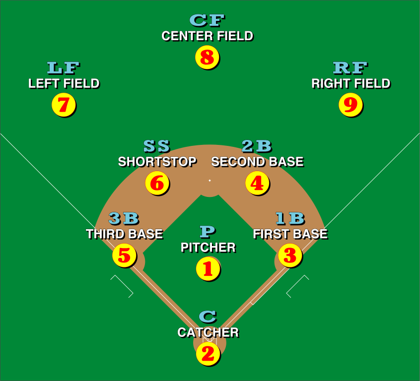

# Comparing Independent Samples {#lab10}

```{r setup, include=FALSE}
knitr::opts_chunk$set(echo = TRUE)
knitr::opts_chunk$set(results = 'hold')
# knitr::opts_chunk$set(class.source = 'code-style')
# knitr::opts_chunk$set(class.output = 'out-style')
set.seed(12222)
```

```{r, echo=FALSE, out.width="100%"}

```

> Put umpteen people in two groups at random.<br>
> Social dynamics make changes in tandem:<br>
> Members within groups will quickly conform;<br>
> Difference between groups will soon be the norm.
>
> --- John Kruschke [@Kruschke2015]

In this session, we will see how to compare multiple independent samples in R.  Last time, we got a sense of how to compare two independent samples by using a $t$ test to test the null hypothesis that two samples come from populations with the same mean.  We will see a bit more of that in this session, but of course $t$ tests are limited to comparing just two samples at a time.  **Analysis of Variance (ANOVA)**, as we've seen, let's us compare multiple samples all at once.

In this session, we will cover

1. Doing independent samples $t$ tests in R.
2. Doing ANOVA in R.
3. Checking the assumptions of these tests.
4. Some neat tricks for manipulating data in R.
    + Using `mutate` to make new variables out of ones we already have.
    + Using `filter` to look at "subsets" of a whole dataset based on specific criteria.

Before we begin, let's make sure we get our hands on the `tidyverse` package, as well as the `infer` package we used last time.  We will also need the `magrittr` package.

```{r}
library(tidyverse)
library(infer)
library(magrittr)
```

## Get to know the data

The data for today's session hearkens back to where many of us (at least who grew up in the United States) first encountered the idea of "statistics": baseball.  These are batting records for Major League players in the 2018 season:

```{r}
batting <- read_csv("https://raw.githubusercontent.com/gregcox7/StatLabs/main/data/batting2018.csv")
```

Click on the data in R's Environment pane to get a look.  Each row is a different player and each column tells us some useful information.  

* **Name**: The player's name.
* **Team**: The team for which the player played.
* **Group**: Depends on primary position played, groups them into infield, outfield, battery, and designated hitter.
* **Position**: The primary position played.  These are abbreviated:
    + 1B: First base
    + 2B: Second base
    + 3B: Third base
    + C: Catcher
    + CF: Center field
    + DH: Designated hitter
    + LF: Left field
    + P: Pitcher
    + RF: Right field
    + SS: Shortstop
* **Games_Played**: The number of games played in the 2018 regular seaosn.
* **AB**: Number of "at bats".
* **R**: Number of runs scored.
* **H**: Number of hits while at bat.
* etc.

To get a sense of where the different positions in baseball are, take a look at this picture:

```{r, echo=FALSE, out.width="100%"}

```

### Batting average

A player's "batting average" is the *proportion* of times they made a hit while at bat.  For example, if a player had 400 at bats that season and had a hit 100 of those times, their batting average would be $100 / 400 = 0.25$.  Note that it is conventional in baseball stats to multiply that average by 1000 to get a number between 0 and 1000 instead of one between 0 and 1, but we'll just keep things simple and stick with using a standard proportion between 0 and 1.

If we were interested in studying the batting performance of just one player, we could use our old friend the *binomial* distribution.  After all, we have a number of repeated events (at-bats) each of which can have an outcome of interest (a hit).  But we are interested today in comparing different players, not studying the performance of a specific one.

In particular, we'd like to find the batting averages for every player in our dataset.  We have the relevant numbers already in our dataset in the H and AB columns.  Specifically, the batting average for each player is `H / AB`, the number of hits made divided by the number of opportunities (at-bats).  While we could do this by hand for each player, that would be pretty annoying.  Instead, we can use R to do that work using `mutate`:

```{r}
batting %>%
    mutate(AVG = H / AB)
```

As usual, the first line told R what data we were working with (`batting`).  The second line `mutate`d two of the variables `H` and `AB` into `AVG`, each player's batting average.  Let's spend a bit of time on that `mutate` line, because it is extremely useful.

#### Making new variables with `mutate`

First, note that "AVG" is just the name that we decided.  We could replace "AVG" with a more descriptive name like "Batting_Average":

```{r}
batting %>%
    mutate(Batting_Average = H / AB)
```

Now the new column is called "Batting_Average" instead of "AVG".

We can use this to make some more variables as well.  Try using `mutate` to create a new variable called `Total_Bases` which will count the total number of bases earned by a player.  This number is equal to `H + Doubles + 2 * Triples + 3 * HR`.  After filling in the blank below, the result should look like the following:

```{r eval = FALSE}
batting %>%
    mutate(Total_Bases = ___)
```

```{r echo = FALSE}
batting %>%
    mutate(Total_Bases = H + Doubles + 2 * Triples + 3 * HR)
```

```{exercise, ex1001, echo = TRUE, eval = FALSE}

What code did you write to use `mutate` to create the new `Total_Bases` variable?

```

#### Updating our data with new variables

So far, we've left our original `batting` dataset untouched because we haven't told R to remember the dataset with the new variables we've created.  Since we'll be using the batting average later, let's tell R to replace our original `batting` data with the updated version including the `AVG` column:

```{r}
batting <- batting %>%
    mutate(AVG = H / AB)
```

By adding `batting <-` to the beginning, we've told R to remember our updated data (with the new `AVG` column) under the same name (`batting`) as our original data.

### Batting average by position

Now let's see whether the batting average looks much different between different positions.  For example, we'd expect that pitchers would, in general, have pretty low batting averages because that's not their job.

To get a sense of the differences, we will make a set of histograms:

```{r}
batting %>%
    ggplot(aes(x = AVG)) +
    geom_histogram(binwidth = 0.05) +
    facet_wrap("Position")
```

That's pretty hard to interpret!  Let's add an option to the last line (`facet_wrap`) to help us out.  This option is `scales = "free_y"`, meaning that the `scale` of the vertical axes (the `y` axis) on each histogram are allowed to be different (they are "`free`"):

```{r}
batting %>%
    ggplot(aes(x = AVG)) +
    geom_histogram(binwidth = 0.05) +
    facet_wrap("Position", scales = "free_y")
```

This is a bit easier to see, and we can immediately tell there are some differences between different positions.

```{exercise, ex1002, echo = TRUE, eval = FALSE}

Why does the histogram for `DH` (Designated Hitter) look so different from the others? (Hint: look at the numbers on the vertical axis of the `DH` histogram.)  What seems to be different about the histogram for `P` (Pitchers)?

```

To get a sense of what might be causing the unusual shape of the histogram for pitchers, let's construct another histogram that looks at `AB`, the number of at-bats.

```{r eval = FALSE}
batting %>%
    ggplot(aes(x = ___)) +
    geom_histogram(binwidth = ___) +
    facet_wrap("Position", scales = "free_y")
```

```{r echo = FALSE}
batting %>%
    ggplot(aes(x = AB)) +
    geom_histogram(binwidth=25) +
    facet_wrap("Position", scales = "free_y")
```

```{exercise, ex1003, echo = TRUE, eval = FALSE}

What code did you use to make histograms for at-bats (`AB`)?  What did you pick for the `binwidth` and why?

```

Based on these new histograms, it looks like Pitchers don't have nearly as many at-bats as players in other positions, so we don't have as many opportunities to see their batting ability.  This suggests that we can't think about pitchers the same way as we would other positions.

## Independent samples $t$ test: Infield vs. Outfield

We will first use an independent samples $t$ test to compare batting averages between infielders and outfielders.  An infielder is a player who plays a position within the bases (1B, 2B, 3B, and SS) while an outfielder is a player who plays a position further away (LF, CF, RF).  Designated hitters (DH) do not play on the field at all, and pitchers and catchers are considered part of a different category (the "battery").  These groupings are given by the **Group** variable in our dataset.

To compare just infielders to outfielders we need to **filter** our data so that it only contains players from those two groups.

### Filtering data with `filter`

R makes it easy to filter out data we don't need from a particular analysis.  The code for this is, helpfully, called `filter`.  Let's see it in operation:

```{r}
batting %>%
    filter(Group != "Battery")
```

The second line `filters` the data according to the criteria in the parentheses.  The `!=` symbol means "not equal", so `Group != "Battery"` can be read as "group is not equal to battery (pitcher or catcher)".  The result of the filtering operation is a subset of the original data that excludes players with battery positions, i.e., pitchers and catchers.

We could also filter out designated hitters using a similar chunk of code.

```{r eval=FALSE}
batting %>%
    filter(___)
```

```{r echo=FALSE}
batting %>%
    filter(Group != "DH")
```

```{exercise, ex1004, echo = TRUE, eval = FALSE}

What code would filter out designated hitters?  *Hint: what is the abbreviation for designated hitters?*

```

Finally, we can combine filters just by listing them.  The following bit of code filters out both pitchers and catchers, so the resulting data includes only infield and outfield players.

```{r}
batting %>%
    filter(Group != "Battery", Group != "DH")
```

### Doing the $t$ test

Last time, we saw how to carry out the individual components of the computation involved in an independent samples $t$ test, but today we will see how to do it in a more streamlined form similar to how we did it with one-sample and paired samples $t$ tests last time.

First, let's make ourselves more histograms to get a sense of whether there is anything we should be concerned about in our data

```{r}
batting %>%
    filter(Group != "Battery", Group != "DH") %>%
    ggplot(aes(x = AVG)) +
    geom_histogram(binwidth=0.05) +
    facet_wrap("Group", scales = "free_y")
```

Nothing too wonky, so we should be good to go to conduct our $t$ test.

#### State your hypotheses

Our **research question** is, "is there a difference in batting averages between infield and outfield players?"  Because our research question is about *any* kind of difference, we will be doing a **two-sided** test.  Specifically, our **null hypothesis** is that there is no difference in the population mean batting average for infielders and outfielders ($H_0$: $\mu_1 - \mu_2 = 0$) while our **alternative hypothesis** is that there is some difference ($H_1$: $\mu_1 - \mu_2 \neq 0$).

#### Set your alpha level

Let's choose an **alpha level of 0.05**.

#### Find the $t$ value

We will use the `infer` package to visualize the $t$ test like last time.  First, we need to get our $t$ value:

```{r}
t_value <- batting %>%
    filter(Group != "Battery", Group != "DH") %>%
    specify(AVG ~ Group) %>%
    calculate(stat = 't')
```

We told R to remember the result under the label `t_value`.  Aside from that, the first two lines are the same as above and tell R what data we are working with; it takes two lines because the second line is the `filter`ing operation.  The third line looks interesting:  Remember that last time we used `specify` to tell R what our "response" variable was.  Now, we have both a response variable and an "explanatory" variable, `Group`.  By "explanatory", we mean that the `Group` variable is what divides the response variable into two independent groups, and we are seeing if that variable *explains* differences between those groups.  `AVG ~ Group` says that the variable on the left of the `~` (`AVG`) is the **response** variable (the one we want to analyze) and the variable on the right (`Group`) is what we are testing to see if it **explains** differences in our response variable.  Finally, the last line just tells R to calculate the $t$ statistic.

#### Find the $p$ value

We can now visualize where our sample falls on the appropriate $t$ distribution:

```{r}
batting %>%
    filter(Group != "Battery", Group != "DH") %>%
    specify(AVG ~ Group) %>%
    hypothesize(null = 'point', mu = 0) %>%
    visualize(method = 'theoretical') +
    shade_p_value(obs_stat = t_value, direction = 'two-sided')
```

```{exercise, ex1005, echo = TRUE, eval = FALSE}

Based on the plot above and the amount of the $t$ distribution that is shaded in, do you think our $p$ value will be relatively high or relatively low?
    
```

Finally, let's get our full $t$ test results:

```{r}
batting %>%
    filter(Group != "Battery", Group != "DH") %>%
    t_test(AVG ~ Group,
           alternative = 'two-sided',
           var.equal = TRUE,
           mu = 0,
           conf_level = 0.95)
```

As above, the first two lines tell R what data to use.  The remaining lines tell R all about the `t_test` we want to perform.  First, we use `AVG ~ Group` to say that we are testing a null hypothesis about how `AVG` differs between different values of `Group`.  We are doing a test with an `alternative` hypothesis that is `two-sided`; that the mean difference according to the null hypothesis is `mu = 0`; and that our confidence level (`conf_level`) is 0.95, which is one minus our alpha level.  The `var.equal = TRUE` line tells R that we are assuming the population `var`iances are `equal` between the two groups, so we can use the pooled sample standard deviation.  If we had reason to believe the variances were not equal between groups, we could say `var.equal = FALSE` instead, like so:

```{r}
batting %>%
    filter(Group != "Battery", Group != "DH") %>%
    t_test(AVG ~ Group,
           alternative = 'two-sided',
           var.equal = FALSE,
           mu = 0,
           conf_level = 0.95)
```

We won't get into the mathematics for this, but just point out that it is an option.  For our purposes, we will always use `var.equal = TRUE`.

#### Decide whether or not to reject the null hypothesis

Based on the $p$ value and our alpha level above, we **fail to reject** the null hypothesis.  We have no reason to believe that infielders and outfielders have different batting averages.

## Analysis of Variance: Batting average by position

Maybe infielders and outfielders as two big groups don't differ in their batting average.  But what if we took a closer look and compared by specific positions?  And what about the positions that we didn't include before, pitchers, catchers, and designated hitters?  To compare multiple independent samples, we will use **Analysis of Variance (ANOVA)**.

### Doing the ANOVA

As we've seen, the steps of ANOVA are broadly similar to any other hypothesis test.

#### State your hypotheses

Our **research question** is, "is there a difference in batting average between positions?"  Our **null hypothesis** is that the population mean batting average is the same for all positions ($H_0$: $\mu_{1B} = \mu_{2B} = \cdots = \mu_{SS}$).  Our **alternative hypothesis** is that there is at least one position with a different population mean batting average from the others.

#### Set your alpha level

Again, let's keep our **alpha level of 0.05**.

#### Find the $F$ value

Similar to above, we can use R not only to find the $F$ value for our data, but to visualize where it falls on the distribution of $F$ values that we would observe if the null hypothesis were true.

```{r}
F_value <- batting %>%
    specify(AVG ~ Position) %>%
    calculate(stat = "F")
```

The block of code above calculated the $F$ value and told R to remember it under the label `F_value`.  As usual, we began by telling R what data to work with (`batting`), then `specify` that our response variable is `AVG` and our explanatory variable is `Position`.  Again, by "explanatory", we mean that we are testing to see how well differences in the response variable can be "explained by" the fact that they came from different groups defined by the explanatory variable (`Position`).  Finally, we get the $F$ value.

```{exercise, ex1006, echo = TRUE, eval = FALSE}

Compare the code we just used to find `F_value` with the code we used above to find the `t_value` (comparing infielders and outfielders).  What is similar and what is different?  Is there a difference in how we told R what data to use?  Is there a difference in how we "specified" the response variable and explanatory variable?  Is there a difference in what we told R to "calculate"?
    
```

Let's check out that $F$ value now

```{r}
F_value
```

#### Find the $p$ value

The following code let's us visualize the $F$ value for our data relative to the distribution of $F$ values that we would expect to see if the null hypothesis were true:

```{r}
batting %>%
  specify(AVG ~ Position) %>%
  hypothesize(null = "independence") %>%
  visualize(method = "theoretical") +
  shade_p_value(F_value, direction = "greater")
```

It's pretty clear that our $F$ value is way out there!

But let's finally get our ANOVA table so we can see the $p$ value:

```{r}
batting %$%
    lm(AVG ~ Position) %>%
    anova()
```

The block of code above is how to do ANOVA in R.  As usual, we first tell R what data to work with (`batting`).  In the second line, we again define our response variable (`AVG`) and explanatory variable (`Position`) using the `~`.  Finally, the last line tells R to do an `anova`.

There are two things to note:  First, the connection between the first and second lines uses the `$%$` symbol.  The reason for this is not so critical in this class, but this is something to check if you ever encounter a problem.  Second, the second line begins with `lm`, rather than `specify`.  As we will see, `lm` is an important function in R that is used for other things too.

Anyway, the output we get from R is a familiar ANOVA table and we can read from it that our $p$ value is extremely low, essentially equal to 0.  In other words, if the null hypothesis were true, a result like ours would be exceedingly unlikely.

#### Decide whether or not to reject the null hypothesis

Based on the fact that the $p$ value is much less than our alpha level, we **reject** the null hypothesis.  We have reason to believe that batting averages do differ between different positions.

### Post hoc pairwise tests

Since we rejected the null hypothesis at the end of our ANOVA, let's use post hoc pairwise $t$ tests to see which specific pairs of positions are likely to differ from one another.  We can get some sense of this by looking at the sample mean batting averages for each position:

```{r}
batting %>%
    group_by(Position) %>%
    summarize(M = mean(AVG))
```

Hmm, it certainly looks like there's one particularly low mean relative to the others.  But to know whether we have statistical evidence for these differences, we use the following code in R to conduct post-hoc pairwise $t$ tests:

```{r}
batting %$%
    pairwise.t.test(
        x = AVG,
        g = Position,
        p.adjust.method = 'bonferroni'
    )
```

Notice that, again, we connected the first and second lines with `%$%`.  By telling R `x = AVG`, we were saying that our response variable is `AVG`.  By telling R `g = Position`, we were saying that the explanatory variable is `Position`.  Finally, we told R to adjust the $p$ values for each of our pairwise $t$ tests using the `bonferroni` correction we discussed in class.

The result is a big matrix of $p$ values.  To see which pairs of groups are statistically significantly different from one another, we compare each $p$ value against our alpha level (0.05); as usual, if the $p$ value in the matrix is less than our alpha level, we can reject the null hypothesis that there is no difference on average.

```{exercise, ex1007, echo = TRUE, eval = FALSE}

Based on the $p$ values in the table above, for which pairs of positions would we reject the null hypothesis?  Does this outcome make sense based on the sample means we found above, and the histograms we made at the beginning?

```

### No Pitchers Allowed?

At the beginning of the session, we saw that the batting averages for pitchers seemed odd relative to other positions, largely because they are not at bat as often.  And we saw with our post hoc pairwise tests that all the statistically significant pairwise differences between positions involved pitchers.  If we excluded pitchers from the set of groups being compared, would we still have evidence that positions differ in batting average?

Let's see!  You will need to add a line to our ANOVA code that filters out pitchers.  You'll need to fill in the blank part of the following slice of code:

```{r eval = FALSE}
batting %>%
    filter(___) %$%
    lm(AVG ~ Position) %>%
    anova()
```

The result of running your new ANOVA will be the following:

```{r echo = FALSE}
batting %>%
    filter(Position != 'P') %$%
    lm(AVG ~ Position) %>%
    anova()
```

```{exercise, ex1008, echo = TRUE, eval = FALSE}

What code did you write to do an ANOVA with `AVG` as the response variable and `Position` as the explanatory variable, but first using a `filter` to exclude pitchers?  *Hint: Look at how we filtered out specific groups of positions earlier in the session, and remember the abbreviation for "Pitcher".*
    
```

### Slugging Average

It looks like, if pitchers are excluded, we no longer have any evidence that positions differ in their batting averages, since we would fail to reject the null hypothesis at our alpha level of 0.05.

But maybe we would find evidence for a difference in some other measure of batting performance?  Let's use `mutate` to once again create a new variable for us to analyze, this time the "slugging average".  The slugging average is the average number of bases made on each at-bat.  The slugging average is therefore a more sensitive measure of batting ability than just the batting average, because it takes into account how *good* a hit was, not just whether it was made.

The slugging average is the total number of bases won (which we found above) divided by the number of at-bats.

```{r}
batting <- batting %>%
    mutate(SLG = (H + Doubles + 2 * Triples + 3 * HR) / AB)
```

#### Inspecting the data

As before, let's construct a set of histograms so we can get a sense of whether there are any outliers or if any of the groups look like they might be very different from the others.  We will modify the code we used above for `AVG`, so you'll need to fill in the blanks to get something like the result below (play around with different `binwidth`s until you find one that seems good):

```{r eval = FALSE}
batting %>%
    ggplot(aes(x = ___)) +
    geom_histogram(binwidth = ___) +
    facet_wrap("Position", scales = "free_y")
```

```{r echo = FALSE}
batting %>%
    ggplot(aes(x = SLG)) +
    geom_histogram(binwidth=0.1) +
    facet_wrap("Position", scales = "free_y")
```

```{exercise, ex1009, echo = TRUE, eval = FALSE}

What code did you write to make something like the set of histograms above?  What did you choose for your `binwidth`?

```

Again, there might be something weird about pitchers, so we'll try the ANOVA both with and without including them.

#### ANOVA including pitchers

First, let's run the ANOVA including all positions, including pitchers.  Remember that we are now using slugging average (`SLG`) as the response variable.  Fill in the blank to get the result below.

```{r eval = FALSE}
batting %$%
    lm(___ ~ Position) %>%
    anova()
```

```{r echo = FALSE}
batting %$%
    lm(SLG ~ Position) %>%
    anova()
```

Again, an extremely unlikely result if the null hypothesis were true!  As a result, we reject the null hypothesis and can move on to conducting post hoc pairwise tests to see which groups differ from one another.  Again, fill in the blank to get the result below:

```{r eval = FALSE}
batting %$%
    pairwise.t.test(
        x = ___,
        g = Position,
        p.adjust.method = 'bonferroni'
    )
```

```{r echo = FALSE}
batting %$%
    pairwise.t.test(
        x = SLG,
        g = Position,
        p.adjust.method = 'bonferroni'
    )
```

```{exercise, ex1010, echo = TRUE, eval = FALSE}

What did you put in the blank to get the correct pairwise $t$ test result?  This time, do you see any $p$ values less than our alpha level (0.05) that do *not* involve pitchers?  What pairs of positions have differences in slugging average that are statistically significant?

```

#### ANOVA excluding pitchers

Just to be on the safe side, let's see how that ANOVA would turn out if we had excluded pitchers.  Now we need to insert a `filter` line.  Fill in the blanks below to conduct the ANOVA:

```{r eval = FALSE}
batting %>%
    filter(___) %$%
    lm(___ ~ Position) %>%
    anova()
```

```{r echo = FALSE}
batting %>%
    filter(Position != 'P') %$%
    lm(SLG ~ Position) %>%
    anova()
```

```{exercise, ex1011, echo = TRUE, eval = FALSE}

What code did you write to do an ANOVA using `SLG` as the response variable instead of `AVG`?

```

Interesting!  Again, a result that would be very unlikely if the null hypothesis were true, even though we have excluded pitchers from the set of groups being compared.  Time for some post hoc pairwise tests...

```{r eval = FALSE}
batting %>%
    filter(___) %$%
    pairwise.t.test(
        x = ___,
        g = Position,
        p.adjust.method = 'bonferroni'
    )
```

```{r echo = FALSE}
batting %>%
    filter(Position != 'P') %$%
    pairwise.t.test(
        x = SLG,
        g = Position,
        p.adjust.method = 'bonferroni'
    )
```

```{exercise, ex1012, echo = TRUE, eval = FALSE}

What code did you use to do the post hoc pairwise tests above?  Which pairs of positions have different slugging averages using an alpha level of 0.05?  Why are we able to detect differences that we couldn't before when we had included pitchers?  (*Hint: remember that the Bonferroni correction depends on the number of possible pairs.*)

```

## Wrap-up

In this session, we have seen how to compare independent samples in R.  We can compare two independent samples using a **$t$ test**.  We can compare multiple independent samples using **Analysis of Variance (ANOVA)**.  If the result of our ANOVA leads us to reject the null hypothesis, then we can proceed to conduct **post hoc pairwise $t$ tests** using the **Bonferroni correction** to avoid inflating our probability of making a Type I error.