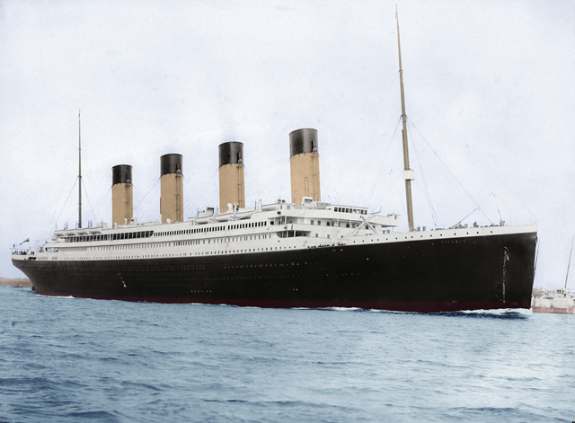
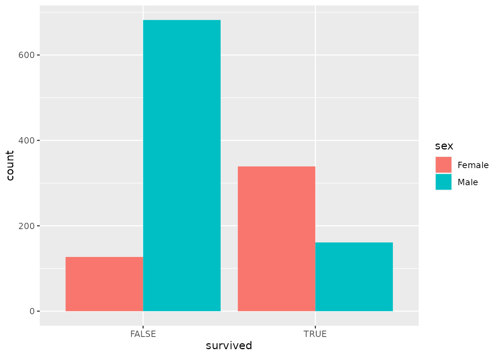
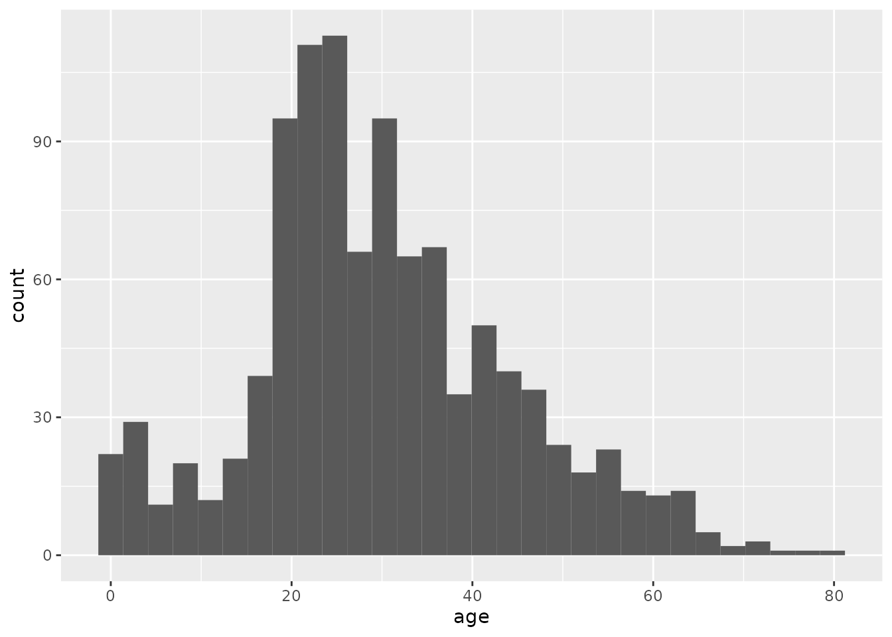

# Exploring Data with R {#lab1}




In this session, we will learn a bit about data and how to explore it using the statistical computing language called `R`.  The point is to learn a bit more about data and variables and to get a feel for the power of the tools we will be learning to use in the rest of the semester.

Another point of today's activity is to illustrate how even though statistics is about dealing with data, those data are *meaningful*.  They are not just numbers or names, they are a peek into the world.  They offer glimpses of someone's life, of the workings of some natural process, of some social structure, etc.  Any dataset will be limited in how wide of a glimpse it gives us.  The point of statistics is to help us learn and make decisions based on that glimpse.

## Working with R and RStudio

All of our labs will make use of the statistical computing language called "R".  The R language represents the current state of the art for statistical computing in both academic and industrial research.  It is likely to remain relevant for many years to come because it is free and open-source, meaning both that it is widely accessible and that improvements and extensions are being made continuously by a large community of professionals and hobbyists.  In fact, many of the best features of R that we will be using are extensions made by people outside the "core" development team for R.  These extensions are called "packages", and they represent bundles of code that are useful for doing statistics.

### Using packages

Let's load one of those packages now.  This package is called `tidyverse` and is one that we will use for *every* lab activity in this course.  The `tidyverse` package contains a lot of useful tools for summarizing data and making graphs.

The box below is called a "chunk" of code.  They always begin and end with three back-quotes.  There is also a little "{r}" at the beginning, which tells RStudio that the stuff in between the back-quotes is R code.  Finally, there are a couple buttons in the upper-right of the chunk.  The cog-wheel lets you set various options for a chunk, but we don't need that for now.  The downward-facing arrow above the line runs all the chunks of code *above* the current one.  This can come in handy for later labs which involve multiple steps.

For now, though, all we need is the green rightward-facing arrow.  Clicking this arrow will *run* the chunk of code.  Run the chunk below to tell R to load a package called "tidyverse" from its "library" of packages.


```r
library(tidyverse)
```

```{.Rout .text-info}
## ── Attaching packages ─────────────────────────────────────── tidyverse 1.3.1 ──
```

```{.Rout .text-info}
## ✔ ggplot2 3.3.6     ✔ purrr   0.3.4
## ✔ tibble  3.1.8     ✔ dplyr   1.0.9
## ✔ tidyr   1.1.3     ✔ stringr 1.4.0
## ✔ readr   2.1.2     ✔ forcats 0.5.1
```

```{.Rout .text-info}
## ── Conflicts ────────────────────────────────────────── tidyverse_conflicts() ──
## ✖ dplyr::filter() masks stats::filter()
## ✖ dplyr::lag()    masks stats::lag()
```

You might see some messages from R about loading some helpful "packages" from its "library" that we will use.  You may also notice some messages about "conflicts", but these are nothing we need to worry about.  As you'll come to see, R often gives us more information than we really need, but it is usually trying to be helpful.

### Chunks of code

Our lab activities will involve writing and running chunks of code like the one we just used to load the `tidyverse` package.  The chunk below tells R to add the numbers 2 and 3.  Run the chunk to see the result.


```r
2 + 3
```

```{.Rout .text-muted}
## [1] 5
```

Notice that there's a mysterious "1" between two brackets in front of our answer.  Why is that?  It's because R is telling us that "5" is the "first part" of our answer.  Sometimes we will ask R to do things that give multiple answers at once, but this time we only asked it for one answer.  This may seem pedantic, but it is just R trying to help by giving us more information than we really need at the moment.

### Interactive worksheets

Our labs make use of these interactive worksheets that allow us to mix English with computer code like we've just seen.  Text like this is meant to give context and instruction to what you are doing in each lab.  We work through the lab activities from beginning to end, i.e., from top to bottom.  As we go, you will encounter **Exercises** like the one below which may require you to write and run some code, to write a response in English, or both.

After you're done with each lab activity, you'll need to turn in your worksheet on Blackboard.  To do so, click the little arrow just to the right of the "Knit" button in the upper left area of the RStudio window and then click "Knit to PDF".  This will run all your chunks of code in the order they appear in your worksheet.  It will then compile those results alongside the normal text in your worksheet into a single PDF document.  You will then save this document and submit it on Blackboard.

------

### Exercise 1

Now give it a try yourself!  This is our first "exercise".  In most exercises, you will need to run a chunk of code and say something about the result.  In this exercise, you'll just be writing and running some small chunks of code.  For each blank chunk below, write code to accomplish the given goal.

a) Tell R to add 5 and 7, then click the green arrow to run your chunk.


b) Tell R to subtract 10 from 33 (using `-` for subtraction), then click the green arrow to run your chunk.


c) Tell R to multiply 4 and 20 (using `*` for multiplication), then click the green arrow to run your chunk.


d) Tell R to divide 10 by 3 (using `/` for division), then click the green arrow to run your chunk.


------

## Meet your data

The data we will be looking at for the rest of the activity are passenger records from the RMS *Titanic*, an ocean liner which famously sank on April 15, 1912.  Passengers on the *Titanic* were divided into different "classes", 1st, 2nd, and 3rd.  Though the liner was not filled to capacity, lax safety precautions---including a failure to carry enough lifeboats---meant that many of her passengers died because they were unable to evacuate when the ship struck an iceberg.  This was true for passengers regardless of class, but perhaps not *equally* true, as we shall see.

### Load the data

Run the following chunk of code to tell R to download our data into your current R environment.


```r
titanic <- read_csv("https://raw.githubusercontent.com/gregcox7/StatLabs/main/data/titanic.csv")
```

```{.Rout .text-info}
## Rows: 1309 Columns: 11
## ── Column specification ────────────────────────────────────────────────────────
## Delimiter: ","
## chr (7): residence, sex, name, ticket, cabin, embarked, hometown
## dbl (3): class, age, fare
## lgl (1): survived
## 
## ℹ Use `spec()` to retrieve the full column specification for this data.
## ℹ Specify the column types or set `show_col_types = FALSE` to quiet this message.
```

### Check out the variables

After running the chunk above, you should see something called `titanic` in your RStudio "Environment" in the upper right of the RStudio window.  If you click on the word `titanic`, you can check out the data we have just loaded.  Each row represents a specific passenger ("case") and each column represents a different *variable*.  Notice that there are some *missing values* that we don't have for every passenger.  These are labeled `NA`.

------

### Exercise 2

This second exercise only involves a written response.  Find an example of each of the following types of variable in the dataset.  Explain your reasoning for each choice.

a) Numerical (either discrete or continuous)

**PROVIDE YOUR WRITTEN RESPONSE HERE**

b) Ordinal categorical

**PROVIDE YOUR WRITTEN RESPONSE HERE**

c) Nominal categorical

**PROVIDE YOUR WRITTEN RESPONSE HERE**

------

## Frequency tables

Now that we've gotten acquainted with the kind of data we have, we can begin using it to answer some questions.  The questions we will attempt to answer are all about *who* survived and *who* perished on the *Titanic*.  Answering these questions will involve simplifying the data, turning it into a summary form that makes it easier to see and understand patterns or trends.  These summaries fall under the heading of "descriptive statistics", because they are meant to *describe* important aspects of the data.  The first type of summary we will use is a **frequency table**.

One way we could answer literally the question, "who survived and who died on the *Titanic*?" would be to read the names of each of the 1300 or so passengers in our dataset and sort them into piles, one pile for the people who survived and another pile for those who did not.  Fortunately, computers are great at those kinds of tedious tasks!  The chunk of code below gives a **frequency table** that counts the number of passengers who survived (for whom the value of the `survived` variable is `TRUE`) and the number of passengers who did not survive (for whom the value of the `survived` variable is `FALSE`).  This summary will give us a sense of the scale of the disaster.  The code below provides such a table.


```r
titanic %>%
  group_by(survived) %>%
  summarize(n = n())
```

```{.Rout .text-muted}
## # A tibble: 2 × 2
##   survived     n
##   <lgl>    <int>
## 1 FALSE      809
## 2 TRUE       500
```

We got a table that counted the number of people who did and did not survive.  We went from 1300 or so rows with multiple variables each to just two numbers.  A pretty concise summary!  But how did we do it?  Let's break down that bit of code:

* `titanic` is the name of our dataset.
* `group_by(survived)` tells R to group the cases in that dataset by whether they survived (`TRUE`) or not (`FALSE`).
* `summarize(n = n())` tells R to take our grouped cases and *summarize* them by counting the `n`umber of people in each group and labeling the resulting number "`n`".
* The funky symbol `%>%` connects the three steps above and makes sure R does them in the order we want.  This symbol is called a "pipe".

------

### Exercise 3

To get a better understanding of how R interprets instructions like the chunk of code above, run each of the following chunks of code and provide a written response to the corresponding questions.

a) This one changes `n = n()` in the last line to `Number = n()`.  What has changed about the result R gives us?


```r
titanic %>%
  group_by(survived) %>%
  summarize(Number = n())
```

```{.Rout .text-muted}
## # A tibble: 2 × 2
##   survived Number
##   <lgl>     <int>
## 1 FALSE       809
## 2 TRUE        500
```

**PROVIDE YOUR WRITTEN RESPONSE HERE**

b) This one changes `survived` to `class`.  The result is another frequency table, but what are these frequencies of?


```r
titanic %>%
  group_by(class) %>%
  summarize(n = n())
```

```{.Rout .text-muted}
## # A tibble: 3 × 2
##   class     n
##   <dbl> <int>
## 1     1   323
## 2     2   277
## 3     3   709
```

**PROVIDE YOUR WRITTEN RESPONSE HERE**

c) The following changes `survived` to `degree`, short for whether or not a passenger had a college degree.  When you run the chunk below, it will give you an error.  In your own words, why doesn't it work?


```r
titanic %>%
  group_by(degree) %>%
  summarize(n = n())
```

```{.Rout .text-danger}
## Error in `group_by()`:
## ! Must group by variables found in `.data`.
## ✖ Column `degree` is not found.
```

**PROVIDE YOUR WRITTEN RESPONSE HERE**

d) The following changes `n = n()` to `n = m()`.  This will also result in an error.  In your own words, describe why it doesn't work.


```r
titanic %>%
  group_by(survived) %>%
  summarize(n = m())
```

```{.Rout .text-danger}
## Error in `summarize()`:
## ! Problem while computing `n = m()`.
## ℹ The error occurred in group 1: survived = FALSE.
## Caused by error in `m()`:
## ! could not find function "m"
```

**PROVIDE YOUR WRITTEN RESPONSE HERE**

------

## Bar charts

You may have heard that, when trying to evacuate the *Titanic*, there was a rule to put "women and children first" onto lifeboats.  This suggests a **hypothesis**:  *If* this rule was actually followed, *then* female passengers should have a higher survival rate than male passengers.

To see if the data are consistent with this hypothesis, we can begin by using code similar to what we've been using to count the number of male and female passengers who either did or did not survive.  Notice that we can `group_by` more than one variable using a list of the variable names separated by commas:


```r
titanic %>%
  group_by(sex, survived) %>%
  summarize(n = n())
```

```{.Rout .text-info}
## `summarise()` has grouped output by 'sex'. You can override using the `.groups`
## argument.
```

```{.Rout .text-muted}
## # A tibble: 4 × 3
## # Groups:   sex [2]
##   sex    survived     n
##   <chr>  <lgl>    <int>
## 1 Female FALSE      127
## 2 Female TRUE       339
## 3 Male   FALSE      682
## 4 Male   TRUE       161
```

Now each row of the table tells us the number of passengers (in column `n`) that fall into categories defined by the *combination* of `sex` and `survived`.  So the first row is the number of female passengers who did not survive, the second row is the number of female passengers who did survive, etc.

The table we just made contains all the information we need to test the hypothesis about whether women in fact survived at a higher rate than men.  However, it is hard to compare male and female survival rates because there were different numbers of male and female passengers.  This is a case where a visual summary would make it easier to compare the survival rate of male and female passengers.

Run the chunk of code below to tell R make a visual summary of the number of male and female survivors.  The result is what we call a **dodged bar plot**.


```r
titanic %>%
    ggplot(aes(x = sex, fill = survived)) +
    geom_bar(position = "dodge")
```


Pretty neat!  The height of each bar corresponds to the number of passengers of each combination of male/female and survived/not survived.  The code we used is similar to what we've been using, but differs in some important ways:

* The first line is the same, telling R what dataset we are using (`titanic`).
* The second line tells R that we want to make a `plot` and that we want to put the variable `sex` along the horizontal axis of that plot (the `x` axis).  We are also telling R that we want to make multiple bars where they are `fill`ed with a different color depending on whether the people counted in that bar `survived`.  The "gg" in front of "plot" refers to the "**g**rammar of **g**raphics", which is the language R uses to describe plots.  In this language, different parts of a plot are called "**aes**thetics", which is why `x = sex` falls inside a parenthetical labeled `aes`(thetic).
* The final line just tells R that we want to make a `bar` chart.  In the grammar of graphics, different types of charts are called `geom`s.  We also told R that we want the bars within each group to `dodge` one another.  We will see different options in the next exercise.
* Notice that the second 2 lines are connected by a `+` rather than the `%>%` symbol.  This is a historical accident, but the meaning of the two symbols is basically the same.  Both of them are telling R the order in which it should follow our instructions.

------

### Exercise 4

Try running the following chunks of code.  Each of them are different ways to make a bar chart of the number of male and female passengers who did or did not survive.  After running each one, provide your response to the question below.

a) In this one, we change `position = "dodge"` to `position = "stack"`.  The result is a **stacked bar plot**.  In your own words, what visual feature of the resulting graph tells you the total number of male and female passengers?  What visual feature tells you how many of each of them survived?


```r
titanic %>%
    ggplot(aes(x = sex, fill = survived)) +
    geom_bar(position = "stack")
```


**PROVIDE YOUR WRITTEN RESPONSE HERE**

b) In this one, instead of using different colors to tell apart people who did or did not survive, we put male and female passengers into separate "facets".  How is the resulting graph similar or different to the dodged bar plot we made earlier?


```r
titanic %>%
    ggplot(aes(x = survived)) +
    geom_bar() +
    facet_wrap("sex")
```


**PROVIDE YOUR WRITTEN RESPONSE HERE**

c) The following graph swaps `sex` and `survived`.  In your own words, describe a question that would be easier to answer using the graph below than it would using the graph we made just prior to this exercise.


```r
titanic %>%
    ggplot(aes(x = survived, fill = sex)) +
    geom_bar(position = "dodge")
```


**PROVIDE YOUR WRITTEN RESPONSE HERE**

------

## Histograms

So far, we have been summarizing *categorical* variables.  There are also some numerical variables in our data, including the age of each passenger.  Let's try running the chunk of code below to make a frequency table to figure out how many people of different ages sailed on the *Titanic*:


```r
titanic %>%
  group_by(age) %>%
  summarize(n = n())
```

```{.Rout .text-muted}
## # A tibble: 99 × 2
##      age     n
##    <dbl> <int>
##  1 0.167     1
##  2 0.333     1
##  3 0.417     1
##  4 0.667     1
##  5 0.75      3
##  6 0.833     3
##  7 0.917     2
##  8 1        10
##  9 2        12
## 10 3         7
## # … with 89 more rows
```

Well that's not very helpful!  R didn't even bother to show us the whole thing.  Though we can see something interesting:  Age is measured in years, and for passengers at least one year old, their age is a whole number.  But there are fractions of years for passengers less than a year old---these ages were *measured* in months rather than years.

The main point is that even though age can be measured in a more or less fine-grained manner, age is effectively *continuous*.  We don't want to know how many passengers were exactly 31.3491 years old or whatever.  We want to get an overall sense of the *distribution* of ages across passengers.

We can construct a summary that conveys this information using a **histogram**.  A histogram is very similar to a bar chart; the difference is that bar charts are for categorical variables while histograms are for numerical variables.  Run the code below to construct a histogram to summarize passenger age:


```r
titanic %>%
  ggplot(aes(x = age)) +
  geom_histogram()
```

```{.Rout .text-info}
## `stat_bin()` using `bins = 30`. Pick better value with `binwidth`.
```

```{.Rout .text-warning}
## Warning: Removed 263 rows containing non-finite values (stat_bin).
```



The resulting histogram shows a bunch of bars.  Just like in a bar chart, the height of each bar indicates the number of passengers within a particular age range.

We got a couple of messages from R in addition to our plot, one about "non-finite values" and another about "picking a better value".  When R says, "non-finite values", it is talking about people for whom their age was not recorded.  This is an unfortunate thing about real data: sometimes it has missing pieces.  This didn't stop R from making the plot we wanted using the non-missing data, but R wanted to warn us just in case.

The message about "picking a better value" is important:  When you make a histogram, you are looking at how many things fall within a particular range of values, say, between ages 4 and 8.  How do you decide those ranges?  If you don't tell R how to do that, it will decide on its own to divide up the range of values into 30 "bins", each of which corresponds to a range of values that is the same width.  This is usually not what we want.

Instead, we should decide how big or small we want those ranges to be.  The following code tells R to make our histogram using "bins" that are 2 years "wide" (0-1, 2-3, etc.):


```r
titanic %>%
  ggplot(aes(x = age)) +
  geom_histogram(binwidth = 2)
```

```{.Rout .text-warning}
## Warning: Removed 263 rows containing non-finite values (stat_bin).
```


And just like we did with bar charts, we can split a histogram into different "facets".  The pair of histograms below shows the distribution of ages of passengers that either did or did not survive:


```r
titanic %>%
  ggplot(aes(x = age)) +
  geom_histogram(binwidth = 2) +
  facet_wrap("survived")
```

```{.Rout .text-warning}
## Warning: Removed 263 rows containing non-finite values (stat_bin).
```



------

### Exercise 5

Use the chunk below to try making several different histograms of passenger age split by survival, using different bin widths of your own choice.  Each time, just put in a new number after `binwidth = ` and hit the green "Run" arrow on the upper right of the chunk to re-run the code and make a new graph.

After trying out several options, what bin width do you believe gives the best visual summary and why?  Describe whether the shapes of the histograms in each facet are consistent with the "women and *children* first" rule.


```r
titanic %>%
  ggplot(aes(x = age)) +
  geom_histogram(binwidth = 2) +
  facet_wrap("survived")
```

```{.Rout .text-warning}
## Warning: Removed 263 rows containing non-finite values (stat_bin).
```


**PROVIDE YOUR WRITTEN RESPONSE HERE**

------

## Wrap-up

Today we began our adventure by using RStudio to explore some data.  We saw how to look at data and how to summarize it in various helpful ways.  These were frequency tables, proportions, bar charts, and histograms.

* Frequency tables count the number of times a particular value of a particular variable (or combination of values across multiple variables) occurs in our dataset.
* Bar charts display counts of categorical variables in a visual form that makes it easier to compare them.
* Histograms let us visually summarize counts of numerical variables by putting them in "bins", the width of which we need to decide.
