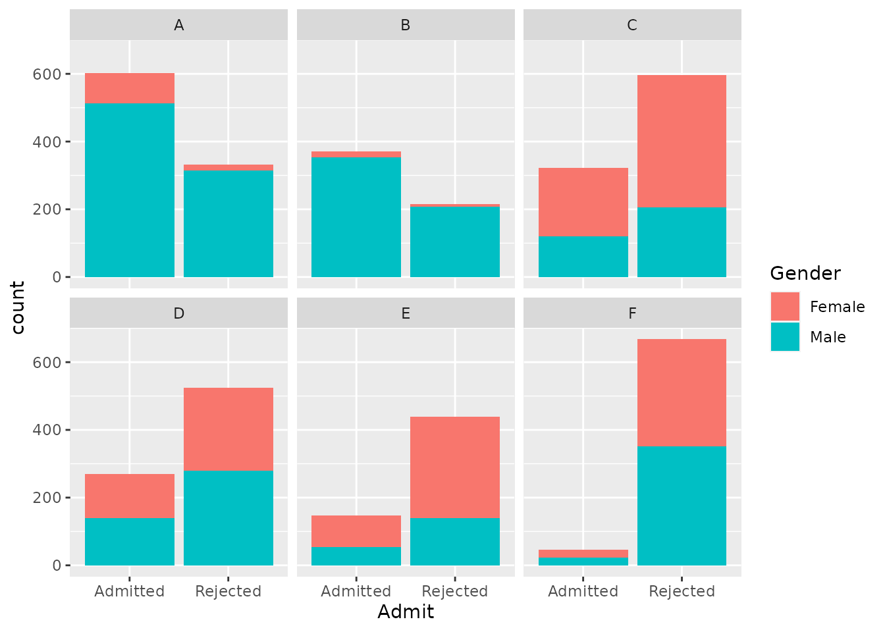

# Sampling {#lab2}


In the previous activity, we got some exposure to how we can explore data in R in such a way that we can use data to help answer questions.  In this activity, we will get a sense of where data come from and how the processes that produce data can force us to change our interpretations.

Generally, the data we have come from a **sample** from some larger **population**.  Depending on how that sample is selected, it may give us a **biased** perspective on the larger population.  In particular, when we have non-random samples (as in **observational studies**), we must think carefully about how the processes by which cases end up in our sample.  If those processes, which might be social in nature, introduce **confounding variables**, then there can be systematic differences between different groups in our sample, requiring us to interpret the data differently.

## First things first

First, start up RStudio.

As usual, the next thing we will do after starting up RStudio is to load the `tidyverse` package from R's library using the following line of code (which you should run in your RStudio console, like last time):


```r
library(tidyverse)
```

```{.Rout .text-info}
## ── Attaching packages ─────────────────────────────────────── tidyverse 1.3.1 ──
```

```{.Rout .text-info}
## ✓ ggplot2 3.3.5     ✓ purrr   0.3.4
## ✓ tibble  3.1.3     ✓ dplyr   1.0.5
## ✓ tidyr   1.1.3     ✓ stringr 1.4.0
## ✓ readr   2.0.0     ✓ forcats 0.5.1
```

```{.Rout .text-info}
## ── Conflicts ────────────────────────────────────────── tidyverse_conflicts() ──
## x dplyr::filter() masks stats::filter()
## x dplyr::lag()    masks stats::lag()
```

Now that that's done, we can get into the data.

## Sex Bias, Sampling Bias, or Both?

In 1973, the University of California at Berkeley noted a disturbing fact about their graduate school admissions: considerably more male applicants were being admitted than female applicants.  The University, fearing a lawsuit, wanted to know if this reflected systematic sex discrimination in their admissions offices.  We shall see for ourselves that the story turned out to be more complex (for the full details, see @BickelEtAl1973).

### Load the data

First, run the code below to load the 1973 Berkeley admissions data into our workspace:


```r
berkeley <- read_csv("https://raw.githubusercontent.com/gregcox7/StatLabs/main/data/berkeley.csv")
```

```{.Rout .text-info}
## Rows: 4526 Columns: 3
```

```{.Rout .text-info}
## ── Column specification ────────────────────────────────────────────────────────
## Delimiter: ","
## chr (3): Admit, Gender, Department
```

```{.Rout .text-info}
## 
## ℹ Use `spec()` to retrieve the full column specification for this data.
## ℹ Specify the column types or set `show_col_types = FALSE` to quiet this message.
```

The `berkeley` dataset should now be visible in the "Environment" pane in the upper right corner of RStudio.  Click on it to have a look at the raw data.

Because each applicant selected themselves into this sample, it is clearly not random.  Each row of the data refers to a specific applicant in 1973.  For each applicant, there are three observed variables:

* **Admit**: Either "Admitted" or "Rejected", depending on whether the applicant was admitted or rejected.
* **Gender**: Either "Male" or "Female".
* **Department**: A letter between "A" and "F"; the department names were obscured for privacy.

::: {.exercise}
What type (nominal categorical, ordinal categorical, numerical) are each of the variables in this dataset?

:::

### Are more males than females admitted?

As noted above, Berkeley was concerned because a greater **proportion** of their male applicants were being admitted than their female applicants.  To verify whether this is true, let's find those proportions ourselves by running the following chunk of code:


```r
berkeley %>%
  group_by(Gender, Admit) %>%
  summarize(n = n()) %>%
  mutate(p = n / sum(n))
```

```{.Rout .text-info}
## `summarise()` has grouped output by 'Gender'. You can override using the `.groups` argument.
```

```{.Rout .text-muted}
## # A tibble: 4 × 4
## # Groups:   Gender [2]
##   Gender Admit        n     p
##   <chr>  <chr>    <int> <dbl>
## 1 Female Admitted   557 0.304
## 2 Female Rejected  1278 0.696
## 3 Male   Admitted  1198 0.445
## 4 Male   Rejected  1493 0.555
```

The rightmost column of the table (labeled `p`) gives the proportion of applicants of each gender who were either admitted or rejected.  Based on this table, it looks like Berkeley was right to be concerned---the proportion of male applicants admitted is higher than the proportion of female applicants admitted.

::: {.exercise}
Compare the chunk of code we just ran to some of the code we used in the last activity in [this section](#titanic-props).  What parts looks similar and what parts look different?

:::

### Is there a bias in all departments?

Even if there is an overall bias, is this the case for all departments, or just some?

::: {.exercise}
Make a new table that gives the proportion of male and female applicants admitted for each department.  You may find it helpful to fill in the blanks in the following chunk of code (note a new line at the end which "filters" out some redundant rows of the table to make it from being too long):


```r
berkeley %>%
  group_by(___, ___, Admit) %>%
  summarize(n = n()) %>%
  mutate(p = n / sum(n)) %>%
  filter(Admit == "Admitted")
```

Which departments admit a higher proportion of female applicants and which admit a higher proportion of male applicants?

:::

### Resolving the paradox

We appear to have a paradox on our hands:  If we ignore differences between departments, it is more likely that a male applicant gets admitted than a female applicant.  But within most departments, the opposite is true: a greater proportion of female applicants are admitted than male applicants.  In other words, there seems to be a **confounding variable** at work, and it is related to the differences between departments.

To try to figure out what this confound might be, we should look at two additional issues.  The first issue is, for each department, what proportion of their applicants are female, regardless of whether they were admitted or not?  We can address that question by running the following chunk of code:


```r
berkeley %>%
  group_by(Department, Gender) %>%
  summarize(n = n()) %>%
  mutate(p = n / sum(n))
```

```{.Rout .text-info}
## `summarise()` has grouped output by 'Department'. You can override using the `.groups` argument.
```

```{.Rout .text-muted}
## # A tibble: 12 × 4
## # Groups:   Department [6]
##    Department Gender     n      p
##    <chr>      <chr>  <int>  <dbl>
##  1 A          Female   108 0.116 
##  2 A          Male     825 0.884 
##  3 B          Female    25 0.0427
##  4 B          Male     560 0.957 
##  5 C          Female   593 0.646 
##  6 C          Male     325 0.354 
##  7 D          Female   375 0.473 
##  8 D          Male     417 0.527 
##  9 E          Female   393 0.673 
## 10 E          Male     191 0.327 
## 11 F          Female   341 0.478 
## 12 F          Male     373 0.522
```

::: {.exercise}
Based on the table we just produced, which departments have more male than female applicants?  Is there any overlap between these departments and those you identified in the previous exercise as admitting a higher proportion of female than male applicants?

:::

The second issue to consider is the overall rate of admission for each department.

::: {.exercise}
Make a table that shows the proportion of applicants who were admitted for each department, regardless of gender.  You may find it useful to modify the chunk of code we just used.

What code did you use?  Put the departments in order from highest to lowest admission rate.

:::

Finally, let's create a visualization that may help us put these pieces together.  The chunk of code below produces a set of bar charts, one for each department.  These are similar to those we made in the previous activity, but have a new "aesthetic", namely, they use a variable (`Gender`) to `fill` in the bars with different colors:


```r
berkeley %>%
  ggplot(aes(x = Admit, fill = Gender)) +
  geom_bar() +
  facet_wrap("Department")
```



::: {.exercise}
Compare the code we just ran to create this colored bar chart with the kind of code you used to make bar charts in the [previous activity](#titanic-bar).  What is similar and what is different?

:::

In the plot we just made, the total height of each bar represents the total number of applicants for each department who were either admitted or rejected.  Each bar is divided into two parts in different colors, representing the numbers of male and female applicants in each bar.  You can use the total height of the bars to see the relative number of people who were admitted vs. rejected in each department; you can use the amount of red vs. teal in each panel to see the relative number of female vs. male applicants for each department.

Putting the pieces together, we have found the following:

* Across all departments, the proportion of female applicants admitted is *lower* than the proportion of male applicants admitted.
* Within most departments, the proportion of female applicants admitted is *higher* than the proportion of male applicants admitted.
* Departments with high overall admission rates receive fewer female applicants than departments with low admission rates.

Finally, we should note that, although the names of the specific departments have been removed, departments A and B (which were easy to get into and received predominantly male applicants) were in the physical sciences and engineering whereas departments E and F (which were hard to get into and received considerably more female applicants) were in the social sciences and humanities.

::: {.exercise}
Even though these results do not suggest a sex bias in admissions at the level of individual departments, what other kinds of bias do these results suggest might be going on?  How are these potential biases related to the types of sampling biases we've discussed in class and in the book?

> In thinking about this, it may help to think about two questions (though there are certainly more that may be relevant):
> 
> * Why might someone choose to apply to a particular department?
> * Why might some departments be able to admit more applicants than others?

:::

## Wrap-up

The paradox we confronted in this activity has a name: "**Simpson's Paradox**".  Check out a good video demonstration of the paradox [here](https://youtu.be/ebEkn-BiW5k).

Simpson's Paradox occurs whenever a pattern that appears in aggregate (like the bias against female applicants over all departments) disappears or reverses when we look at different subgroups (like the apparent bias in favor of female applicants within most departments).  As we have done in this activity, Simpson's Paradox can be resolved only by careful exploration of the data and consideration of potential confounding variables that are associated with different subgroups.
