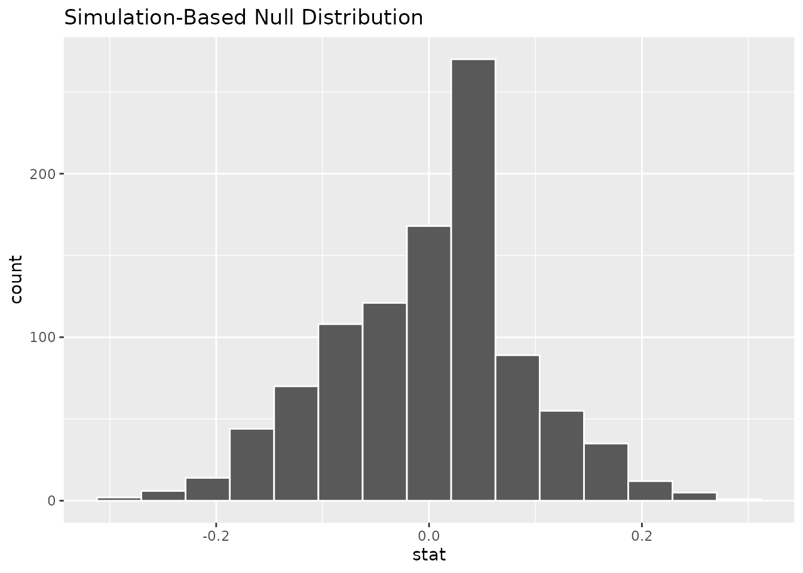
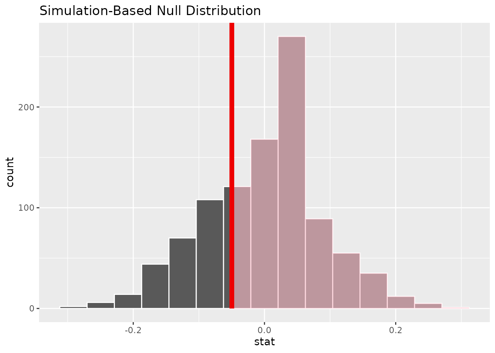
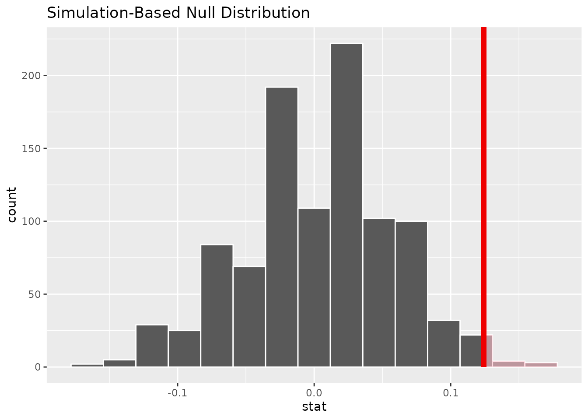

# Hypothesis testing with randomization {#lab5}


In this session, we will get some initial practice in testing hypotheses by randomization.  While this practice will not cover all the nuances of hypothesis testing in statistics, it will touch on many of the key ideas that we will see in different forms throughout the rest of the course.

In the first part, we will get a sense of how **permutation** works, and how it helps us to simulate what a sample might look like if the null hypothesis were true.  In the second part, we will use permutation to test a more serious hypotheses about how different types of people might make decisions differently.

## Required packages

In addition to the `tidyverse` package that we normally use, today we will also need to load the `infer` package.  As you might guess from the name, the `infer` package provides a lot of useful tools for doing `infer`ence with statistics.

### First try this

You should already have the `tidyverse` package installed, since we've been using it since the first lab.  So if you run this code, all should be well:


```r
library(tidyverse)
```

```{.Rout .text-info}
## ── Attaching packages ─────────────────────────────────────── tidyverse 1.3.1 ──
```

```{.Rout .text-info}
## ✔ ggplot2 3.3.6     ✔ purrr   0.3.4
## ✔ tibble  3.1.8     ✔ dplyr   1.0.9
## ✔ tidyr   1.1.3     ✔ stringr 1.4.0
## ✔ readr   2.1.2     ✔ forcats 0.5.1
```

```{.Rout .text-info}
## ── Conflicts ────────────────────────────────────────── tidyverse_conflicts() ──
## ✖ dplyr::filter() masks stats::filter()
## ✖ dplyr::lag()    masks stats::lag()
```

If you are working on any of the University computers in the lab or library, the `infer` package should already be installed.  If the `infer` package is installed, you should be able to run the following line with no problems:


```r
library(infer)
```

### If necessary, install the `infer` package

If you got an error when loading the `infer` package, you need to install it first.  Luckily, this just involves running the following line:


```r
install.packages("infer")
```

Now you should be able to load the `infer` package without any problems.

## Did Kobe have a hot hand?

To get a handle on some of the big ideas in hypothesis testing in general, and of permutation in particular, let's first look at a very special dataset.  These data pertain to Kobe Bryant of the LA Lakers playing against the Orlando Magic in the 2009 NBA finals.  Commentators at the time remarked that Kobe seemed to have a "hot hand".  In other words, they were claiming that once Kobe made a basket, he was *more likely* to make a basket on his next shot.

### Load the data

Run the following line of code to download a dataset consisting of every shooting attempt Kobe made during that game, including whether or not it went in (i.e., was the shot a "Hit" or a "Miss"):


```r
kobe <- read_csv("https://raw.githubusercontent.com/gregcox7/StatLabs/main/data/kobe.csv")
```

```{.Rout .text-info}
## Rows: 111 Columns: 7── Column specification ────────────────────────────────────────────────────────
## Delimiter: ","
## chr  (5): vs, quarter, description, shot, prev_shot
## dbl  (1): game
## time (1): time
## ℹ Use `spec()` to retrieve the full column specification for this data.
## ℹ Specify the column types or set `show_col_types = FALSE` to quiet this message.
```

### Framing the hypotheses

We can translate the claim of the hot hand into a **null hypothesis** and an **alternative hypothesis**.  For us to believe the "hot hand" claim, we first have to rule out the possibility that Kobe's hit proportion is the same regardless of whether his previous shot went in or not.  This possibility is the **null hypothesis**.  The **alternative hypothesis** is that Kobe really had a hot hand and he made a greater proportion of hits after having already made a hit than after missing.

### Check out the data

Now that we've framed our hypotheses, let's see whether our data suggest that we could reject the null hypothesis.  We will just use a simple frequency table like we've used before:


```r
kobe %>%
    group_by(prev_shot, shot) %>%
    summarize(n=n()) %>%
    mutate(p = n / sum(n))
```

```{.Rout .text-info}
## `summarise()` has grouped output by 'prev_shot'. You can override using the
## `.groups` argument.
```

```{.Rout .text-muted}
## # A tibble: 4 × 4
## # Groups:   prev_shot [2]
##   prev_shot shot      n     p
##   <chr>     <chr> <int> <dbl>
## 1 H         H        18 0.36 
## 2 H         M        32 0.64 
## 3 M         H        25 0.410
## 4 M         M        36 0.590
```

Here, `prev_shot` refers to whether Kobe's `prev`ious shot was a hit ("H") or a miss ("M").  The final column `p` gives us the proportions of Hits or Misses following either a Hit or Miss.

::: {.exercise}
Let's call the proportion of hits when the previous shot was a hit $\hat{p}_{\text{Prev. H}}$ and the proportion of hits when the previous shot was a miss $\hat{p}_{\text{Prev. M}}$.

a. Based on the proportions in the frequency table, what is $\hat{p}_{\text{Prev. H}} - \hat{p}_{\text{Prev. M}}$?
b. Given your answer in (a), are these data consistent with Kobe having a "hot hand"?

:::

### Model the null hypothesis

If the null hypothesis were true, whether Kobe made a shot or not should not depend on whether his previous shot was a Hit or Miss.  That means that, if the null hypothesis were true, we should be able to shuffle Kobe's previous shots and still obtain a pattern of results that looks similar to what we just saw.  Of course, if the null hypothesis were false, shuffling Kobe's previous shots should produce a pattern of results that would look different from what we actually saw.

#### A single shuffle

To get a sense of what "shuffling" means here, let's first take a look at Kobe's shots from just the second quarter of the first game.  To do this, we will use a new trick, the `filter` function:


```r
kobe %>%
    filter(game == 1, quarter == 2)
```

```{.Rout .text-muted}
## # A tibble: 8 × 7
##   vs     game quarter time   description                           shot  prev_…¹
##   <chr> <dbl> <chr>   <time> <chr>                                 <chr> <chr>  
## 1 ORL       1 2       05:58  Kobe Bryant makes 20-foot jumper      H     H      
## 2 ORL       1 2       05:22  Kobe Bryant makes 14-foot jumper      H     H      
## 3 ORL       1 2       04:37  Kobe Bryant misses driving layup      M     H      
## 4 ORL       1 2       03:30  Kobe Bryant makes 9-foot two point s… H     M      
## 5 ORL       1 2       02:55  Kobe Bryant makes 14-foot running ju… H     H      
## 6 ORL       1 2       01:55  Kobe Bryant misses 19-foot jumper     M     H      
## 7 ORL       1 2       00:38  Kobe Bryant misses 27-foot three poi… M     M      
## 8 ORL       1 2       00:04  Kobe Bryant makes driving layup       H     M      
## # … with abbreviated variable name ¹​prev_shot
```

The `==` asks the question, are these two things equal?  So `game == 1` pulls out all the shots where `game` equals 1, i.e., the shots from the first game.  Similarly, `quarter == 2` pulls out all the shots where `quarter` equals 2, so the second quarter from *each* game.  Put them together, and you get a `filter` that pulls out the shots for which *both* the game is the first *and* the quarter is the second.  Neat trick!

If we include that line, we can get a frequency table for just this handful of shots, like we did above:


```r
kobe %>%
    filter(game == 1, quarter == 2) %>%
    group_by(prev_shot, shot) %>%
    summarize(n=n()) %>%
    mutate(p = n / sum(n))
```

```{.Rout .text-info}
## `summarise()` has grouped output by 'prev_shot'. You can override using the
## `.groups` argument.
```

```{.Rout .text-muted}
## # A tibble: 4 × 4
## # Groups:   prev_shot [2]
##   prev_shot shot      n     p
##   <chr>     <chr> <int> <dbl>
## 1 H         H         3 0.6  
## 2 H         M         2 0.4  
## 3 M         H         2 0.667
## 4 M         M         1 0.333
```

To model how these shots *might* have gone if the null hypothesis were true, we need to `specify` the relevant variables as well as the `hypothesis`.  Let's see that all at once, then unpack it:


```r
simulated_data <- kobe %>%
    filter(game == 1, quarter == 2) %>%
    specify(shot ~ prev_shot, success = "H") %>%
    hypothesize(null = "independence") %>%
    generate(reps = 1, type = "permute")
```

In the first line, we added `simulated_data <- ` so that R would remember the result under the name `simulated_data`.

In the third line, we `specify` which variable is the **explanatory variable** (`prev_shot`) and which variable is the **response variable** (`shot`).  We do this using the same squiggly thing we used for linear regression (`[response variable] ~ [explanatory variable]`).  Because the response variable is a binary (i.e., two-level) categorical variable, we also need to tell R that a "success" is a Hit (abbreviated "H").

The fourth line is how we tell R what our null hypothesis is, namely, that the explanatory and response variables are **independent** (not associated).

Finally, the fifth line `generate`s a simulated dataset by randomly permuting---that is, *shuffling*---the columns of the original data containing the explanatory and response variables.

Run the following line so you can see what your simulated shots from Kobe look like:


```r
simulated_data
```

```{.Rout .text-muted}
## Response: shot (factor)
## Explanatory: prev_shot (factor)
## Null Hypothesis: independence
## # A tibble: 8 × 3
## # Groups:   replicate [1]
##   shot  prev_shot replicate
##   <fct> <fct>         <int>
## 1 H     H                 1
## 2 H     H                 1
## 3 H     H                 1
## 4 M     M                 1
## 5 M     H                 1
## 6 M     H                 1
## 7 H     M                 1
## 8 H     M                 1
```

Note that your simulation will probably not look the same as the one shown here because the columns were shuffled *randomly*.

Finally, we have a way to quickly calculate the difference in proportions that we are interested in ($\hat{p}_{\text{Prev. H}} - \hat{p}_{\text{Prev. M}}$).  We can do that with both the actual data and simulated data.  Here it is with the actual data:


```r
kobe %>%
    filter(game == 1, quarter == 2) %>%
    specify(shot ~ prev_shot, success = "H") %>%
    calculate(stat = "diff in props", order = c("H", "M"))
```

```{.Rout .text-muted}
## Response: shot (factor)
## Explanatory: prev_shot (factor)
## # A tibble: 1 × 1
##      stat
##     <dbl>
## 1 -0.0667
```

The `calculate` line is where the magic happens.  We tell R that the `stat`istic we are interested in is the "diff in props" (difference in proportions), and then tell R the `order` in which it should calculate it ("H" minus "M").

::: {.exercise}
Fill in the blank below to calculate the same thing on our *simulated* data:


```r
___ %>%
    specify(shot ~ prev_shot, success = "H") %>%
    calculate(stat = "diff in props", order = c("H", "M"))
```

What was the result you got?  Was it larger, smaller, or the same as when we calculated it using the actual data from the second quarter of the first game?

:::

#### Many shuffles {#kobenull}

If that's what a single shuffle of just part of our data look like, it's a good thing we have a computer to do that a bunch of times!

Let's get back to looking at the full dataset.  The next chunk of code will generate 1000 different shuffled datasets to simulate the kinds of results that would occur if the null hypothesis were true, then for each simulated dataset calculated the difference in proportions $\hat{p}_{\text{Prev. H}} - \hat{p}_{\text{Prev. M}}$.  Finally, we will tell R to remember it using the name `null_dist` for "null distribution".

Run the following chunk of code:


```r
null_dist <- kobe %>%
    specify(shot ~ prev_shot, success = "H") %>%
    hypothesize(null = "independence") %>%
    generate(reps = 1000, type = "permute") %>%
    calculate(stat = "diff in props", order = c("H", "M"))
```

Now we can check out the result:


```r
null_dist
```

```{.Rout .text-muted}
## Response: shot (factor)
## Explanatory: prev_shot (factor)
## Null Hypothesis: independence
## # A tibble: 1,000 × 2
##    replicate    stat
##        <int>   <dbl>
##  1         1 -0.159 
##  2         2 -0.0862
##  3         3 -0.0134
##  4         4 -0.159 
##  5         5  0.0230
##  6         6  0.0230
##  7         7 -0.0134
##  8         8 -0.0862
##  9         9  0.0230
## 10        10 -0.0862
## # … with 990 more rows
## # ℹ Use `print(n = ...)` to see more rows
```

The "replicate" column is just a number that labels each simulated dataset and the "stat" column is the difference $\hat{p}_{\text{Prev. H}} - \hat{p}_{\text{Prev. M}}$ *for that simulated dataset*.

We can get a better summary by visualizing this distribution of results using a histogram:


```r
null_dist %>%
    visualize()
```



### Find the $p$ value

Remember that the $p$ value is the proportion of simulated datasets which are *at least as extreme* as our actual data.  In this case, that means the proportion of simulated datasets with a difference in proportions that is *bigger* than what we observed.  Let's tell R to remember that difference by running the chunk of code below:


```r
obs_diff <- kobe %>%
    specify(shot ~ prev_shot, success = "H") %>%
    calculate(stat = "diff in props", order = c("H", "M"))
```

Now, let's see how many simulated datasets were bigger than this.  In the following line of code, we have to tell R that the observed "statistic" (`obs_stat`) is the difference we just told it to remember (`obs_diff`) as well as the fact that we are interested in how many simulations produced results that were "greater" than what was observed:


```r
null_dist %>%
    get_p_value(obs_stat = obs_diff, direction = "greater")
```

```{.Rout .text-muted}
## # A tibble: 1 × 1
##   p_value
##     <dbl>
## 1   0.756
```

Finally, it will help to visualize where the observed difference falls relative to the distribution of differences from our simulated data (note that this uses `shade_p_value` rather than `get_p_value`):


```r
null_dist %>%
    visualize() +
    shade_p_value(obs_stat = obs_diff, direction = "greater")
```



The red line is the value that was actually observed and the parts of the histogram that are shaded pink represent the simulated datasets that were "more extreme" than what was observed.

### Form a conclusion

Remember that we were testing the **null hypothesis** that Kobe did *not* have a hot hand.  We only reject the null hypothesis if our data would be very unlikely if the null hypothesis were true, i.e., if the $p$ value is low.  Assume we adopt a **significance level** of 0.05, so we would reject the null hypothesis if the $p$ value were less than this level.

::: {.exercise}
Do you reject the null hypothesis?  Explain your reasoning.  What does your conclusion say about whether or not Kobe had a "hot hand"?

:::

## Do people on the autism spectrum make more consistent choices?

The kind of hypothesis testing we just did for the fun case of Kobe's hot hand is the same as what we use to answer more serious research questions.

Autism is a condition that has many facets.  Individuals with autism who do not have any cognitive impairments often have different cognitive "styles".  In particular, it is thought that people with autism are more "detail-oriented".  This can be a detriment when trying to find a general pattern, but it might be a benefit in situations where there are many irrelevant distractions.

This potential benefit was studied by @FarmerEtAl2017.  Their experiment included a group of participants diagnosed as being on the autism spectrum (with no cognitive impairments) as well as a group of neuro-typical controls.  They looked at participants' choices between pairs of consumer products that were presented alongside a third, less desirable "decoy" option.  A "rational" choice should not be affected by the presence of this decoy, but in fact people are often swayed by those irrelevant options.  Might people with autism make choices that are more consistent---more "rational"---because they ignore the irrelevant decoy?

For the rest of the lab, you will conduct a hypothesis test to address this question.  It will follow the same basic outline as the procedure we followed to address the "hot hand" question, so be sure to refer to the previous section for guidance.

### Load the data

First, let's load the relevant data collected by @FarmerEtAl2017 with the following line of code:


```r
asc_choice <- read_csv("https://raw.githubusercontent.com/gregcox7/StatLabs/main/data/asc_choice_job.csv")
```

```{.Rout .text-info}
## Rows: 302 Columns: 9── Column specification ────────────────────────────────────────────────────────
## Delimiter: ","
## chr (6): Pcp, Group, Product, Gender, Residence, Choice
## dbl (3): ICAR, AQScore, Age
## ℹ Use `spec()` to retrieve the full column specification for this data.
## ℹ Specify the column types or set `show_col_types = FALSE` to quiet this message.
```
The **response variable** is `Choice`, which is either "Consistent" (if the participant's choice was not affected by the decoy) or "Inconsistent" (if the participant's choice was affected by the decoy).

The **explanatory variable** is `Group`, which is either "ASC" (for "Autism Spectrum Condition") or "NT" (for "Neuro-Typical" control).

### Framing the hypotheses

Our **research question** is, "is the proportion of consistent choices *higher* for participants from the ASC group than those from the NT group?"

::: {.exercise}
What are the **null hypothesis** and **alternative hypothesis** that correspond to this research question?

:::

### Check out the data

The next step is to construct a frequency table so we can know what the proportions of consistent choices were for each group and then find the difference.

::: {.exercise}
Fill in the blanks below to find the proportions of consistent choices for each group.


```r
___ %>%
    group_by(___, ___) %>%
    summarize(n = n()) %>%
    mutate(p = n / sum(n))
```

a. What was the proportion of consistent choices in the ASC group?
b. What was the proportion of consistent choices in the NT group?
c. What is the difference in the proportions?

:::

### Model the null hypothesis

If the null hypothesis were true, a participant's choice shouldn't depend on which group they are in.  By shuffling participants randomly between groups, we can therefore simulate how the data would look if the null hypothesis were true.

::: {.exercise}
Fill in the blanks in the code below to simulate 1000 datasets assuming the null hypothesis were true and find the resulting differences in proportions.


```r
null_dist <- ___ %>%
    specify(___ ~ ___, success = "___") %>%
    hypothesize(null = "___") %>%
    generate(reps = ___, type = "permute") %>%
    calculate(stat = "___", order = c("___", "___"))
```

For guidance, check out how we did it in the Kobe example above (especially [this section](#kobenull)).  Be sure to note:

* What is the name of the relevant dataset?
* What are the names of the explanatory and response variables?
* A "Consistent" choice counts as a "success".
* We want to do *1000* simulations.
* For the difference in proportions, we want to look at ASC minus NT.

What was the final chunk of code you used?

:::

### Find the $p$ value

To find the $p$ value, we first need to get the observed difference in proportions and tell R to remember it with the label `obs_diff`.


::: {.exercise}
Fill in the blanks below to find the observed difference in proportions in the actual data and tell R to remember it under the label `obs_diff`.  *Hint:* see what you wrote in the previous exercise!


```r
obs_diff <- ___ %>%
    specify(___ ~ ___, success = "___") %>%
    calculate(stat = "___", order = c("___", "___"))
```

What code did you use?

:::

Finally, we are in a position to find the $p$ value and to visualize where the observed difference in proportion falls relative to the differences that would be expected if the null hypothesis were true.  If all goes well, your results should be close to the following, though because there is randomness involved, your results will not be strictly identical!


```r
null_dist %>%
    get_p_value(obs_stat = obs_diff, direction = "greater")
```

```{.Rout .text-muted}
## # A tibble: 1 × 1
##   p_value
##     <dbl>
## 1   0.012
```


```r
null_dist %>%
    visualize() +
    shade_p_value(obs_stat = obs_diff, direction = "greater")
```



### Form a conclusion

Assume we adopt a **significance level** of 0.05, so we would reject the null hypothesis if the $p$ value were less than this level.

::: {.exercise}
Do you reject the null hypothesis?  Explain your reasoning.  What does your conclusion say about whether participants with a diagnosis of autism made more consistent choices than neuro-typical participants?

:::

## Wrap-up

In this session, we got practice using R to perform hypothesis tests using randomization.  Specifically, we used a type of shuffling called permutation.  Shuffling allows us to simulate various ways that a particular dataset could look like if the null hypothesis were true.  We then found the $p$ value and visualized the null distribution in order to get a sense of whether our actual data would be unlikely if the null hypothesis were true.
