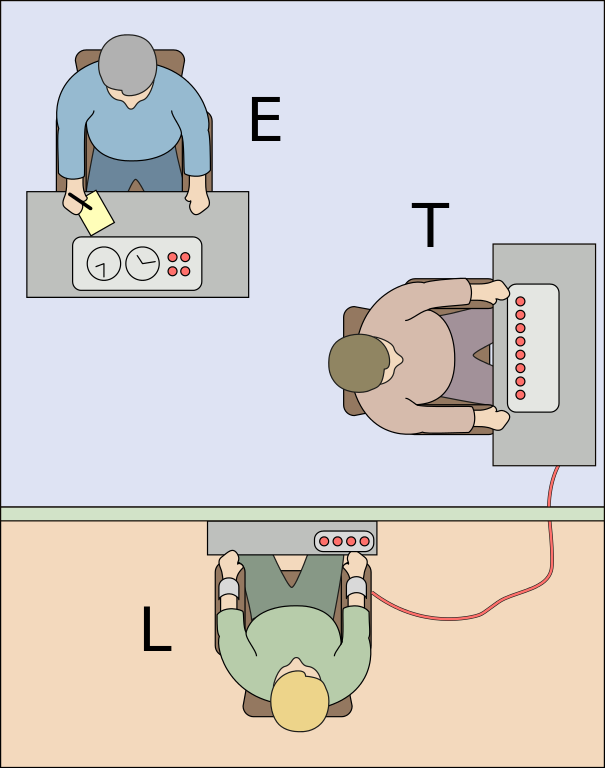

# Confidence intervals with bootstrapping {#lab6}




In this session, we will get practice using R to find confidence intervals via bootstrapping.  As with our initial exposure to hypothesis testing in the previous session, this is meant as a "first contact" with the basics of the techniques.  In the first part, we will revisit the Kobe data to get a view of how resampling works, since this is the heart of the bootstrapping technique.  In the second part, we will use bootstrapping to create confidence intervals representing people's tendencies when making moral decisions.

It is important to keep in mind that both hypothesis testing and confidence intervals involve *imagining how things could have turned out differently*.  Hypothesis testing is about imagining the ways a comparison between two groups could have turned out differently *if the null hypothesis (of no group difference) were true*.  Confidence intervals are about imagining the other ways a sample could look *if our current sample is representative of that population*.  As with hypothesis testing, we use simulation to help us imagine these different possible outcomes.  The ultimate purpose in constructing a confidence interval by simulation is to express what values of a population parameter are "plausible" in light of the sample we got.

To help with the later exercises in this session, be sure to **download the worksheet for this session** by right-clicking on the following link and selecting "Save link as...": [Worksheet for Lab 6](https://raw.githubusercontent.com/gregcox7/StatLabs/main/worksheets/ws_lab06.Rmd).  Open the saved file (which by default is called "ws_lab06.Rmd") in RStudio.

## What is Kobe's field goal percentage?

Last time, we asked whether Kobe Bryant had a "hot hand" during the 2009 NBA finals.  We used randomization to test the null hypothesis that Kobe's chance of making a hit was the same regardless of whether his previous shot was a hit or not.

This time we are just interested in what proportion of Kobe's shots actually make it in the basket.  The traditional basketball term for this is Kobe's "field goal percentage".  This constitutes a **population parameter** that we could label mathematically as $\pi_{\text{Kobe}}$.  The "population" here is all the shots Kobe ever attempted across his career.  The sample are the shots Kobe attempted during the 2009 NBA finals.  The sample yields a **point estimate** $\hat{p}_{\text{Kobe}}$ of the population parameter $\pi_{\text{Kobe}}$.

### What is the point estimate?

What we are interested in this time is just the proportion of Kobe's shots that were hits rather than misses.  For today, we don't care what the outcome of his previous shot was.

To get the point estimate of the proportion of Kobe's shots that were hits rather than misses, we can use the following chunk of code:


```r
kobe %>%
    specify(response = shot, success = "H") %>%
    calculate(stat = "prop")
```

```{.Rout .text-muted}
## Response: shot (factor)
## # A tibble: 1 × 1
##    stat
##   <dbl>
## 1 0.387
```

::: {.exercise}
As a reminder, this is the chunk of code we used to find the observed *difference* in hit proportions last time, as a function of whether Kobe's previous shot was a hit or not:


```r
kobe %>%
    specify(shot ~ prev_shot, success = "H") %>%
    calculate(stat = "diff in props", order = c("prev_H", "prev_M"))
```

a. Why do we *not* need to mention `prev_shot` when calculating the proportion of Kobe's hits?
b. Why do we *not* need to set `order` when calculating the proportion of Kobe's hits?

:::

### Model the randomness

Although our sample gives us a point estimate ($\hat{p}_{\text{Kobe}}$) of Kobe's true field goal percentage ($\pi_{\text{Kobe}}$), we know that our point estimate is unlikely to be a perfect estimate.  This is because we know that any sample from a population is subject to **sampling variability** which can be treated as effectively "random".  A confidence interval is based on modeling the sampling variability that produced the actual sample we got, so we can know what *range* of values for the population parameter remain plausible.

**Bootstrapping** models this randomness by using our sample as an estimate of the population and repeatedly *resampling* from that estimated population.  Let's see how that works.

#### A single resample

As we've seen, "resampling" treats the original data as if it were a whole population.  By *sampling with replacement* from that imaginary population, we can simulate what a new sample from that same population might look like.  The following chunk of code resamples from Kobe's shots to produce a new sample of shots:


```r
kobe %>%
    specify(response = shot, success = "H") %>%
    generate(reps = 1, type = "bootstrap")
```

```{.Rout .text-muted}
## Response: shot (factor)
## # A tibble: 111 × 2
## # Groups:   replicate [1]
##    replicate shot 
##        <int> <fct>
##  1         1 M    
##  2         1 M    
##  3         1 H    
##  4         1 M    
##  5         1 M    
##  6         1 M    
##  7         1 H    
##  8         1 M    
##  9         1 M    
## 10         1 M    
## # … with 101 more rows
```

::: {.exercise}
The chunk of code below is what we used last time to generate a single "shuffle" of these same shots:


```r
kobe %>%
    specify(shot ~ prev_shot, success = "H") %>%
    hypothesize(null = "independence") %>%
    generate(reps = 1, type = "permute")
```

In your own words, explain why do we *not* need to include a `hypothesize` line when doing bootstrapping, like we did when using permutation to test a null hypothesis?

:::

The final step in doing bootstrapping is to calculate the sample statistic---in this case, the proportion of hits---on our randomly generated re-sample.  We can do this by adding a `calculate` line at the end of the code we used to make the resample:


```r
kobe %>%
    specify(response = shot, success = "H") %>%
    generate(reps = 1, type = "bootstrap") %>%
    calculate(stat = "prop")
```

```{.Rout .text-muted}
## Response: shot (factor)
## # A tibble: 1 × 1
##    stat
##   <dbl>
## 1 0.342
```

#### Many resamples

The whole point of bootstrapping is to get a *range* of plausible values and so we will need more than one resample!  And like last time, we will want to get R to remember the proportions from each resample so we can use them later; we will call it `kobe_boot_dist`.

The following chunk of code uses bootstrapping to produce a distribution of sample proportions, the variability of which mimics the sampling variability that was at work when generating our original observed sample:


```r
kobe_boot_dist <- kobe %>%
    specify(response = shot, success = "H") %>%
    generate(reps = 1000, type = "bootstrap") %>%
    calculate(stat = "prop")
```

And like last time, we can use a histogram to get a nice visual summary of the bootstrap distribution:


```r
kobe_boot_dist %>%
    visualize()
```


### Create the interval

To find a confidence interval, we need to find the "middle" of the bootstrap distribution.  We also need to decide how wide that "middle" should be.  For example, to create a 95% confidence interval, we need to find where the middle 95% of the distribution is.

The middle 95% is between two different *quantiles* of the bootstrap distribution.  Specifically, the 2.5% and 97.5% quantiles define the boundaries of the 95% confidence interval.  This is because they are the values for which 2.5% of the simulated proportions are below the interval and 2.5% of the simulated proportions are above the interval.  So, in total, 5% of the values are outside the interval meaning the remainder (95%) are inside it.

As with many things, R has some shortcuts!  The following code finds the 95% confidence interval, where we use `level` to set how wide we want the interval.  Note that we are putting the result under the label `kobe_boot_ci` so we can use it to help us visualize the interval:


```r
kobe_boot_ci <- kobe_boot_dist %>%
    get_confidence_interval(level = 0.95)
```

Now we can add the 95% confidence interval that we saved under `kobe_boot_ci` to our visualization:


```r
kobe_boot_dist %>%
    visualize() +
    shade_confidence_interval(endpoints = kobe_boot_ci)
```


### Form a conclusion

Now we are in a position to form a conclusion about Kobe's true field goal percentage based on the sample that we had.

::: {.exercise}
Answer the following based on the 95% confidence interval we just constructed for Kobe's field goal percentage.  (*Hint:* the visualization alone is enough to answer these questions.)

a. Is it plausible that Kobe makes more than half of the shots he attempts?  Explain your reasoning.
b. Kobe's actual career field goal percentage was 44.7%.  In other words, the true value of the population parameter was $\pi_{\text{Kobe}} = 0.447$.  Based on the 95% CI, are you surprised by this?  Explain your reasoning.

:::

## How willing are people to obey commands that endanger someone's life?

Stanley Milgram conducted a now (in)famous experiment in 1963 into the nature of obedience.  The experiment was part of a line of research motivated by the experiences of the Holocaust.  During the Holocaust, which began during the 1930s and continued until the end of the second world war in 1945, Nazi Germany and its allies engaged in the systematic extermination of millions of people from a variety of ethnic, cultural, and sexual minorities.  A vast bureaucracy was set up to coordinate murder on such a massive scale.  As @Milgram1963 said,

> Gas chambers were built, death camps were guarded, daily quotas of corpses were produced with the same efficiency as the manufacture of appliances. These inhumane policies may have originated in the mind of a single person, but they could only be carried out on a massive scale if a very large number of persons obeyed orders.

The question that laid heavy on Milgram's mind, as well as those of his contemporaries, was why so many otherwise ordinary people would participate in murdering people who, in other circumstances, might have been their neighbors.  Milgram's experiment focused on one potential explanation: that people may have a strong tendency to *obey* authority figures, even when doing so violates their own personal morality.

@Milgram1963 studied this using an experiment in which a participant, which he calls a "naive subject" ("naive" here means "not aware of the purpose of the experiment") is ordered "to administer electric shock to a victim."  He describes the experimental setup:

> A simulated shock generator is used, with 30 clearly marked voltage levels that range from 15 to 450 volts. The instrument bears verbal designations that range from Slight Shock to Danger: Severe Shock. The responses of the victim, who is a trained confederate of the experimenter, are standardized. The orders to administer shocks are given to the naive subject in the context of a "learning experiment" ostensibly set up to study the effects of punishment on memory. As the experiment proceeds the naive subject is commanded to administer increasingly more intense shocks to the victim, even to the point of reaching the level marked Danger: Severe Shock.

The setup of the experiment is shown as the title image for today's session, where "T" is the participant, "E" is the Experimenter, and "L" is the "victim" who is supposedly being shocked.

For this session, we will examine data from one of Milgram's original experiments as well as a more recent *replication* of the experiment.  In both cases, the **response variable** is whether or not a participant continued to obey commands to shock the "victim" past the "danger" mark.

### Milgram's original study

The data from Milgram's original study are loaded into R's environment under the name `milgram`.

::: {.exercise}

Use the chunk of code below to generate 1000 simulated datasets based on Milgram's study and visualize the 95% confidence interval.


```r
milgram_boot_dist <- ___ %>%
    specify(response = ___, success = "___") %>%
    generate(reps = ___, type = "___") %>%
    calculate(stat = "___")

milgram_ci <- milgram_boot_dist %>%
    get_confidence_interval(level = ___)

milgram_boot_dist %>%
    visualize() +
    shade_confidence_interval(endpoints = milgram_ci)
```

Based on the confidence interval you found (you can see the exact numbers if you click on `milgram_ci` in R's **Environment** window after running your code), what can you say about the proportion of people in general who would be willing to risk someone's life out of obedience?

:::

### A more recent replication

It is reasonable to believe that societal attitudes toward authority have changed since the 1960's.  One reason for this shift in attitudes is that people became aware of Milgram's work.  As such, it would be interesting to *replicate* Milgram's experiment to see whether this shift in attitudes has reduced the proportion of people who would continue to obey.

The participants in Milgram's experiments---i.e., the people commanded to issue shocks, not the actor who played the "victim"---experienced considerable stress.  For example, @Milgram1963 says that, "[f]ull-blown, uncontrollable seizures were observed for 3 subjects. On one occasion we observed a seizure so violently convulsive that it was necessary to call a halt to the experiment."  Despite these horrible reactions, these participants still obeyed the command to increase the level of shock.

Because of the horrific effects on the participants, it would be impossible to replicate Milgram's procedure exactly in an ethical way.  @Burger2009 got as close as one could get.  First, Burger screened his participants beforehand to ensure that they did not have risk factors that would lead to the kind of extreme reactions described above.  Second, although Burger's fake electric shock machine looked the same as Milgram's, the experiment would stop before reaching any dangerous setting.  Even if a participant obeyed the command to increase the voltage past a certain point, the experiment would stop before any "shock" was applied.  As a result, participants never thought that they were inflicting any more than mild discomfort.  Even so, Burger's experiment allows us to measure whether someone was *willing* to continue the shocks.

The data from Burger's replication is loaded into R under the name `milgram_replication`.

::: {.exercise}

Fill in the blanks in the following chunk to calculate the proportion of participants in Burger's replication who continue to obey the experimenter.


```r
milgram_replication %>%
    specify(response = ___, success = "___") %>%
    calculate(stat = "___")
```

a. Does this proportion fall inside or outside the 95% confidence interval you found for Milgram's original experiment (in the previous exercise)?
b. What does your answer to part [a] suggest about whether attitudes toward obedience have changed between 1963 and 2009?  Explain your reasoning.

:::

::: {.exercise}

Fill in the blanks in the chunk of code to repeat the analysis you performed on Milgram's original data (called `milgram`) with the more recent replication (called `milgram_replication`).  *Hint:* As usual, you will be able to re-use a lot of code!


```r
milgram_replication_boot_dist <- ___ %>%
    specify(response = ___, success = "___") %>%
    generate(reps = ___, type = "___") %>%
    calculate(stat = "___")

milgram_replication_ci <- milgram_replication_boot_dist %>%
    get_confidence_interval(level = ___)

milgram_replication_boot_dist %>%
    visualize() +
    shade_confidence_interval(endpoints = milgram_replication_ci)
```

a. What is the 95% confidence interval you found?  (You can see the raw numbers by clicking on `milgram_replication_ci` after running your code.)
b. This is how Milgram described his sample: *"The subjects were 40 males between the ages of 20 and 50, drawn from New Haven [Connecticut] and the surrounding communities...subjects were postal clerks, high school teachers, salesmen, engineers, and laborers. Subjects ranged in educational level from one who had not finished elementary school, to those who had doctorate and other professional degrees."*  Burger's sample also includes a range of educational experiences, but is comprised of 18 men and 22 women who range in age between 20 and 81 years old.  Do you think the 95% CI from Milgram's original study or the one from Burger's replication gives a better description of where the true population proportion probably is?  Explain your reasoning.

:::

### Do men and women differ in their proportions of obedience?

A major difference between Milgram's original study and Burger's replication is that Burger's sample contains both men and women.  This allows us to address a **research question**: *Do men and women differ in their tendency toward obedience in this situation?*

::: {.exercise}

Fill in the blanks in the code below to use random permutation to test the *null hypothesis* that men and women *do not differ* in the proportion who obey.

* For the `specify` lines:  The **response variable** is still `obeyed`, but now we have an **explanatory variable** which is labeled `gender`.
* For the blanks in the `hypothesize`, `generate`, and `calculate` lines: look up how we set those in the previous activity.
* For the `direction` lines:  There are three possible settings: `direction = "less"`, `direction = "greater"`, or `direction = "two-sided"`.  Set it to the `direction` in which results would be considered "extreme" if the null hypothesis were true.


```r
milgram_replication_null_dist <- milgram_replication %>%
    specify(___ ~ ___, success = "Yes") %>%
    hypothesize(null = "___") %>%
    generate(reps = 1000, type = "___") %>%
    calculate(stat = "___", order = c("Male", "Female"))

milgram_replication_obs_diff <- milgram_replication %>%
    specify(___ ~ ___, success = "Yes") %>%
    calculate(stat = "___", order = c("Male", "Female"))

milgram_replication_p_value <- milgram_replication_null_dist %>%
    get_p_value(obs_stat = milgram_replication_obs_diff, direction = "___")

milgram_replication_null_dist %>%
    visualize() +
    shade_p_value(obs_stat = milgram_replication_obs_diff, direction = "___")
```

Based on the results you obtained, would you reject the null hypothesis?  (You can check out the $p$ value by clicking on `milgram_replication_p_value` in R's **Environment** window after running your code.)  What does the result of this hypothesis test say about whether men and women differ in their tendency to obey commands that potentially endanger someone's life?

:::

## Wrap-up

In this session, we got practice using R to construct confidence intervals using bootstrapping.  We used R to generate many "resampled" dataset to simulate the kinds of samples we could have seen due to sampling variability.  This allows us say what values of the population parameter are plausible given a sample from that population.
