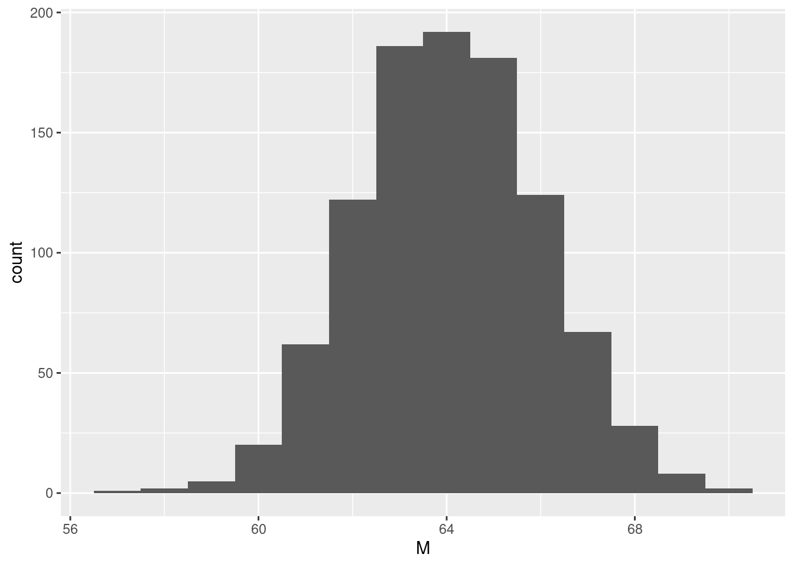
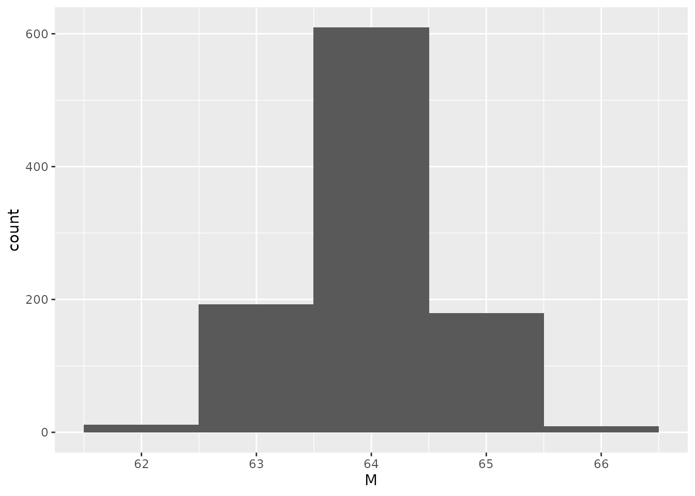
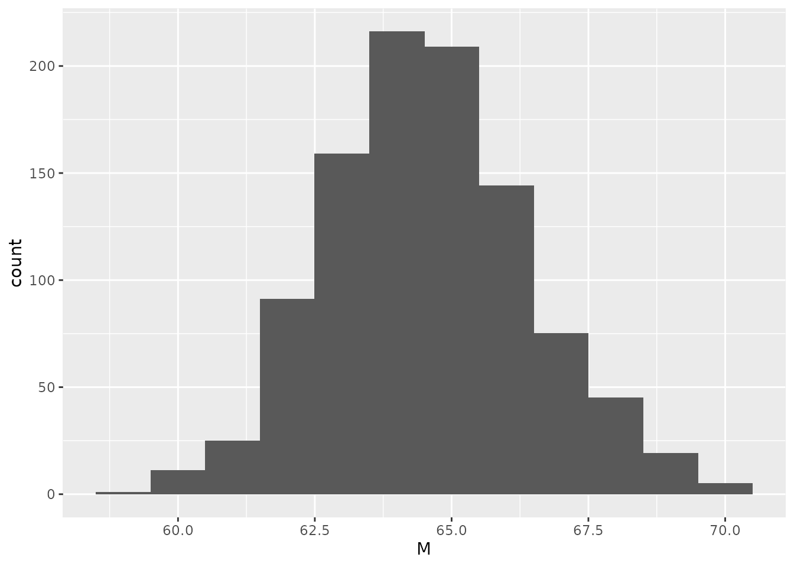
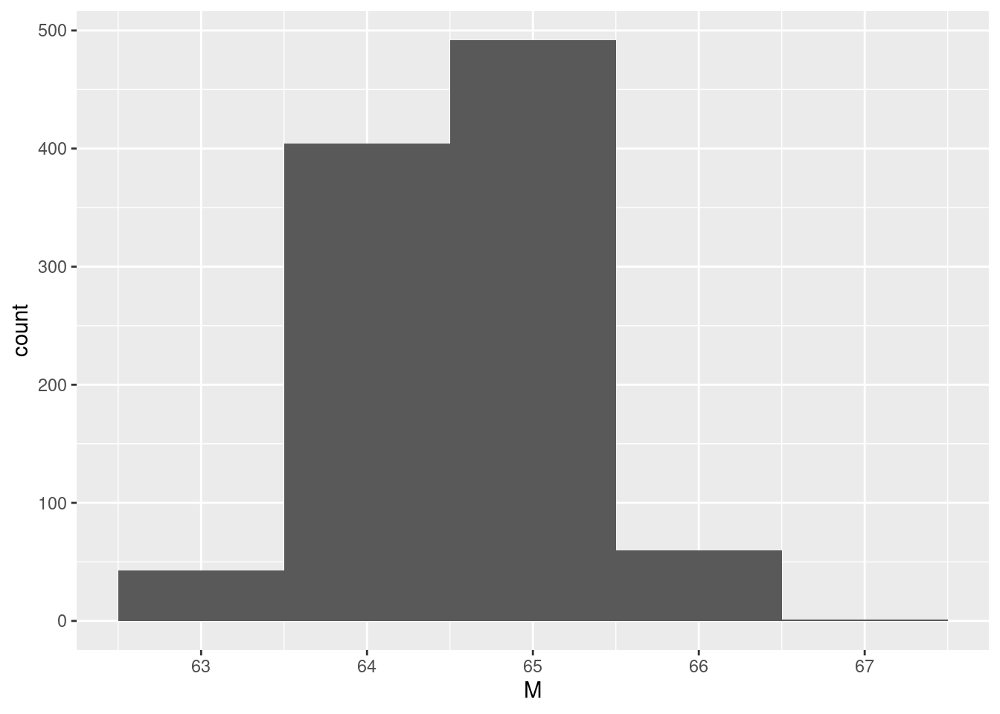
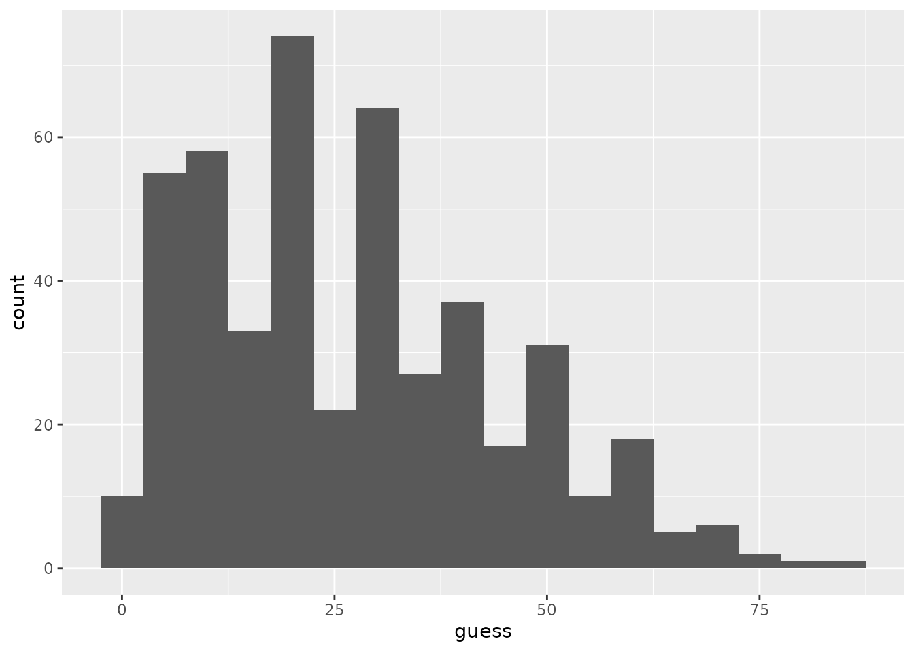

# Sampling and the Central Limit Theorem: The Wisdom of Large Samples {#lab6}


We have just encountered a remarkable phenomenon which goes by the weighty but unclear name "central limit theorem".  This theorem says that if we draw a large enough sample from our population of interest, the *mean* of our sample will have a much better chance of being a good *estimate* of the mean of the population.

Specifically, what happens is that there is a distribution of sample means which is approximately normal.  The mean of this distribution is the population mean (which we've labeled $\mu$) and the standard deviation of this distribution is called the "**standard error of the mean**" and is equal to $\frac{\sigma}{\sqrt{n}}$, where $\sigma$ is the population standard deviation and $n$ is our sample size.  So this distribution of sample means is centered on the "correct answer", and gets narrower and narrower the larger our sample.  This means that, the larger the sample, the better the chance that its mean is close to the population mean.

But for this to happen, our sample has to be *representative* of the population.  If the sample is *biased* in any way, then our estimate of the population mean will also be biased.  One way a sample can be biased is if it is not a *simple random sample* from the population.

In this session, we will see the "central limit theorem" in action to better understand what it means.  We will also see how sampling bias hampers our ability to estimate population means.  Finally, we will see that it is not just a statistical curiosity, but something that is surprisingly pervasive.

## Before we begin...

For this session, we will need the tidyverse package like usual.  We will *also* need another package from R's library called "infer".  Make sure you have it installed (if you already have it installed, you can skip the next line, but try running this line if something doesn't work):


```r
install.packages("infer")
```

Now, make sure you have loaded *both* the tidyverse package *and* the new "infer" package from R's library:


```r
library(tidyverse)
```

```
## ── Attaching packages ─────────────────────────────────────── tidyverse 1.3.1 ──
```

```
## ✓ ggplot2 3.3.5     ✓ purrr   0.3.4
## ✓ tibble  3.1.3     ✓ dplyr   1.0.5
## ✓ tidyr   1.1.3     ✓ stringr 1.4.0
## ✓ readr   2.0.0     ✓ forcats 0.5.1
```

```
## ── Conflicts ────────────────────────────────────────── tidyverse_conflicts() ──
## x dplyr::filter() masks stats::filter()
## x dplyr::lag()    masks stats::lag()
```

```r
library(infer)
```

One last thing before we begin:  Make your best guess about the answer to this question: **What percent of the world's airports are in the United States?**

## Heights

Last time, we saw how when we used a *model* to simulate lots of individual observed values, the descriptive statistics for our simulated data were very close to the model *parameters* we used.  We focused on the distribution of these individual values.  Now, we will focus on the **distribution of sample means**.  This is the distribution that represents our uncertainty about the true value of the population mean.

### A simulated population

Lets use the normal distribution to simulate the heights of an entire population of women, let's say 50,000.  Remember that the mean height is 64 inches and the standard deviation is 6 inches:


```r
height <- rnorm(n = 50000, mean = 64, sd = 6)

population <- tibble(height)
```

In the first line, we used the `rnorm` function to simulate the heights of `n = 50000` women, where the average height is `mean = 64` inches and the standard deviation of heights is `sd = 6` inches.  We told R to remember this collection of values under the name "height".  In the second line, we told R to treat "height" as if it were data (a "tibble") and told R to remember our data under the name "population".

### A sample from our simulated population

Now that we have a whole population at our disposal---which we can only do because we are *simulating them*!---we can experiment and see what the effect is of getting different samples from this population.

The code below selects a simple random sample of 10 women from our population:


```r
population %>%
    slice_sample(n = 10)
```

```
## # A tibble: 10 × 1
##    height
##     <dbl>
##  1   55.2
##  2   56.8
##  3   58.9
##  4   65.6
##  5   65.0
##  6   52.0
##  7   58.1
##  8   52.6
##  9   59.5
## 10   65.3
```

This is pretty similar to how we simulated things like coin flips earlier.^[Compare sampling from a population to simulating coin flips.  When we select an individual from a population, what is the *sample space*?  If we are doing simple random sampling, what is the probability that any particular individual is selected into our sample?]  The `slice_sample` function is just another way we can simulate drawing a "sample" of size `n` from a set of possibilities.

Let's try it again and see what a different sample of 10 women from this population might be:


```r
population %>%
    slice_sample(n = 10)
```

```
## # A tibble: 10 × 1
##    height
##     <dbl>
##  1   64.5
##  2   67.8
##  3   55.9
##  4   60.7
##  5   66.3
##  6   69.0
##  7   74.7
##  8   57.0
##  9   54.8
## 10   64.3
```

Now let's tell R to remember one of these samples under the name "sample_heights", so we can work with it later.


```r
sample_heights <- population %>%
    slice_sample(n = 10)
```

Now we can do our usual thing and find the mean and standard deviation of the heights *in this one sample*:


```r
sample_heights %>%
    summarize(M = mean(height), S = sd(height))
```

```
## # A tibble: 1 × 2
##       M     S
##   <dbl> <dbl>
## 1  64.9  5.73
```

As we might expect, they are somewhat close to the parameters we used to generate the population, but they are unlikely to match exactly.

### Many samples from our simulated population

If we kept getting samples of size 10 from our population, how often would their sample means be close to the true population mean?  While we could just keep running that same code from above over and over again, R helps us automate this process:


```r
many_samples_size10 <- population %>%
    rep_slice_sample(n = 10, reps = 1000)
```

What we just did was use the `rep_slice_sample` function to `rep`eatedly sample groups of 10 women from our population^[Compare this line of code with the line we used to get a single sample of size 10, above.  What is similar and what is different?].  Specifically, we got `reps = 1000` samples of size 10, and we told R to remember these samples under the name "many_samples_size10".  Let's have a look at what the resulting simulated data look like:


```r
many_samples_size10
```

```
## # A tibble: 10,000 × 2
## # Groups:   replicate [1,000]
##    replicate height
##        <int>  <dbl>
##  1         1   65.3
##  2         1   72.3
##  3         1   69.6
##  4         1   67.1
##  5         1   69.0
##  6         1   70.4
##  7         1   67.6
##  8         1   54.5
##  9         1   56.2
## 10         1   55.1
## # … with 9,990 more rows
```

So there are two columns, one column is "height", representing the height in inches of each simulated woman in our samples.  The other column is "replicate" which tells us *which sample* (of the 1000 samples we made) the woman is in.  This column will let us group the women into their respective samples.

Now we can get the mean height for each sample:


```r
many_samples_size10 %>%
    group_by(replicate) %>%
    summarize(M = mean(height))
```

```
## # A tibble: 1,000 × 2
##    replicate     M
##        <int> <dbl>
##  1         1  64.7
##  2         2  67.3
##  3         3  62.5
##  4         4  60.8
##  5         5  63.0
##  6         6  64.6
##  7         7  62.2
##  8         8  66.1
##  9         9  64.1
## 10        10  60.6
## # … with 990 more rows
```

So we begin to see how the sample mean changes depending on who happened to have been selected into the sample.  But this is still too many numbers, so let's go to our old standby, the histogram.

First, let's tell R to remember those sample means we just found:


```r
sample_means_size10 <- many_samples_size10 %>%
    group_by(replicate) %>%
    summarize(M = mean(height))
```

Now, we are in shape to make a histogram representing the *frequency* with which different samples have different means:


```r
sample_means_size10 %>%
    ggplot(aes(x=M)) +
    geom_histogram(binwidth=1)
```



Certainly looks like a normal distribution!  Now let's see what the mean and standard deviation of the sample means are:


```r
sample_means_size10 %>%
    summarize(MM = mean(M), SEM = sd(M))
```

```
## # A tibble: 1 × 2
##      MM   SEM
##   <dbl> <dbl>
## 1  64.0  1.93
```

Remember that the standard deviation of sample means goes by the special name **standard error of the mean**, hence why we labeled it `SEM`.^[Based on the "central limit theorem", and the fact that the population standard deviation is $\sigma = 6$ and the samples are of size $n = 10$, how does the value of `SEM` above compare with what the central limit theorem would predict?]

### Many larger samples

Let's follow the same steps above, but instead of collecting many samples of size 10, let's get many larger samples of size 100.

First, let's simulate 1000 samples, all of size 100, and tell R to remember them under the name "many_samples_size100".^[What code would do this?  *Hint: what would you need to change in the code we used to produce many samples of size 10?*]


Next, let's find the means of each of those samples like we did above:


```r
sample_means_size100 <- many_samples_size100 %>%
    group_by(replicate) %>%
    summarize(M = mean(height))
```

And have a look at a histogram:


```r
sample_means_size100 %>%
    ggplot(aes(x=M)) +
    geom_histogram(binwidth=1)
```



And the mean of sample means and standard error of the mean^[Compare `SEM` we found for our samples of size 100 with what the central limit theorem says the standard error of the mean should be---is it close?  Compare `SEM` for samples of size 10 to `SEM` for samples of size 100, which is smaller?]:


```r
sample_means_size100 %>%
    summarize(MM = mean(M), SEM = sd(M))
```

```
## # A tibble: 1 × 2
##      MM   SEM
##   <dbl> <dbl>
## 1  64.0 0.600
```

### The probability of being wrong

Remember that, just like we never really get to see the whole population in any real-world settings, we also never really get to see the distribution of sample means in real life.  In real life, we will probably only have one sample and, therefore, one sample mean.

But because our sample mean comes from a distribution of sample means that is *normal*, we can use the normal distribution to figure out the *probability* that whatever sample mean we have is wrong, and by how much.

#### Using simulation

First, let's use our many simulated samples to see how many are wrong by different amounts.

How many of our samples of size 10 had sample means that under-shot or over-shot the true population mean of 64 inches?


```r
sample_means_size10 %>%
    group_by(M > 64) %>%
    summarize(n=n()) %>%
    mutate(p = n / sum(n))
```

```
## # A tibble: 2 × 3
##   `M > 64`     n     p
##   <lgl>    <int> <dbl>
## 1 FALSE      497 0.497
## 2 TRUE       503 0.503
```

In the second line above, we grouped our samples by whether or not their sample means were greater than 64 (`M > 64`).  Looks like it is about even.^[By counting the number of samples that over-shot, we also end up knowing how many samples under-shot.  Why is this?]  This suggests that the sample means are not *biased* either high or low.

Now, how many of our samples of size 10 had sample means that were within 1 inch of the true population mean of 64 inches?  In other words, how many had sample means that were between 63 and 65 inches?


```r
sample_means_size10 %>%
    group_by(63 < M & M < 65) %>%
    summarize(n=n()) %>%
    mutate(p = n / sum(n))
```

```
## # A tibble: 2 × 3
##   `63 < M & M < 65`     n     p
##   <lgl>             <int> <dbl>
## 1 FALSE               600   0.6
## 2 TRUE                400   0.4
```

By comparison, how many of our samples of size 100 had sample means that were within 1 inch of the true population mean of 64 inches?^[What code produces the results below?  *Hint: what should we change in the code immediately above?*]


```
## # A tibble: 2 × 3
##   `63 < M & M < 65`     n     p
##   <lgl>             <int> <dbl>
## 1 FALSE                97 0.097
## 2 TRUE                903 0.903
```

Wow, that's quite an improvement!  The probability that our estimate of the population mean---the sample mean---is within 1 inch of the correct answer is much higher if our sample has 100 women than 10 women.

#### Using the central limit theorem

Remember that we were only able to count those results above *because we have many many samples of the same size*.  In real life, we almost never have this.  That's why the central limit theorem is useful---we can use what we know about the normal distribution to calculate the probability of being wrong and by how much.

Let's first think about our samples of size 10.  The central limit theorem says that the means of these samples have a normal distribution with a mean of $\mu = 64$ inches and a standard deviation of $\frac{\sigma}{\sqrt{n}} = \frac{6}{\sqrt{10}} \left( \approx 1.897 \right)$ inches.  In R, we can write that standard deviation like this: `6 / sqrt(10)`, where `sqrt` stands for "square root".

Now, using the normal distribution, what is the probability that the mean we get from a sample of size 10 is within 1 inch of the true population mean?^[How does the probability we get from the normal distribution compare with the one we found by counting our samples, above?]


```r
pnorm(q=65, mean = 64, sd = 6 / sqrt(10)) - pnorm(q = 63, mean = 64, sd = 6 / sqrt(10))
```

```
## [1] 0.4018385
```

And what is the probability that the mean we get from a sample of size 100 is within 1 inch of the true population mean?^[What code produces this result?  *Hint: what do we need to change in the code above?*]


```
## [1] 0.9044193
```

### Biased samples

So far, we assumed that our samples were all simple random samples.  What happens if this is no longer the case?  What if instead our samples are **biased**?

Imagine that instead of selecting women at random, we got a bunch of women in a large room and selected them based on how easy they were to see.  Obviously this would lead us to select more tall than short women, because it is easier to see a tall person above a crowd (and a tall person could hide a shorter person behind them).  We can simulate this kind of biased sampling by telling R to give more "weight" to a woman who is taller when selecting samples.  This doesn't mean that a short person will *never* get selected (maybe they are standing in front so no one is in the way), but it does make it less likely.

Here's an example of a single sample of size 10, where more "weight" is given to women who are taller:


```r
population %>%
    slice_sample(n = 10, weight_by = height)
```

```
## # A tibble: 10 × 1
##    height
##     <dbl>
##  1   65.6
##  2   62.5
##  3   65.7
##  4   65.2
##  5   62.4
##  6   60.2
##  7   46.7
##  8   57.6
##  9   74.8
## 10   62.3
```

Now let's repeat the same steps from above to get 1000 *biased* samples each of size 10 and size 100 (note that this may take longer than simulating unbiased samples):


```r
many_biased_samples_size10 <- population %>%
    rep_slice_sample(n=10, reps=1000, weight_by = height)

many_biased_samples_size100 <- population %>%
    rep_slice_sample(n=100, reps=1000, weight_by = height)
```

Now let's get the means of each of these biased samples:


```r
biased_sample_means_size10 <- many_biased_samples_size10 %>%
    group_by(replicate) %>%
    summarize(M = mean(height))

biased_sample_means_size100 <- many_biased_samples_size100 %>%
    group_by(replicate) %>%
    summarize(M = mean(height))
```

Let's look at some histograms to get a sense of their distribution shape.  Here it is for biased samples of size 10:


```r
biased_sample_means_size10 %>%
    ggplot(aes(x=M)) +
    geom_histogram(binwidth=1)
```



And for biased samples of size 100^[Do the shapes of the distributions of biased means still look roughly normal, or do they look a bit skewed?  Is there a difference between biased samples of size 10 vs. 100?]:


```r
biased_sample_means_size100 %>%
    ggplot(aes(x=M)) +
    geom_histogram(binwidth=1)
```



And finally, let's have a look at the mean of the sample means and their standard errors for biased samples of size 10:


```r
biased_sample_means_size10 %>%
    summarize(MM = mean(M), SEM = sd(M))
```

```
## # A tibble: 1 × 2
##      MM   SEM
##   <dbl> <dbl>
## 1  64.6  1.84
```

And for biased samples of size 100^[What is different between the mean of sample means (`MM`) and the standard error of the mean (`SEM`) for biased samples versus unbiased samples?  Does this difference make sense given the way our samples are biased?]:


```r
biased_sample_means_size100 %>%
    summarize(MM = mean(M), SEM = sd(M))
```

```
## # A tibble: 1 × 2
##      MM   SEM
##   <dbl> <dbl>
## 1  64.6 0.606
```

## The Wisdom of the Crowd

We've seen how, at least when we have simple random samples, the larger a sample, the more likely it is that our sample mean is close to the actual population mean.  But this isn't just a statistical curiosity about estimating properties of populations, like their heights.  It turns out that if you want to know anything about the world, you're better off asking more people.  This concept was originally identified by @Galton1907 and is now called the "wisdom of the crowd" [@Surowiecki2004].

The wisdom of crowds was studied recently by @SteegenEtAl2014 who replicated a study by @VulPashler2008.  They asked people questions about world facts like the one you answered at the beginning of the session.  These people weren't experts and weren't allowed to look up the answer.  But as we will see, their *mean* answer is actually pretty close to the truth.

### Grab the data

First, let's download the guesses that the participants in @SteegenEtAl2014 made to the question you answered at the beginning:


```r
wisdom_data <- read_csv("https://raw.githubusercontent.com/gregcox7/StatLabs/main/data/wisdom.csv")
```

```
## Rows: 471 Columns: 4
```

```
## ── Column specification ────────────────────────────────────────────────────────
## Delimiter: ","
## chr (2): nationality, sex
## dbl (2): age, guess
```

```
## 
## ℹ Use `spec()` to retrieve the full column specification for this data.
## ℹ Specify the column types or set `show_col_types = FALSE` to quiet this message.
```

Taking a look at the data, each row represents a different person's answer to the question.  The answer they gave is in the "guess" column.  There is also some demographic information about each person (age, sex, nationality).

### Make a histogram

Now let's make a histogram of people's guesses^[Why do you think the histogram looks kind of "lumpy"? *Hint: how much detail do you think people can give when making a guess like this?*]:


```r
wisdom_data %>%
    ggplot(aes(x=guess)) +
    geom_histogram(binwidth = 5)
```



Doesn't look especially normal, but it is also pretty spread out.  This makes sense given that very few if any people in this sample would be expected to be experts in airport distribution.

### What is the right answer?

At the time these data were collected, the correct answer to the question, "what percent of the world's airports are in the United States?" was **32.3%** (how close were you?).

How many people over- or under-shot the answer?


```r
wisdom_data %>%
    group_by(guess < 32.3) %>%
    summarize(n = n()) %>%
    mutate(p = n / sum(n))
```

```
## # A tibble: 2 × 3
##   `guess < 32.3`     n     p
##   <lgl>          <int> <dbl>
## 1 FALSE            155 0.329
## 2 TRUE             316 0.671
```

### What about the average?

How close was the *mean* guess to the right answer?


```r
wisdom_data %>%
    summarize(M = mean(guess))
```

```
## # A tibble: 1 × 1
##       M
##   <dbl>
## 1  27.0
```

Huh, not too bad!  The difference between the mean guess and the right answer is about $32.3 - 27 = 5.3$.  How many people were at least as close to the correct answer as the mean guess, in other words, how many people guessed a value between 27 and $32.3 + 5.3 = 37.6$?^[What code would give us this result?  *Hint: remember how we found the number of sample mean heights that were within an inch of the true population average above.*]


```
## # A tibble: 2 × 3
##   `27 < guess & guess < 37.6`     n     p
##   <lgl>                       <int> <dbl>
## 1 FALSE                         380 0.807
## 2 TRUE                           91 0.193
```

So the mean guess is doing better than the vast majority of individual guesses.  This is pretty remarkable!  The "wisdom of the crowd" is another case in which large samples get us closer to the truth.^[Why do you think that the *mean* of a set of guesses does so much better than most of the individual guesses?]

## Wrap-up

We've seen the "central limit theorem" in action:  The larger our sample, the more likely it is that the sample mean is close to the population mean.  This is valuable because, in reality, we almost never know the true population mean, so we have to *estimate* it using a sample.  But we also saw that a *biased* sample can give us the wrong answer.  Finally, we saw that the power of large samples extends to making guesses about the world at large---maybe instead of finding an expert, we just need a lot of guesses!
