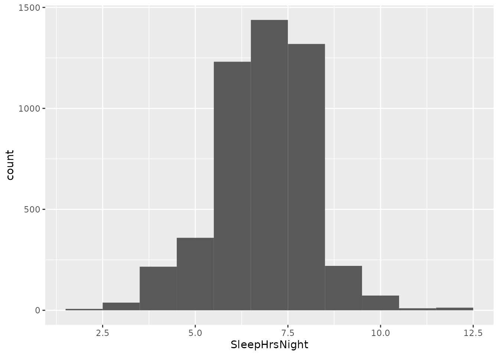
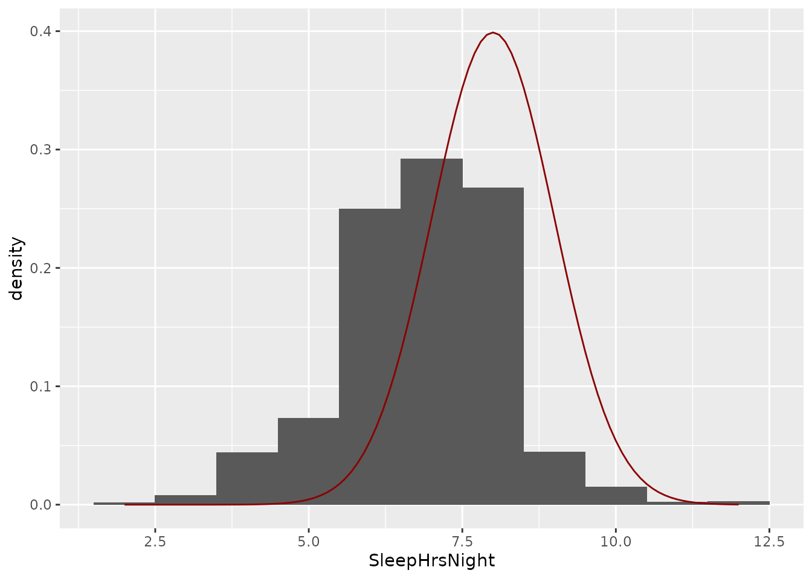
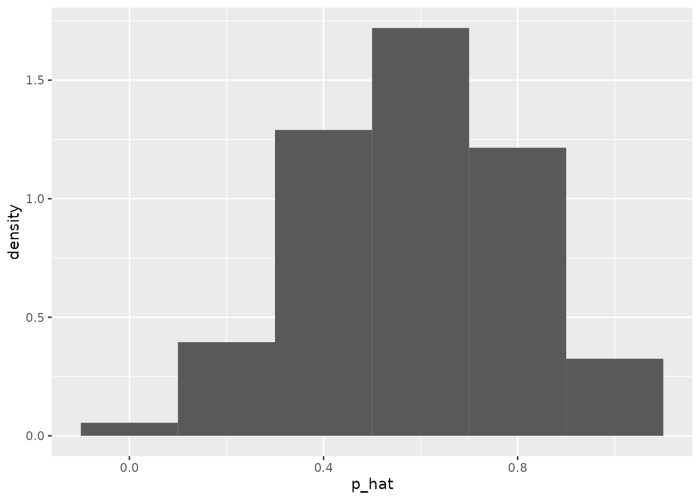
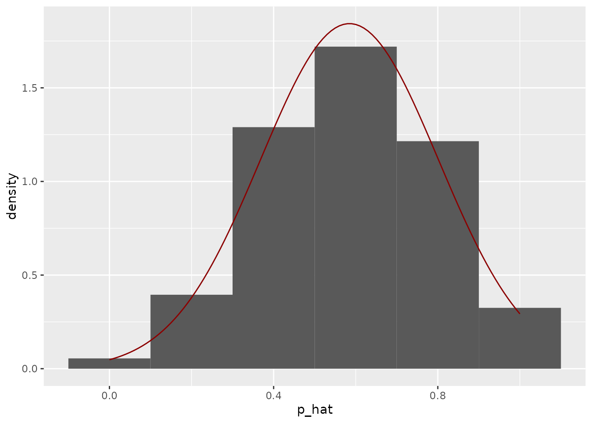
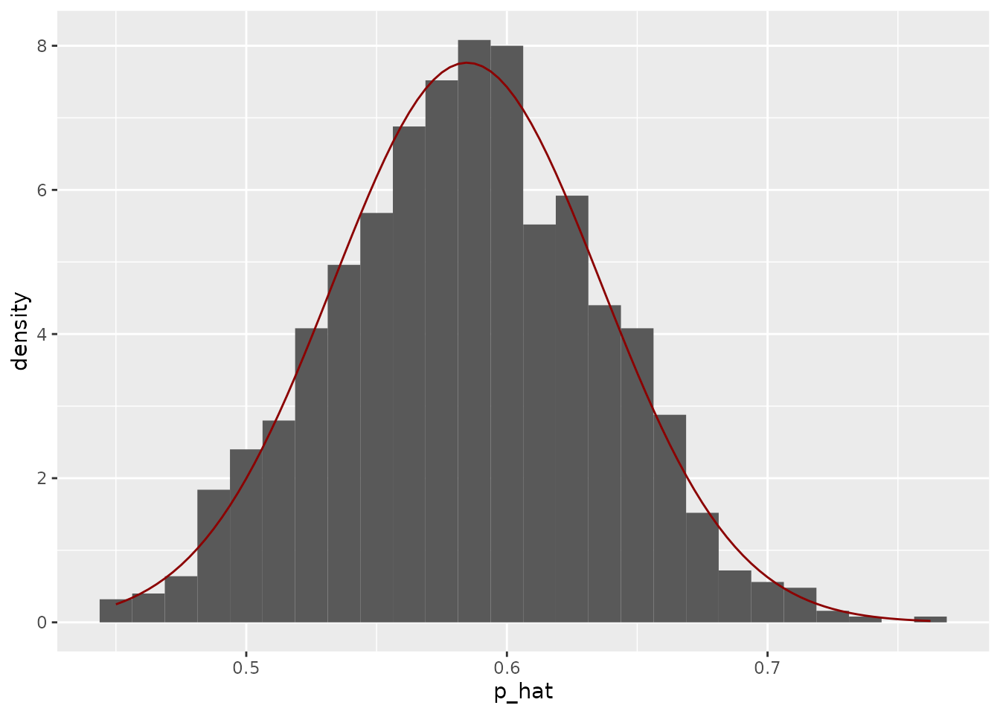

# The normal distribution {#lab7}


The venerable **normal distribution** or "bell curve" is almost like a mascot for statistics.  Although there are variables in real life that are distributed according to a normal distribution, its real value is in describing sampling distributions.  We have seen sampling distributions in both hypothesis testing and confidence intervals:  Sampling distributions represent the variability in a point estimate like a proportion or mean that is due to the randomness involved in selecting samples from a population.  According to the **central limit theorem**, much of the time, sampling distributions will be approximately normal in shape.

In this session, we will first use the normal distribution as a model for population distributions, that is the distribution of values on a particular variable across a whole population.  Along the way, we will get the hang of using R to find proportions and intervals based on the normal distribution.  Then, in the second part, we will use the normal distribution as a model for sampling distributions.  This will give us some insight into how **standard error** relates to things like sample size.

## Required packages: `tidyverse` and `infer`

We will require both the `tidyverse` and `infer` packages for this session, so make sure to load both from R's library:


```r
library(tidyverse)
```

```{.Rout .text-info}
## ── Attaching packages ─────────────────────────────────────── tidyverse 1.3.1 ──
```

```{.Rout .text-info}
## ✔ ggplot2 3.3.6     ✔ purrr   0.3.4
## ✔ tibble  3.1.8     ✔ dplyr   1.0.9
## ✔ tidyr   1.1.3     ✔ stringr 1.4.0
## ✔ readr   2.1.2     ✔ forcats 0.5.1
```

```{.Rout .text-info}
## ── Conflicts ────────────────────────────────────────── tidyverse_conflicts() ──
## ✖ dplyr::filter() masks stats::filter()
## ✖ dplyr::lag()    masks stats::lag()
```

```r
library(infer)
```

## The data: National Health and Nutrition Examination Surveys (NHANES)

The data we will be using in this lab were originally collected by the US National Center for Heath Statistics between 2009 and 2012.  This is a subset of what is effectively a simple random sample from the entire US population, though we will only use some of the observations out of the many they collected.  Load the data with the following line:


```r
nhanes <- read_csv("https://raw.githubusercontent.com/gregcox7/StatLabs/main/data/nhanes.csv")
```

```{.Rout .text-info}
## Rows: 4924 Columns: 76── Column specification ────────────────────────────────────────────────────────
## Delimiter: ","
## chr (31): SurveyYr, Gender, AgeDecade, Race1, Race3, Education, MaritalStatu...
## dbl (41): ID, Age, AgeMonths, HHIncomeMid, Poverty, HomeRooms, Weight, Heigh...
## lgl  (4): Length, HeadCirc, TVHrsDayChild, CompHrsDayChild
## ℹ Use `spec()` to retrieve the full column specification for this data.
## ℹ Specify the column types or set `show_col_types = FALSE` to quiet this message.
```

## The normal distribution as a model for a population distribution

### Hours of Sleep (`SleepHrsNight`)

The variable we will focus on in this section is the number of hours people report sleeping each night, measured in hours.  This is recorded for each individual in the sample under the variable `SleepHrsNight`.

#### Visualize the distribution

As usual, we begin by visualizing the actual data.  As a reminder, we will assume for the time being that these data constitute the entire population of interest.  The histogram below shows the population distribution of nightly hours of sleep:


```r
nhanes %>%
    ggplot(aes(x = SleepHrsNight)) +
    geom_histogram(binwidth = 1)
```



#### Is the normal distribution a good model?

Next, we want to know whether the normal distribution will be a good model of the population distribution we just visualized.  To do this, we will draw a curve representing the normal distribution on top of the histogram we just made.

But remember that the normal distribution is just a shape.  Its center and spread are determined by two population parameters: the **mean** ($\mu$) and **standard deviation** ($\sigma$).  What should those parameters be?

Let's first take a wild guess and say they should be $\mu = 8$ and $\sigma = 1$.  We can draw this distribution using the chunk of code below:


```r
nhanes %>%
    ggplot(aes(x = SleepHrsNight)) +
    geom_histogram(aes(y = ..density..), binwidth = 1) +
    stat_function(fun = dnorm, args = list(mean = 8, sd = 1), color = 'darkred')
```



Notice that we needed to add `aes(y = ..density..)` to our histogram line, for reasons which will be clear in the next paragraph.  The final line lets us draw a `function` on our graph.  The `fun`ction is called `dnorm` for "`d`ensity of a `norm`al distribution".  We had to say what the `arg`ument`s` of that function should be, which are a `list` in which we say what the `mean` and `sd` of the normal distribution should be.

The whole "density" thing comes from this:  A histogram shows *absolute* counts.  But a normal distribution only specifies the *relative* frequency of different values.  The relative frequency is called the "density".  This is what the `dnorm` function gives us for the normal distribution.  So adding `aes(y = ..density..)` to the histogram line told R to show the density (relative frequency) rather than the absolute counts.

Anyway, it is clear that a mean of 8 hours and standard deviation of 1 hour do not make a good fit.  What we should use instead are the actual mean and SD from our data:


```r
nhanes %>%
    summarize(mean(SleepHrsNight), sd(SleepHrsNight))
```

```{.Rout .text-muted}
## # A tibble: 1 × 2
##   `mean(SleepHrsNight)` `sd(SleepHrsNight)`
##                   <dbl>               <dbl>
## 1                  6.86                1.32
```

Let's give those numbers a label so we can use them later:


```r
mean_sleep <- nhanes %>%
    summarize(mean(SleepHrsNight)) %>%
    pull()

sd_sleep <- nhanes %>%
    summarize(sd(SleepHrsNight)) %>%
    pull()
```

::: {.exercise}
Fill in the blanks in the code below to visualize the fit of the normal distribution using the values for the mean and SD we just found.


```r
nhanes %>%
    ggplot(aes(x = SleepHrsNight)) +
    geom_histogram(aes(y = ..density..), binwidth = 1) +
    stat_function(fun = dnorm, args = list(mean = ___, sd = ___), color = 'darkred')
```

Does the normal distribution do a good job approximating the shape of the population distribution?

:::

#### Proportions from a normal distribution

Using a normal distribution, it is possible to estimate what proportion of values will be above or below some number.  For example, the following uses the normal distribution to estimate the proportion of people who say they get less than eight hours of sleep per night:


```r
pnorm(q = 8, mean = mean_sleep, sd = sd_sleep, lower.tail = TRUE)
```

```{.Rout .text-muted}
## [1] 0.8058069
```

Conversely, this is the proportion that get *more* than eight hours of sleep per night:


```r
pnorm(q = 8, mean = mean_sleep, sd = sd_sleep, lower.tail = FALSE)
```

```{.Rout .text-muted}
## [1] 0.1941931
```

Notice that the difference is whether `lower.tail` is `TRUE` or `FALSE`.  If `lower.tail = TRUE`, we are asking the proportion that is *below* the value `q`, but if `lower.tail = FALSE` we are asking the proportion that is *above* the value `q`.

::: {.exercise}
Use the `pnorm` function to find the following proportions:

a. The proportion of people who get *less than* 6 hours of sleep per night.
b. The proportion of people who get *more than* 10 hours of sleep per night.
c. The proportion of people who get *either* less than 6 hours of sleep per night *or* more than 10 hours of sleep per night (*Hint:* you can add proportions of things that do not overlap.)

:::

#### Quantiles from a normal distribution

As we saw last time, things like confidence intervals are defined in terms of "quantiles".  Finding a quantile is the opposite of finding a proportion.  In R, this opposite relationship is clear because we just swap the `p` and `q`.  The `qnorm` function find the value `q` for which the proportion `p` of values are either below or above `q`.

For example, if we want to know the "25th percentile", this is the quantile `q` for which `p = 0.25` are *less than* that value:


```r
qnorm(p = 0.25, mean = mean_sleep, sd = sd_sleep, lower.tail = TRUE)
```

```{.Rout .text-muted}
## [1] 5.964337
```

Here's a neat trick, though:  If 0.25 are *less than* some value, that means 0.75 are *more than* that value.  So if we flip `lower.tail` to `FALSE` and `p` to `0.75`, we will get the same answer:


```r
qnorm(p = 0.75, mean = mean_sleep, sd = sd_sleep, lower.tail = FALSE)
```

```{.Rout .text-muted}
## [1] 5.964337
```

::: {.exercise}
Use the `qnorm` function to find the following quantiles:

a. What is the quantile for which 0.025 of the data are *below* that value?
a. What is the quantile for which 0.025 of the data are *above* that value?
a. Between which two values does the middle 95% of the data fall?  (*Hint:* how much of the data would fall above and below the middle 95%?)

:::

### Bad Days (`DaysMentHlthBad`)

As part of the same survey, people were asked how many days out of the last 30 would they consider their mental health to have been poor.  This is recorded under the variable named `DaysMentHlthBad`.

Just like we did for the number of hours slept per night, find the mean and standard deviation of `DaysMentHlthBad` and see whether the normal distribution seems to provide a good approximation to the population distribution.

::: {.exercise}
Fill in the blanks in the chunk of code below to find the mean and standard deviation of `DaysMentHlthBad` and plot the data along with the approximating normal distribution.


```r
mean_mental_health <- nhanes %>%
    summarize(mean(___)) %>%
    pull()

sd_mental_health <- nhanes %>%
    summarize(sd(___)) %>%
    pull()

nhanes %>%
    ggplot(aes(x = ___)) +
    geom_histogram(aes(y = ..density..), binwidth = 1) +
    stat_function(fun = dnorm, args = list(mean = ___, sd = ___), color = 'darkred')
```

a. Describe the shape of the distribution of the observed data shown in the histogram.
a. Does the normal distribution provide a good fit to these data?
a. Make a reasoned guess about why the population distribution might have the shape that it has, taking note of the fact that respondents had to give a number of days out of 30.

:::

## The normal distribution as a model for a sampling distribution

In the previous section, we got a sense of how we can use the normal distribution to approximate a distribution of observed values from a population:

1. Find the mean and standard deviation.
2. Check to see how well the normal distribution with that mean and standard deviation fits the histogram of the observed data.

We will now follow these same two steps, but instead of using the normal distribution to model a population distribution, we will use it to model a **sampling distribution**, that is, the distribution of summary statistics that we would get across many samples from the same population.

In this section, we will again assume that the `nhanes` dataset represents the *entire population* of interest.  We will *simulate* drawing many different samples of different sizes from this population and calculate a summary statistic on each sample.  The **sampling distribution** is the distribution of those summary statistics and we will see how well we can approximate it with a normal distribution.

We will focus on just one of the questions asked on the NHANES survey.  This question asks whether someone has ever tried using marijuana.  This information resides in the variable `Marijuana` and a person's response is either "Yes" or "No".

::: {.exercise}
Without even looking at the data, would it make sense to try to use a normal distribution to approximate the population distribution of the responses to the `Marijuana` question?  Why or why not?

:::

### The "true" proportion

Because we are assuming that the `nhanes` data represent an entire population, we can directly find the "true" value of the population parameter $\pi_{\text{Marijuana}}$, that is, the proportion of people who have ever tried marijuana.  We can use the code below:


```r
nhanes %>%
    group_by(Marijuana) %>%
    summarize(n = n()) %>%
    mutate(pi = n / sum(n))
```

```{.Rout .text-muted}
## # A tibble: 2 × 3
##   Marijuana     n    pi
##   <chr>     <int> <dbl>
## 1 No         2045 0.415
## 2 Yes        2879 0.585
```

Actually, since we are only interested in the proportion who said "Yes", we can find that proportion using some more compact code:


```r
nhanes %>%
    summarize(pi_marijuana = mean(Marijuana == "Yes"))
```

```{.Rout .text-muted}
## # A tibble: 1 × 1
##   pi_marijuana
##          <dbl>
## 1        0.585
```

The "trick" in the previous chunk of code is this: `Marijuana == "Yes"` checks to see, for each person, whether their response to the `Marijuana` question was "Yes".  If it was, it gives that person a "score" of 1, but if not, it gives that person a "score" of 0.  Recall that the mean is the *sum* of a set of numbers divided by the *total number* of numbers.  So when we find the `mean` of those scores using `mean(Marijuana == "Yes")`, we are really adding up the number of people who "scored" a 1 and dividing by the total number of people.

### Simulating many samples

Last time, we used *bootstrapping* to simulate what would happen if we collected many samples from a population by using the sample we actually had to *estimate* the whole population.  Now, we have access to that population directly.  We can therefore draw as many samples of a given size as we want!

For example, the following chunk of code randomly samples 5 people from the population and gets R to remember that sample under the name `sample_size5`.


```r
sample_size5 <- nhanes %>%
    sample_n(size = 5)

sample_size5
```

```{.Rout .text-muted}
## # A tibble: 5 × 76
##      ID Surve…¹ Gender   Age AgeDe…² AgeMo…³ Race1 Race3 Educa…⁴ Marit…⁵ HHInc…⁶
##   <dbl> <chr>   <chr>  <dbl> <chr>     <dbl> <chr> <chr> <chr>   <chr>   <chr>  
## 1 65978 2011_12 male      57 50-59        NA White White Some C… NeverM… 25000-…
## 2 53457 2009_10 female    30 30-39       364 Mexi… <NA>  8th Gr… Married <NA>   
## 3 53965 2009_10 male      31 30-39       375 Mexi… <NA>  Some C… Married 65000-…
## 4 54006 2009_10 male      20 20-29       240 Mexi… <NA>  Some C… NeverM… 75000-…
## 5 63200 2011_12 female    59 50-59        NA White White Colleg… Married more 9…
## # … with 65 more variables: HHIncomeMid <dbl>, Poverty <dbl>, HomeRooms <dbl>,
## #   HomeOwn <chr>, Work <chr>, Weight <dbl>, Length <lgl>, HeadCirc <lgl>,
## #   Height <dbl>, BMI <dbl>, BMICatUnder20yrs <chr>, BMI_WHO <chr>,
## #   Pulse <dbl>, BPSysAve <dbl>, BPDiaAve <dbl>, BPSys1 <dbl>, BPDia1 <dbl>,
## #   BPSys2 <dbl>, BPDia2 <dbl>, BPSys3 <dbl>, BPDia3 <dbl>, Testosterone <dbl>,
## #   DirectChol <dbl>, TotChol <dbl>, UrineVol1 <dbl>, UrineFlow1 <dbl>,
## #   UrineVol2 <dbl>, UrineFlow2 <dbl>, Diabetes <chr>, DiabetesAge <dbl>, …
## # ℹ Use `colnames()` to see all variable names
```

Notice that we still have all of those people's responses to each question on the NHANES survey.  That means we can get a *summary statistic* for the `Marijuana` variable from this sample, just like we did from the population.

::: {.exercise}
Based on the code we used above to find the "true" proportion in the population, get the point estimate based on the sample of 5 people you just drew (`sample_size5`).


```r
___ %>%
    summarize(p_hat = ___)
```

a. What is the proportion of people who tried marijuana in your sample?
a. Would you expect to get the same proportion from another random sample from the population?  Why or why not?

:::

As we've seen, the great thing about computers is that they can do boring repetitive things for us very quickly.  Now, we will draw 1000 samples of size 5 from the population and get R to remember them under the name `samples_size5`.


```r
samples_size5 <- nhanes %>%
    rep_sample_n(size = 5, reps = 1000)

samples_size5
```

```{.Rout .text-muted}
## # A tibble: 5,000 × 77
## # Groups:   replicate [1,000]
##    replicate    ID SurveyYr Gender   Age AgeDecade AgeMonths Race1 Race3 Educa…¹
##        <int> <dbl> <chr>    <chr>  <dbl> <chr>         <dbl> <chr> <chr> <chr>  
##  1         1 54148 2009_10  male      34 30-39           418 Mexi… <NA>  9 - 11…
##  2         1 60229 2009_10  male      50 50-59           605 Mexi… <NA>  8th Gr…
##  3         1 68152 2011_12  male      56 50-59            NA Black Black High S…
##  4         1 57109 2009_10  female    41 40-49           500 Other <NA>  Some C…
##  5         1 71164 2011_12  male      48 40-49            NA White White Some C…
##  6         2 57175 2009_10  male      49 40-49           590 White <NA>  Colleg…
##  7         2 69456 2011_12  male      52 50-59            NA Black Black Colleg…
##  8         2 66289 2011_12  male      41 40-49            NA White White Colleg…
##  9         2 59541 2009_10  male      49 40-49           593 White <NA>  High S…
## 10         2 67261 2011_12  male      57 50-59            NA White White 8th Gr…
## # … with 4,990 more rows, 67 more variables: MaritalStatus <chr>,
## #   HHIncome <chr>, HHIncomeMid <dbl>, Poverty <dbl>, HomeRooms <dbl>,
## #   HomeOwn <chr>, Work <chr>, Weight <dbl>, Length <lgl>, HeadCirc <lgl>,
## #   Height <dbl>, BMI <dbl>, BMICatUnder20yrs <chr>, BMI_WHO <chr>,
## #   Pulse <dbl>, BPSysAve <dbl>, BPDiaAve <dbl>, BPSys1 <dbl>, BPDia1 <dbl>,
## #   BPSys2 <dbl>, BPDia2 <dbl>, BPSys3 <dbl>, BPDia3 <dbl>, Testosterone <dbl>,
## #   DirectChol <dbl>, TotChol <dbl>, UrineVol1 <dbl>, UrineFlow1 <dbl>, …
## # ℹ Use `print(n = ...)` to see more rows, and `colnames()` to see all variable names
```

### Summary statistics for each sample

Notice that the different samples are labeled using the variable `replicate`.  We can use this to get the proportion of marijuana triers in each sample using the old `group_by` routine.  We will tell R to remember these sample proportions under the name `sample_props_mari_size5`:


```r
sample_props_mari_size5 <- samples_size5 %>%
    group_by(replicate) %>%
    summarize(p_hat = mean(Marijuana == "Yes"))

sample_props_mari_size5
```

```{.Rout .text-muted}
## # A tibble: 1,000 × 2
##    replicate p_hat
##        <int> <dbl>
##  1         1   0  
##  2         2   0.8
##  3         3   0.6
##  4         4   0.8
##  5         5   0.4
##  6         6   0.8
##  7         7   0.4
##  8         8   0.8
##  9         9   1  
## 10        10   0.6
## # … with 990 more rows
## # ℹ Use `print(n = ...)` to see more rows
```

Notice that the proportions calculated from each sample will tend to vary.  We can visualize this using a histogram:


```r
sample_props_mari_size5 %>%
    ggplot(aes(x = p_hat)) +
    geom_histogram(aes(y = ..density..), binwidth = 0.2)
```



### Approximating with a normal distribution

Finally, to see whether we can approximate this sampling distribution with a normal distribution, we need to find the *mean* and *standard deviation* of the sampling distribution.  Recall, that the standard deviation of a sampling distribution has a special name: the **standard error (SE)**.

We will tell R to remember this numbers under the names `mean_props_mari_size5` and `se_props_mari_size5`:


```r
mean_props_mari_size5 <- sample_props_mari_size5 %>%
    summarize(mean(p_hat)) %>%
    pull()

se_props_mari_size5 <- sample_props_mari_size5 %>%
    summarize(sd(p_hat)) %>%
    pull()
```

Now we will draw the normal curve on top of the histogram we made earlier:


```r
sample_props_mari_size5 %>%
    ggplot(aes(x = p_hat)) +
    geom_histogram(aes(y = ..density..), binwidth = 0.2) +
    stat_function(fun = dnorm, args = list(mean = mean_props_mari_size5, sd = se_props_mari_size5), color = 'darkred')
```



Not bad!

::: {.exercise}
Use the `qnorm` function to help you find the 95% confidence interval for the proportion of marijuana triers based on samples of size 5.

It may help to start from the "skeleton" below, which will put the lower and upper boundaries of the confidence interval under the labels `ci_lower` and `ci_upper` respectively.


```r
ci_lower <- qnorm(p = ___, mean = ___, sd = ___, lower.tail = ___)
ci_upper <- qnorm(p = ___, mean = ___, sd = ___, lower.tail = ___)
```

a. What is the 95% confidence interval, according to the normal distribution?
a. Is there anything strange about this interval, given that it is meant to describe plausible values for a *proportion*?  What does this suggest about whether or not the normal distribution is a good approximation to this particular sampling distribution?

:::

### A larger sample

The following chunk of code re-does everything we just did, but now with a sample size of 80 instead of 5:


```r
samples_size80 <- nhanes %>%
    rep_sample_n(size = 80, reps = 1000)

sample_props_mari_size80 <- samples_size80 %>%
    group_by(replicate) %>%
    summarize(p_hat = mean(Marijuana == "Yes"))

mean_props_mari_size80 <- sample_props_mari_size80 %>%
    summarize(mean(p_hat)) %>%
    pull()

se_props_mari_size80 <- sample_props_mari_size80 %>%
    summarize(sd(p_hat)) %>%
    pull()

sample_props_mari_size80 %>%
    ggplot(aes(x = p_hat)) +
    geom_histogram(aes(y = ..density..), binwidth = 0.0125) +
    stat_function(fun = dnorm, args = list(mean = mean_props_mari_size80, sd = se_props_mari_size80), color = 'darkred')
```



::: {.exercise}
--

a. Does the normal distribution provide a good "fit" to the sampling distribution for samples of size 80?
a. What is the 95% confidence interval based on a sample size of 80, according to the normal distribution?  (*Hint:* see the previous exercise.)
a. Compare the standard error when samples were size 5 (`se_props_mari_size5`) to when samples were size 80 (`se_props_mari_size80`).  How does the standard error change with sample size?
a. Compare the mean of the sampling distributions for samples of size 5 (`mean_props_mari_size5`) and samples of size 80 (`mean_props_mari_size80`).  Does the mean change much with sample size?  How close are these means to the "true" proportion in the population that we found earlier?
a. Based on the relationships between the mean of a sampling distribution, the standard error, and sample size, conjecture a reason why we might call the standard deviation of a sampling distribution a "standard error". (*Hint:* consider that we are typically trying to use a sample statistic as an imperfect estimate of a population parameter.)

:::

## Wrap-up

In this session, we saw how we can use the normal distribution as a model of either a population distribution or a sampling distribution.  Sometimes the normal distribution fits well, and sometimes it does not, and it is important for us to check whether it provides a reasonable approximation or not.  We saw how to use the normal distribution to find intervals and proportions.  When using the normal distribution to model a sampling distribution, its standard deviation (spread) is called the "standard error" and has a close relationship with sample size.
