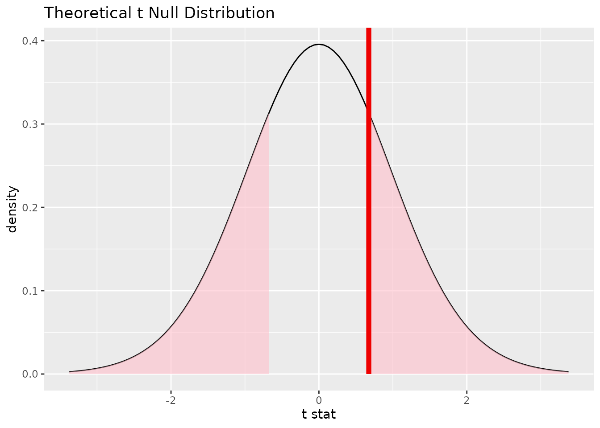
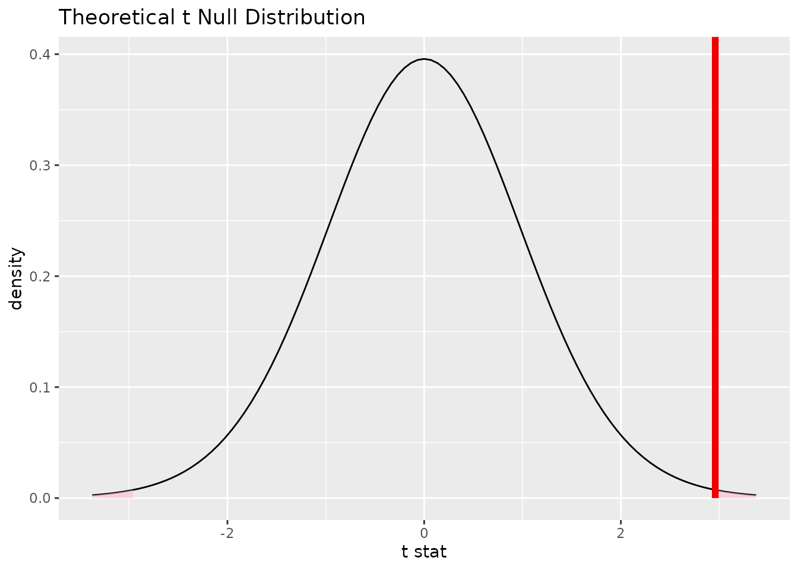
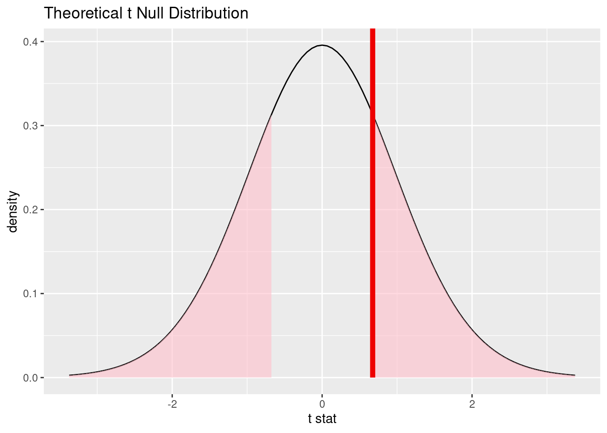
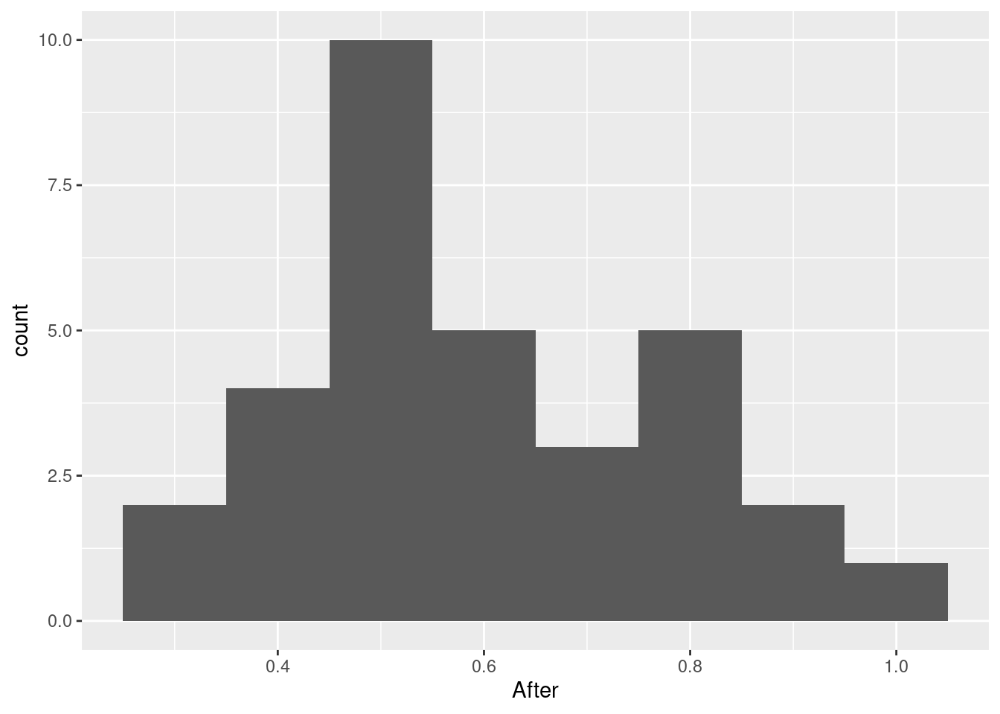
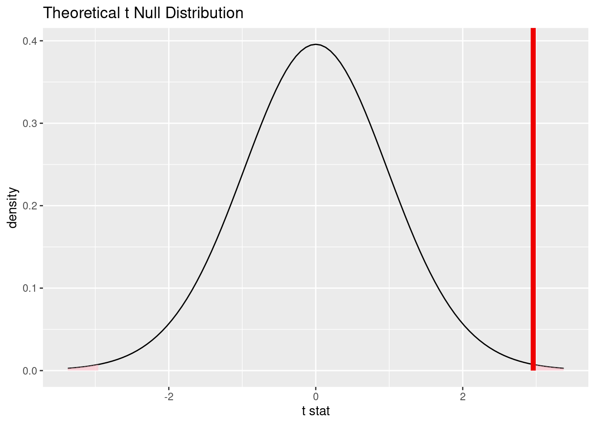
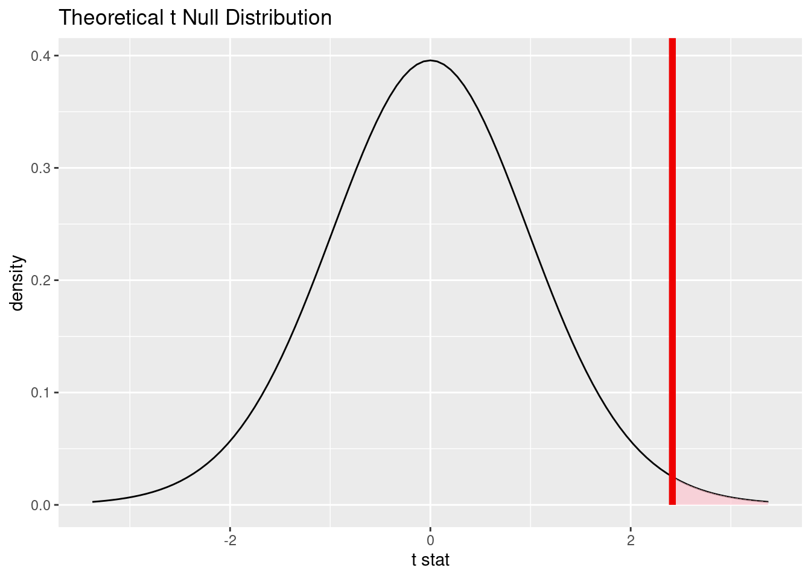

# $t$ tests {#lab9}


In this session, we will see how we can use R to do all the calculations involved in conducting the various types of $t$ test we have been learning about.  In addition, we will begin to get acquainted with some more advanced R functions that make it easier to do these tests on real data, including some helpful visualizations for understanding the relationship between $t$ values and $p$ values.

For this session, we are going to need to load both our standard `tidyverse` package as well as the `infer` package from R's library.


```r
library(tidyverse)
```

```
## ── Attaching packages ─────────────────────────────────────── tidyverse 1.3.0 ──
```

```
## ✓ ggplot2 3.3.3     ✓ purrr   0.3.4
## ✓ tibble  3.0.5     ✓ dplyr   1.0.3
## ✓ tidyr   1.1.2     ✓ stringr 1.4.0
## ✓ readr   1.4.0     ✓ forcats 0.5.0
```

```
## ── Conflicts ────────────────────────────────────────── tidyverse_conflicts() ──
## x dplyr::filter() masks stats::filter()
## x dplyr::lag()    masks stats::lag()
```

```r
library(infer)
```

## $t$ tests on tiny data

To get acquainted with how $t$ tests work in R, let's first try them out on some simple artificial data before applying them to some real data.  Imagine that we're designing an advertisement and want to make sure it is attention-grabbing.  The ad will be embedded in a webpage.  We use an eye tracker to monitor people's eye movements over the course of 1 minute while looking at a fake webpage containing the ad.  We *operationalize* the construct of attention-grabbing by measuring the proportion of that time that a person is looking at the ad.


The result is, for each person, a number between 0 (never looked at the ad) and 1 (only looked at the ad).  Here are measurements from a sample of $N = 5$ individuals:


```r
X_1 <- c(0.507, 0.052, 0.172, 0.066, 0.204)
```

Notice that we have labeled them `X_1` because we will soon have more than one set of measurements.

### One-sample $t$ test

If participants were looking at the ad half the time on average, their population mean would be $\mu = 0.5$.  Our first **research question** is therefore, "do people look at the ad more than half the time?"

#### State your hypotheses

Given this research question, our **null hypothesis** is that the mean ad proportion is less than or equal to 0.5 ($H_0$: $\mu \leq 0.5$) while our **alternative hypothesis** is that the mean ad proportion is more than 0.5 ($H_1$: $\mu > 0.5$).  This is, therefore, a **one-sided** test.

#### Set your alpha level

Let's adopt a relatively lenient alpha level of 0.1.

#### Find the $t$ value

To get the ingredients we need for the $t$ value, we need to know the deviation of the *sample mean* from the null hypothesis as well as the *estimated standard error* of the mean.  The deviation from the null hypothesis is the difference between the sample mean and that specified by the null hypothesis, which is 0.5.


```r
mean(X_1) - 0.5
```

```
## [1] -0.2998
```

Meanwhile, the *estimated standard error* is the sample standard deviation (`sd(X_1)`) divided by the square root of the sample size (`length(X_1)`).


```r
sd(X_1) / sqrt(length(X_1))
```

```
## [1] 0.08213063
```

Taking the ratio of the above two quantities gives us our $t$ value:


```r
t <- (mean(X_1) - 0.5) / (sd(X_1) / sqrt(length(X_1)))
t
```

```
## [1] -3.650283
```

#### Find the $p$ value

Because this is a *one-sided* test and the alternative hypothesis is that the population mean is *greater* than 0.5, we need to to know the probability of observing a value that is *at least as **large*** as the one we have.  We also need to know the degrees of freedom, which in this case is $5 - 1 = 4$ (`length(X_1) - 1`).


```r
1 - pt(q = t, df = length(X_1) - 1)
```

```
## [1] 0.989117
```

#### Decide whether or not to reject the null hypothesis

Since the $p$ value is *bigger* than our alpha level, we **fail to reject** the null hypothesis.  We have no evidence that people look at the ad more than half the time.

### Paired sample $t$ test

Perhaps spurred by the disappointing results of that one-sample $t$ test, we decide to change the colors in the ad and bring the same sample of 5 people back.  Again, we record the proportion of the time that they spend looking at our new ad, which we label `X_2`:


```r
X_2 <- c(0.907, 0.115, 0.548, 0.202, 0.347)
```

Now we have a *pair* of measurements from each person.  So the first entry in `X_1` and the first entry in `X_2` come from the same person, same for the second entry, third entry, etc.  Our **research question** now is, "did changing the ad affect how much people looked at it at all?"

To address this question, we will do a **paired sample $t$ test**.  This involves looking at the *differences* for each person, which we can find in R like so (we will also give them a label `D` to make it easier):


```r
D <- X_2 - X_1
```

(*Note that you can do the subtraction in any order, the important thing is to remember which order you picked so you know what the difference means!*)

#### State your hypotheses

Notice that now our question is about any kind of effect, so this will be a **two-tailed** test.  The **null hypothesis** is that the mean difference is zero ($H_0$: $\mu_D = 0$) and the **alternative hypothesis** is that the mean difference is *not* zero ($H_1$: $\mu_D \neq 0$).

#### Set your alpha level

Again, let's keep our alpha level from before and say that our alpha level is 0.1.

#### Find the $t$ value

Remember that the paired sample $t$ test is much like the one-sample $t$ test, only instead of using raw measurements, we use the *differences* which we labeled `D`.


```
## [1] 3.256259
```

\BeginKnitrBlock{exercise}<div class="exercise"><span class="exercise" id="exr:unnamed-chunk-12"><strong>(\#exr:unnamed-chunk-12) </strong></span>Modify the slice of code we used in the previous section to find the $t$ value given above and make sure that it is labeled `t_D` (the "D" is for "difference").  What code did you write to find this new $t$ value?  *Hint: remember what the mean from the null hypothesis is!*</div>\EndKnitrBlock{exercise}

#### Find the $p$ value

Since the $t$ value is positive, this means it is on the upper end of the $t$ distribution.  To find the probability of seeing a value that is at least as high as the one we saw, we can use


```r
1 - pt(q = t_D, df = length(D) - 1)
```

```
## [1] 0.01559538
```

But remember that we have to multiply that by `2` since this is a *two-tailed test*.  So this is our $p$ value:


```r
2 * (1 - pt(q = t_D, df = length(D) - 1))
```

```
## [1] 0.03119075
```

#### Decide whether or not to reject the null hypothesis

Since the $p$ value is *smaller* than our alpha level, we **reject** the null hypothesis.  We have reason to believe that changing the ad really did affect each individual's viewing patterns.

\BeginKnitrBlock{exercise}<div class="exercise"><span class="exercise" id="exr:unnamed-chunk-15"><strong>(\#exr:unnamed-chunk-15) </strong></span>Although the test we just did was only about differences in *any* direction, based on the $t$ value does it seem like changing the ad increased or decreased the proportion of time people spent looking at the ad?</div>\EndKnitrBlock{exercise}

### Independent samples $t$ test

Let's imagine that, instead of bringing back the same sample of 5 people to view our new ad, we brought in a different sample.  While we're imagining, let's say that this new sample still produce the *same* measurements.  So our "data" is the same, only now it is not "paired", it comes from two *independent samples*.

Our **research question** remains the same: "did changing the ad affect how much people looked at it at all?"  But now, to address this question, we will do an **independent samples $t$ test**.

#### State your hypotheses

Because we have two samples from (potentially) two populations, our null and alternative hypotheses are about a difference in population parameters.  This is still a **two-tailed** test.  The **null hypothesis** is that the mean difference is zero ($H_0$: $\mu_2 - \mu_1 = 0$) and the **alternative hypothesis** is that the mean difference is *not* zero ($H_1$: $\mu_2 - \mu_1 \neq 0$).

Notice that we are keeping the order of the subtraction (2 minus 1) the same as above, to make it easier to compare.

#### Set your alpha level

Again, let's keep our alpha level from before and say that our alpha level is 0.1.

#### Find the $t$ value

To find the $t$ value, remember that we first have to find the **pooled sample standard deviation**.  In mathematical terms, this is $\hat{\sigma}_P = \sqrt{\frac{df_1 \hat{\sigma}^2_1 + df_2 \hat{\sigma}^2_2}{df_1 + df_2}}$.  We can write that out in R like so:


```r
df_1 <- length(X_1) - 1
df_2 <- length(X_2) - 1

sd_pooled <- sqrt((df_1 * sd(X_1)^2 + df_2 * sd(X_2)^2) / (df_1 + df_2))
sd_pooled
```

```
## [1] 0.2584249
```

With our pooled SD in hand, we can now find the $t$ value


```r
t_Indep <- (mean(X_2) - mean(X_1)) / (sd_pooled * sqrt(1 / length(X_1) + 1 / length(X_2)))
t_Indep
```

```
## [1] 1.368067
```

#### Find the $p$ value

Again, since the $t$ value is positive, this means it is on the upper end of the $t$ distribution.  To find the probability of seeing a value that is at least as high as the one we saw, we can use


```r
1 - pt(q = t_Indep, df = length(X_1) + length(X_2) - 2)
```

```
## [1] 0.1042398
```

Note that we have a different number of **degrees of freedom** here because we are treating these data as being from two independent samples.  But again we have to multiply the probability above by `2` since this is a *two-tailed test*.  So this is our final $p$ value:


```r
2 * (1 - pt(q = t_Indep, df = length(X_1) + length(X_2) - 2))
```

```
## [1] 0.2084797
```

#### Decide whether or not to reject the null hypothesis

This time, the $p$ value is *bigger* than our alpha level, so we **fail to reject** the null hypothesis.  Funny---the same data lead us to different conclusions depending on whether it came from just one sample versus two independent samples!

\BeginKnitrBlock{exercise}<div class="exercise"><span class="exercise" id="exr:unnamed-chunk-20"><strong>(\#exr:unnamed-chunk-20) </strong></span>Why do you think we were able to reject the null hypothesis using the paired samples $t$ test, but not with the independent samples $t$ test, even though the actual data were the same in both cases?  Think about the fact that there is variability both between different individuals and within a single individual (e.g., if you do something multiple times, chances are you won't act exactly the same each time).  Does one type of test effectively eliminate one of these kinds of variability?  How might that affect the ability to the test to detect particular kinds of differences?</div>\EndKnitrBlock{exercise}

## $t$ tests with real data

We've now seen how to do all the calculations for a $t$ test in R.  Because R was built for statistics, you won't be surprised that it can automate many of those things for us, as we'll see.  As usual, though, when a computer does the "mindless" work, we have to be even more "mindful" of how to interpret the results it gives us.

In this example, we will look at a study by Sam Mehr, Lee Ann Song (aptly named), and Liz Spelke [@MehrEtAl2016].  They wanted to see whether music is an important social cue for infants.  Specifically, they wondered whether infants tend to prefer people who sing familiar songs.  The idea is that someone singing a song you know is probably a member of the same social group as you are.

They conducted an experiment in which a child's parents were taught a new melody and were instructed to sing it to their child at home over the course of 1--2 weeks.  After this exposure period, the parents brought their infant back to the lab.  The infant was seated in front of a screen showing videos of two unfamiliar adults just smiling in silence.  They recorded the proportion of the time that the infant looked at each individual during this "before" phase.  Then, one of these unfamiliar people sang the melody that the parents had been singing for 1--2 weeks, while the other sang a totally new song.  Finally, during the "after" phase, the infant saw the same videos of each person silently smiling and the researchers recorded the proportion of the time spent looking at the person who sang the familiar song.

The overall aim of this experiment is to see whether infants will prefer to look at the singer of the familiar melody after hearing them sing it, even though they've never seen this person before.

### Check out the data

First, let's get the data into R:


```r
lullaby <- read_csv("https://raw.githubusercontent.com/gregcox7/StatLabs/main/data/lullaby_wide.csv")
```

```
## 
## ── Column specification ────────────────────────────────────────────────────────
## cols(
##   id = col_double(),
##   Before = col_double(),
##   After = col_double()
## )
```

Have a look at the data by clicking on `lullaby` in RStudio's "Environment" pane.  Each row is data from a specific infant.  There are three variables in this dataset:

* "id": Identifies each infant in the study.
* "Before": In the phase before the infants heard anyone sing, what proportion of the time did they look at the person who would eventually sing the familiar melody?
* "After": In the phase after the infants heard the two people sing, what proportion of the time did they look at the person who sang the familiar melody?

Let's summarize the looking preferences for infants before and after hearing the people sing:


```r
lullaby %>%
    summarize(M_before = mean(Before), S_before = sd(Before), M_after = mean(After), S_after = sd(After))
```

```
## # A tibble: 1 x 4
##   M_before S_before M_after S_after
##      <dbl>    <dbl>   <dbl>   <dbl>
## 1    0.521    0.177   0.593   0.179
```

\BeginKnitrBlock{exercise}<div class="exercise"><span class="exercise" id="exr:unnamed-chunk-23"><strong>(\#exr:unnamed-chunk-23) </strong></span>Based on the sample means and standard deviations we just found, does it seem like there might be a preference to look more at the person who would sing the familiar melody, either before or after hearing them sing?</div>\EndKnitrBlock{exercise}

### Did infants show any prior bias?

Before we can ask whether infants prefer to look at someone who sings a familiar melody, we need to see whether they show any kind of *bias* to look at one person or another *before* hearing them sing.  If they did show a bias to look at one of the individuals before hearing them, then we wouldn't be able to attribute their behavior to the familiarity of the song.

Let's first inspect the data by making a histogram:


```r
lullaby %>%
    ggplot(aes(x = Before)) +
    geom_histogram(binwidth=0.1)
```



\BeginKnitrBlock{exercise}<div class="exercise"><span class="exercise" id="exr:unnamed-chunk-25"><strong>(\#exr:unnamed-chunk-25) </strong></span>Based on the histogram above, does it seem like there are any outliers or skew that are very far from a normal distribution?</div>\EndKnitrBlock{exercise}

Our **research question** is, "do infants prefer to look at one person over the other, even before hearing them sing?"  We will address this question using a **one-sample $t$ test**.

#### State your hypotheses

An unbiased infant would look equally often at both people, so the proportion of the time they looked at the singer of the familiar song would be 0.5.  This is our **null hypothesis**: $H_0$: $\mu = 0$.  So our **alternative hypothesis** is just that $H_1$: $\mu \neq 0$.

#### Set your alpha level

Let's choose an alpha level of 0.05, same as the one @MehrEtAl2016 chose.

#### Find the $t$ value

R's `infer` package makes it easy to get our $t$ value.  Let's first look at the code for doing this, then explain line-by-line what it means:


```r
lullaby %>%
    specify(response = Before) %>%
    hypothesize(null = 'point', mu = 0.5) %>%
    calculate(stat = 't')
```

```
## # A tibble: 1 x 1
##    stat
##   <dbl>
## 1 0.674
```

The first line, like usual, tells R what data to work with.  In the second line, we `specify` that the variable we want to use for our test is the `Before` variable.  The variable we are interested in is called a `response` variable.  In the third line, we tell R that our null hypothesis is a "point" (that is, a single value) at `mu = 0.5`.  Finally, the fourth line tells R to `calculate` the `t` `stat`istic based on what we told it in the first 3 lines.

Let's tell R to remember that $t$ value.  We'll call it `t_before`, since it refers to the looking *before* the infants heard anything.


```r
t_before <- lullaby %>%
    specify(response = Before) %>%
    hypothesize(null = 'point', mu = 0.5) %>%
    calculate(stat = 't')
```

#### Find the $p$ value

We can do something fancy now and `visualize` the appropriate $t$ distribution corresponding to our null hypothesis:


```r
t_before %>%
    visualize(method = 'theoretical')
```

```
## Warning: Check to make sure the conditions have been met for the theoretical
## method. {infer} currently does not check these for you.
```



The first line tells R to use the $t$ value we just found as "data".  The second line instructs R to visualize the `theoretical` $t$ distribution if the null hypothesis were true.  This distribution is what will let us calculate the $p$ value.

In fact, we can visualize what the $p$ value will be by showing where the $t$ statistic for our sample falls on the $t$ distribution:


```r
t_before %>%
    visualize(method = 'theoretical') +
    shade_p_value(obs_stat = t_before, direction = 'two-sided')
```

```
## Warning: Check to make sure the conditions have been met for the theoretical
## method. {infer} currently does not check these for you.
```



All we did was add a third line where we told R to `shade` the area of the $t$ distribution that is *at least as extreme* as our sample (that's what `obs_stat = t_before` did).  What counts as "extreme" depends on whether our test is one- or two-sided, so we had to tell R that the `direction` of our test was `two-sided`.  The *area* of the shaded region on the plot above is what our $p$ value is.

But of course, we can't get a number just by looking at a graph.  Here's how we actually get all the numbers we need out of R:


```r
lullaby %>%
    t_test(response = Before,
           alternative = 'two-sided',
           mu = 0.5,
           conf_level = 0.95)
```

```
## # A tibble: 1 x 6
##   statistic  t_df p_value alternative lower_ci upper_ci
##       <dbl> <dbl>   <dbl> <chr>          <dbl>    <dbl>
## 1     0.674    31   0.505 two.sided      0.457    0.585
```

The first line, as usual, tells R what data to use.  The remaining lines tell R all about the `t_test` we want to perform.  We tell R that the `response` variable (the one we want to test) is `Preference`; that we are doing a test with an `alternative` hypothesis that is `two-sided`; that the mean according to the null hypothesis is `mu = 0.5`; and that our confidence level (`conf_level`) is 0.95, which is one minus our alpha level.

The output we got from R told us a lot:

* `statistic`: The value of the $t$ statistic.
* `t_df`: The number of degrees of freedom.
* `p_value`: The $p$ value.
* `alternative`: Reminding us that we were doing a two-sided test.
* `lower_ci`: The lower limit of the *updated* confidence interval (assuming the population mean is equal to the sample mean).  The width of the interval is defined by the `conf_level` we told R already.
* `upper_ci`: The upper limit of the *updated* confidence interval (assuming the population mean is equal to the sample mean).

#### Decide whether or not to reject the null hypothesis

Finally, we can use the $p$ value we just found, in combination with the alpha level from above (which we decided was 0.05) to say that we **fail to reject** the null hypothesis.  As a result, we have no reason to believe that there is any bias in who the infants look at before hearing them sing.

### Do infants prefer to look at the singer of the familiar melody?

What about where infants look *after* they hear the two people sing?  Do they show any kind of preference?  Again, we can use a **one-sample $t$ test** to find out.  In fact, all we need to do is reuse different bits of code from the previous section, just changing the variable of interest from "Before" to "After".

Let's begin by making a histogram of the `After` variable.



\BeginKnitrBlock{exercise}<div class="exercise"><span class="exercise" id="exr:unnamed-chunk-32"><strong>(\#exr:unnamed-chunk-32) </strong></span>What code did you use to make the histogram above?  Do you see any evidence of outliers or skew that are very different from what we might see in a normal distribution?</div>\EndKnitrBlock{exercise}

Our **research question** is, "do infants prefer to look at one person over the other *after* hearing them sing?"

#### State your hypotheses

Again, an infant without any preference would look equally often at both people, so the proportion of the time they looked at the singer of the familiar song would be 0.5.  This is, again, our **null hypothesis**: $H_0$: $\mu = 0$.  Again, our **alternative hypothesis** is just that $H_1$: $\mu \neq 0$.

#### Set your alpha level

Let's keep our alpha level of 0.05.

#### Find the $t$ value

Let's tell R to remember our *new* $t$ value so that we can visualize it like we did before.  We're going to call this new $t$ value `t_after` to keep it distinct.


\BeginKnitrBlock{exercise}<div class="exercise"><span class="exercise" id="exr:unnamed-chunk-34"><strong>(\#exr:unnamed-chunk-34) </strong></span>What code did you use to make `t_after`?  (*Hint: what do you change in the code we used above to make `t_before`?*)</div>\EndKnitrBlock{exercise}

#### Find the $p$ value

Let's visualize our $t$ statistic to get a sense of what the $p$ value will be


```r
t_after %>%
    visualize(method = 'theoretical') +
    shade_p_value(obs_stat = t_after, direction = 'two-sided')
```

```
## Warning: Check to make sure the conditions have been met for the theoretical
## method. {infer} currently does not check these for you.
```



Finally, let's get the whole shebang:


```
## # A tibble: 1 x 6
##   statistic  t_df p_value alternative lower_ci upper_ci
##       <dbl> <dbl>   <dbl> <chr>          <dbl>    <dbl>
## 1      2.96    31 0.00586 two.sided      0.529    0.658
```

\BeginKnitrBlock{exercise}<div class="exercise"><span class="exercise" id="exr:unnamed-chunk-37"><strong>(\#exr:unnamed-chunk-37) </strong></span>What code did you use to get the `t_test` output above?</div>\EndKnitrBlock{exercise}

#### Decide whether or not to reject the null hypothesis

Comparing the $p$ value we just found to our alpha level of 0.05, we **reject** the null hypothesis.  We have reason to believe that the infants have a *preference* to look at one singer over the other.

### Did their preferences change?

Based on what we've done so far, it seems like before hearing the two people sing, the infants didn't look at either one more than the other, but *after* hearing them sing, the infants did show a preference.  Now let's ask a more direct **research question**:  For each infant, did hearing someone sing a familiar song lead that infant to prefer looking at that person?  This question can be addressed using a **paired samples $t$ test**.

#### State your hypotheses

Based on the way our research question is phrased, we are looking at a **one-tailed test** because we are asking about a difference in a specific direction---an *increase* in preferential looking.  So our **null hypothesis** is that the difference in preference is less than or equal to zero ($H_0$: $\mu_D \leq 0$) while our **alternative hypothesis** is that the difference is greater than zero ($H_0$: $\mu_D > 0$).

#### Set your alpha level

Let's stay consistent and say that our **alpha level** is still 0.05.

#### Find the $t$ value

Like we did above, we need to first find the *difference* for each infant between their looking preferences before and after hearing the people sing.  We can do that in R using the `mutate` function, which we've previously used to calculate probabilities based on relative frequency.

The code below creates a new variable called `Difference` by subtracting the `Before` preference from the `After` preference:


```r
lullaby %>%
    mutate(Difference = After - Before)
```

```
## # A tibble: 32 x 4
##       id Before After Difference
##    <dbl>  <dbl> <dbl>      <dbl>
##  1   101  0.437 0.603     0.166 
##  2   102  0.413 0.683     0.270 
##  3   103  0.754 0.724    -0.0304
##  4   104  0.439 0.282    -0.157 
##  5   105  0.475 0.499     0.0239
##  6   106  0.871 0.951     0.0800
##  7   107  0.237 0.418     0.181 
##  8   108  0.759 0.938     0.179 
##  9   109  0.416 0.5       0.0837
## 10   110  0.800 0.586    -0.213 
## # … with 22 more rows
```

We can insert that second line of code above in order to calculate the $t$ statistic corresponding to our difference scores:


```r
t_diff <- lullaby %>%
    mutate(Difference = After - Before) %>%
    specify(response = Difference) %>%
    hypothesize(null = 'point', mu = 0) %>%
    calculate(stat = 't')
```

\BeginKnitrBlock{exercise}<div class="exercise"><span class="exercise" id="exr:unnamed-chunk-40"><strong>(\#exr:unnamed-chunk-40) </strong></span>Compare the code used to make `t_diff` with the code we previously used to make `t_before` and `t_after`.  What is similar and what is different?</div>\EndKnitrBlock{exercise}

#### Find the $p$ value

Now that we have found `t_diff`, let's see where our sample falls on the $t$ distribution corresponding to the null hypothesis:


```r
t_diff %>%
    visualize(method = 'theoretical') +
    shade_p_value(obs_stat = t_diff, direction = 'greater')
```

```
## Warning: Check to make sure the conditions have been met for the theoretical
## method. {infer} currently does not check these for you.
```



\BeginKnitrBlock{exercise}<div class="exercise"><span class="exercise" id="exr:unnamed-chunk-42"><strong>(\#exr:unnamed-chunk-42) </strong></span>Compare the visualization of the $t$ distribution for `t_diff` to the ones we made for `t_before` and `t_after`.  Is there a difference in which sides of the distribution are shaded?  Why might this be?</div>\EndKnitrBlock{exercise}

Finally, we can obtain the $p$ value along with the rest of the results of the $t$ test:


```
## # A tibble: 1 x 6
##   statistic  t_df p_value alternative lower_ci upper_ci
##       <dbl> <dbl>   <dbl> <chr>          <dbl>    <dbl>
## 1      2.42    31  0.0109 greater       0.0216      Inf
```

\BeginKnitrBlock{exercise}<div class="exercise"><span class="exercise" id="exr:unnamed-chunk-44"><strong>(\#exr:unnamed-chunk-44) </strong></span>How did you modify the code we used above for the previous two $t$ tests to get the result above?  Do you notice anything different about the output we got from R for this one-tailed test, relative to the two-tailed tests we did above?</div>\EndKnitrBlock{exercise}

#### Decide whether or not to reject the null hypothesis

Comparing the $p$ value we just found to our alpha level of 0.05, we **reject** the null hypothesis.  We have reason to believe that infants' preferences *changed* after hearing the two people sing, such that they look more often at the singer of the familiar melody.

## Wrap-up

In this session, we saw both how to conduct all the individual calculations in a $t$ test as well as how to use R to do a $t$ test "all at once".  We saw how to do one-sample, paired samples, and independent samples $t$ tests in step-by-step form.  We also saw how to do one-sample and paired samples $t$ tests in a fancier form with helpful visual aids that are better suited for dealing with real data.  We can also do independent samples $t$ tests in this fancier way, but we will have to wait until next week to see a demonstration.  Nonetheless, it is clear that R has powerful facilities for doing the kinds of hypothesis tests that are the bread and butter of inferential statistics.
