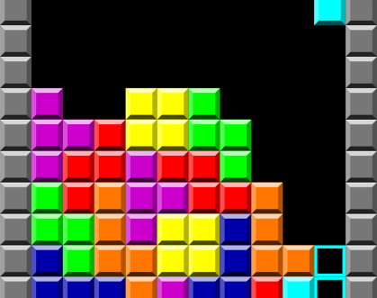

# Inference for multiple independent groups {#lab12}




In this session, we will use R to do inference for comparing averages from multiple independent groups.  Specifically, we will be interested in doing hypothesis tests to address questions about whether multiple groups differ on average, called **Analysis of Variance (ANOVA)**.  We will see that the simulation techniques we learned for comparing proportions or means between two groups also apply when we have multiple groups.  The mathematical model for ANOVA is different, however; it is an "F distribution".  We will use these techniques to analyse an experiment designed to compare different ways to minimize intrusions of traumatic memories.

## Required packages

For this session, we are going to need to load both our standard `tidyverse` package as well as the `infer` package from R's library.


```r
library(tidyverse)
```

```{.Rout .text-info}
## ── Attaching packages ─────────────────────────────────────── tidyverse 1.3.1 ──
```

```{.Rout .text-info}
## ✓ ggplot2 3.3.5     ✓ purrr   0.3.4
## ✓ tibble  3.1.3     ✓ dplyr   1.0.5
## ✓ tidyr   1.1.3     ✓ stringr 1.4.0
## ✓ readr   2.0.0     ✓ forcats 0.5.1
```

```{.Rout .text-info}
## ── Conflicts ────────────────────────────────────────── tidyverse_conflicts() ──
## x dplyr::filter() masks stats::filter()
## x dplyr::lag()    masks stats::lag()
```

```r
library(infer)
```

## Can we reduce intrusions of traumatic memories?

One of the hallmarks of post-traumatic stress disorder is that memories of the traumatic event "intrude" on everyday life, popping up when they are not wanted.  When you remember a previous event, the memory is said to be "active".  According to reconsolidation theory, active memories can also be changed.  For example, when you tell a story from memory, telling the story might change your memory such that you would tell it differently next time.  Reconsolidation theory suggests that one way to reduce intrusions of traumatic memories is to "activate" them and then change them so they are less likely to intrude on everyday life.

One way to modify intrusive memories was studied by @JamesEtAl2015.  They thought that playing a video game, namely *Tetris*, while a memory was active would help make that memory less traumatic.  They had participants first view a traumatic film (including scenes of real car accidents).  Over the next week, participants recorded how often a memory of the traumatic film *intruded* on their everyday life.  During that week, participants came back into the lab and were randomly assigned to one of four treatment conditions:

* Reactivation-plus-Tetris: In this group, participants were shown still images from the traumatic film to "reactivate" memories for the film.  They then played Tetris for 12 minutes.
* Reactivation only: In this group, participants were shown still images from the traumatic film to "reactivate" memories for the film, but then sat silently for 12 minutes and did not play Tetris.
* Tetris only: In this group, participants were not shown any images from the film but simply played Tetris for 12 minutes.
* No task (control): In this group, participants simply sat quietly for 12 minutes.

According to reconsolidation theory, people in the reactivation-plus-Tetris condition should experience fewer intrusive memories because playing Tetris should change those memories to be less disruptive.  This is not predicted to happen in any other group either because the original traumatic memories are not being reactivated (control or Tetris-only) or because they are not being changed after reactivation (control or reactivation-only).

### Load the data

Load the relevant data into R now:


```r
tetris_data <- read_csv("https://raw.githubusercontent.com/gregcox7/StatLabs/main/data/tetris.csv")
```

```{.Rout .text-info}
## Rows: 72 Columns: 3
```

```{.Rout .text-info}
## ── Column specification ────────────────────────────────────────────────────────
## Delimiter: ","
## chr (1): condition
## dbl (2): intrusions_pre, intrusions_post
```

```{.Rout .text-info}
## 
## ℹ Use `spec()` to retrieve the full column specification for this data.
## ℹ Specify the column types or set `show_col_types = FALSE` to quiet this message.
```

```r
tetris_data
```

```{.Rout .text-muted}
## # A tibble: 72 × 3
##    condition         intrusions_pre intrusions_post
##    <chr>                      <dbl>           <dbl>
##  1 No task (control)              2               4
##  2 No task (control)              2               3
##  3 No task (control)              5               6
##  4 No task (control)              0               2
##  5 No task (control)              5               3
##  6 No task (control)              4               4
##  7 No task (control)              0               0
##  8 No task (control)              4               4
##  9 No task (control)              3               2
## 10 No task (control)              5              11
## # … with 62 more rows
```

Each row shows data from a single participant.  There are 3 variables in the dataset:

* `condition`: Which of the four treatment conditions the participant was in.
* `intrusions_pre`: The number of times the participant reported an intrusive memory of the traumatic film prior to treatment.
* `intrusions_post`: The number of times the participant reported an intrusive memory of the traumatic film after treatment.

::: {.exercise}

Consider the design of this study to address the following questions.

a. Would it be possible to conclude that the treatment condition plays a role in *causing* any changes we might observe in the number of intrusive memories?  Why or why not?
b. Fill in the blanks in the code below to use `mutate` to create a new variable called `effect` that represents the *difference* between the number of intrusions after treatment and the number of intrusions before treatment.  Write the code so that a *negative* value of `effect` means a *reduction* in the number of intrusive memories from before to after treatment.  What code did you use?


```r
tetris_data %>%
    mutate(effect = ___ - ___)
```

:::

### Visualize the data

::: {.exercise}

Fill in the blanks in the code below to make a boxplot that compares the distribution of `effect` for each group (defined by their treatment `condition`):


```r
tetris_data %>%
    mutate(effect = ___ - ___) %>%
    ggplot(aes(x = ___, y = effect)) +
    geom_boxplot()
```

a. Our **research question** is, "is there a difference in average effectiveness between treatment conditions?"  What are the null and alternative hypotheses corresponding to this research question?
b. What are the names of the explanatory variable and response variable?
c. Based on the boxplot you just made in this exercise, do these data seem more consistent with the null or the alternative hypothesis?  Explain your reasoning.

:::

### Hypothesis testing by randomization

We will use these data to conduct a hypothesis test to help us address the research question, "is there a difference in average effectiveness between treatment conditions?"  As we've seen, the test statistic that we need is a **F statistic**, which represents how much variability there is *between* groups, relative to the amount of variability *within* groups.

#### The observed F statistic

::: {.exercise}

Fill in the blanks in the code below to find the F statistic for our observed data.  *Hint:* for the `specify` line, remember to put the name of the response variable on the left of the `~` and the name of the explanatory variable on the right.


```r
obs_f <- tetris_data %>%
    mutate(effect = ___ - ___) %>%
    specify(___ ~ ___) %>%
    calculate(stat = "F")

obs_f
```

a. What was the F statistic you found?
b. Does the F statistic you found indicate that the between-group variability is greater or smaller than the within-group variability?  Explain your reasoning.

:::

#### Simulating the null hypothesis

Just like when we were comparing proportions or comparing means from independent samples, we can simulate how the data would look if the null hypothesis were true.  Specifically, to simulate a single dataset, we randomly re-assign (*permute*) the values of the explanatory variable across observations.  We then calculate an F statistic for that simulated dataset.  We then repeat that process many times to build a **sampling distribution** for the F statistic.  Finally, we see whether the F statistic for the actual data is large enough that we reject the idea that it came about by sampling error alone.

::: {.exercise}

Fill in the blanks in the code below to use random permutation to conduct a hypothesis test.  The final result should be a histogram of simulated F statistics along with a line indicating where our observed F statistic (`obs_f` from the last exercise) falls in that distribution.  *Hint:* For the blanks in the `hypothesize` and `generate` lines, consider how we simulated the null hypothesis for [comparing proportions](#lab5) or [means from independent samples](#lab10).


```r
null_dist <- tetris_data %>%
    mutate(effect = ___ - ___) %>%
    specify(___ ~ ___) %>%
    hypothesize(null = "___") %>%
    generate(reps = 1000, type = "___") %>%
    calculate(stat = "F")

null_dist %>%
    visualize() +
    shade_p_value(obs_stat = obs_f, direction = "greater")
```

a. Based on the histogram you just produced, would you consider the observed F statistic to be unusually large if the null hypothesis were true?
b. Run the chunk of code below to overlay the mathematical model of the null hypothesis---the "F distribution"---on the histogram of simulated F statistics.  Describe the shape of the F distribution (skewness, number of modes) as well as whether the F distribution (the smooth curve) make a good "fit" with the histogram of simulated F statistics.


```r
null_dist %>%
    visualize(method = "both") +
    shade_p_value(obs_stat = obs_f, direction = "greater")
```

:::

### Hypothesis testing by mathematical model

In practice, ANOVA is often done using a mathematical model of the null hypothesis instead of using simulation.  The relevant calculations are carried out by computer, but the results are often presented in a table that makes it easier to see how the sausage is made (this is the same format used in class and in the book).

::: {.exercise}

Fill in the blanks in the code below to use R to produce an ANOVA table.  *Hint:* The first two lines are just for convenience; they tell R to store a version of the data that already has the `effect` variable.  So be sure to use the same `mutate` line you've been using in previous exercises.  For the `lm` line, recall that the squiggly `~` is used to `specify` the response and explanatory variables.


```r
tetris_data_effect <- tetris_data %>%
    mutate(effect = ___ - ___)

lm(___ ~ ___, data = tetris_data_effect) %>%
    anova()
```

a. Find the mathematically computed $p$ value in the table you just produced (the column headings will be helpful, you may also compare the format to ANOVA tables from class or the book).  What is the $p$ value?
b. Using a significance level of 0.05, would we reject the null hypothesis or not?  Why or why not?
c. Summarize what the results of this hypothesis test tell us about whether the treatment conditions were equally effective in reducing intrusive memories.
d. The reconsolidation theory predicts that reactivation-plus-Tetris should be significantly more effective than all three other treatment conditions.  Describe follow-up analyses you would use to test this prediction as well as whether those follow-up analyses would require any special adjustments.

:::

## Wrap-up

The final technique we've learned, Analysis of Variance, is used to address questions about whether multiple independent groups differ from one another on average.  The F statistic is used to summarize how much variability there is between groups versus the amount of variability within groups.  We used random permutation to simulate the kinds of data that would occur if the null hypothesis were true.  We used simulation as well as a mathematical model to determine whether the observed F statistic is large enough to reject the null hypothesis.
